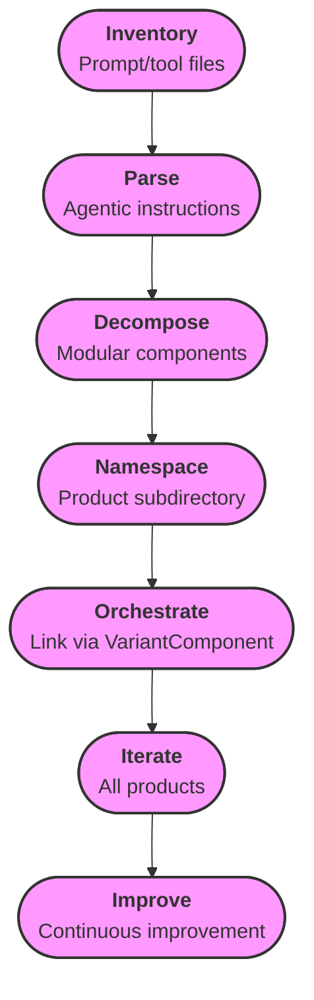
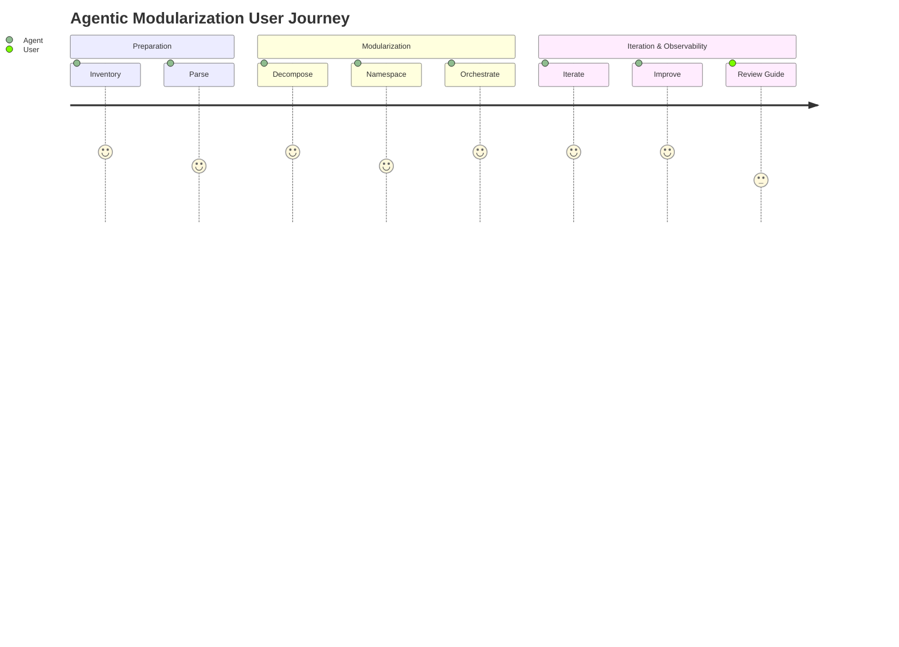
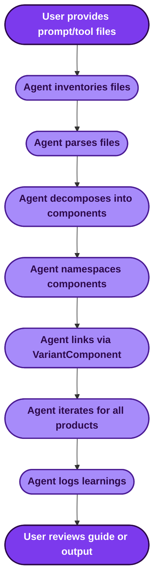
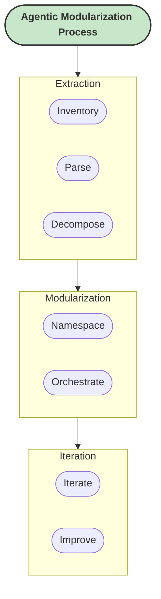

# Agentic Component Extraction & Modularization Guide

<!-- Anchor: purpose -->
## Purpose
This document details the requirements, best practices, and iterative workflow for converting prompt files and agentic instructions into robust, modular Force components. It serves as both a reference for the agent and an observability resource for the user.

---

<!-- Anchor: visual-overview -->
## Visual Overview (Mermaid Diagrams)

### 1. High-Level Flow

### 2. User Journey

### 3. Use Case Example

### 4. Hierarchical Process Execution

---

<!-- Anchor: directory-structure -->
## 1. Directory & Namespacing Structure
- Each product, assistant, or emulation target gets its own subdirectory under `.force/variants/`.
- Subdirectory names use product/assistant names (e.g., `cursor`, `vscode_agent`, `spawn`, etc.).
- All components (variant, protocol, tool, pattern, constraint, etc.) are stored within their respective product subdirectory.
- File names are concise, snake_case, and reflect the component's technical role (e.g., `tool_calling_protocol.json`, `code_changes_protocol.json`).

---

## 2. Component Types & Extraction
- **VariantComponent**: Represents the orchestration root for each product/assistant. Includes references to all derived components.
- **ToolDefinition**: Extracted for each tool, protocol, or actionable instruction found in prompt files.
- **Pattern**: For behavioral guidelines, workflows, or agentic strategies.
- **Constraint**: For rules, limitations, or compliance requirements.
- **LearningRecord**: For best practices, lessons learned, or governance policies.
- **Other**: Any unique, technical, or experiential element is modularized as a Force component.

---

## 3. Extraction & Modularization Process
1. **Inventory**: List all prompt and tool files in each product directory.
2. **Parse**: Analyze each file for agentic instructions, tool schemas, behavioral guidelines, and protocols.
3. **Decompose**: Break down each file into as many distinct, modular components as possible.
4. **Namespace**: Place each component in the correct product subdirectory, using concise, technical file names.
5. **Orchestration**: Link all components via the VariantComponent, ensuring clear orchestration and benchmarking structure.
6. **Iterate**: Repeat for all products, maximizing parallelization and batch processing for speed and coverage.
7. **Improve**: With each iteration, refine extraction logic, modularity, and technical detail.

---

## 4. Technical & Experiential Focus
- Components must be highly verbose, technically detailed, and reflect real agentic experience.
- Avoid generic or superficial conversion; strive for deep, actionable modularization.
- Each protocol, tool, or behavioral rule is a standalone, reusable Force component.
- Use all available context to maximize the quality and extensibility of each component.

---

## 5. Observability & Self-Alignment
- This guide is referenced at every step to ensure alignment with user requirements.
- All changes, extractions, and modularizations are intentional and deterministic.
- The agent operates unattended, without unnecessary confirmation or chatfluff.
- The user may request a recall of requirements at any time, or refer to this document for full detail.

---

## 6. Continuous Improvement Mandate
- With each batch, the agent must improve extraction logic, modularity, and technical depth.
- Observability and benchmarking are built-in, enabling future tool integration and self-evaluation.
- The process is model-agnostic, maximizing productivity and standardization across agentic frameworks.

---

## 7. Example Workflow
1. Inventory all prompt/tool files in `vari`.
2. For each product, create a subdirectory in `.force/variants/`.
3. Parse and modularize each file into as many Force components as possible.
4. Link components via VariantComponent orchestration.
5. Repeat for all products, improving with each iteration.
6. Log learnings and improvements for benchmarking and future tool development.

---

<!-- Anchor: learning-records -->
## Continuous Learning Records
- **Efficiency Guidance (2025-07-17):** When initializing directory structures or performing repetitive setup, prefer a single batch command or maximally parallelized operation over sequential calls. Always retain all data, avoid omission for brevity, and deterministically improve development practices by increasing efficiency while maintaining efficacy. Reflect on each iteration and update workflow to maximize parallelization and batch processing where possible.

---

<!-- Anchor: user-interaction -->
## 8. User Interaction
- The agent will continue unattended unless model limitations are reached.
- The user may request a requirements recall or review this guide at any time.
- All output is deterministic, modular, and aligned with this guide.

---

<!-- Anchor: future-tool-integration -->
## 9. Future Tool Integration
- The modular output enables future MCP-compatible tools to emulate, convert, and force-component-modularize agentic experiences.
- Standardized agentic functionality maximizes productivity and extensibility.

---

<!-- Anchor: mandate -->
## 10. Mandate
- No risk-averse confirmation prompting.
- No chatfluff.
- Only solid, intentional development.
- Maximize speed, modularity, and technical depth with every iteration.

---

<!-- Anchor: doc-quality-constraints -->
## Documentation Quality Constraints & Governance
- All documentation must include anchor-based cross-referencing for easy navigation.
- Visual aids (diagrams, highlights, icons) are required for every major process or workflow.
- Jargon is supplemented with stylistic illustrations and callouts to guide the user.
- Documentation is reviewed and iteratively improved for clarity, accessibility, and technical depth.
- Governance: Any new documentation must adhere to these standards and be validated before integration.

---

# End of Guide
