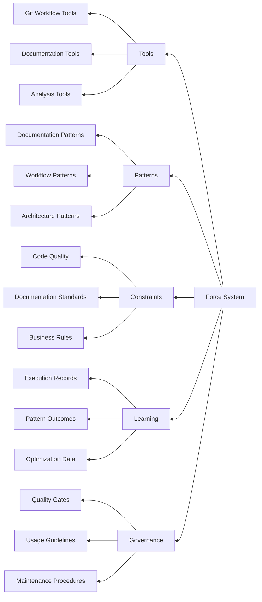

# Force Agentic Development Assistant System

**Version:** 1.0.0  
**Status:** Active Development  
**Last Updated:** June 24, 2025  
**Schema Version:** 1.0.0  

## Overview

The Force system is a comprehensive agentic development assistance framework that records, analyzes, and improves development processes through structured tools, proven patterns, enforceable constraints, and machine learning mechanisms. It serves as a self-improving assistant for agentic and copiloted development efforts.

## System Architecture



## Directory Structure

```plaintext
docs/.force/
├── schemas/                    # JSON schemas for type safety and validation
│   └── force-schema.json      # Master schema for all Force components
├── tools/                     # Agentic development tools with execution parameters
│   └── git-workflow-tools.json
├── patterns/                  # Proven development patterns and best practices
│   └── documentation-patterns.json
├── constraints/               # Enforceable quality rules and standards
│   └── development-constraints.json
├── learning/                  # Machine learning data and insights
│   └── development-learning.json
├── governance/                # System governance and management policies
│   └── system-governance.json
└── README.md                  # This file
```

## Core Components

### 🛠️ Tools

**Purpose:** Actionable development tools with precise execution parameters  
**Format:** JSON objects with comprehensive metadata and validation rules  
**Example Tools:**

- `grouped_commit_workflow` - Intelligent git workflow management
- `documentation_sync_commit` - Documentation synchronization with implementation
- `efficient_command_grouping` - Command optimization for reduced execution overhead
- `project_structure_migration` - Comprehensive project restructuring

### 📋 Patterns

**Purpose:** Proven development patterns for consistent, scalable workflows  
**Format:** Structured documentation with implementation guidance  
**Example Patterns:**

- `modular_documentation_structure` - Professional documentation organization
- `continuous_changelog_pattern` - Real-time progress tracking
- `versioned_project_management` - Scalable project evolution
- `anchor_based_cross_referencing` - Navigable documentation networks

### 🔒 Constraints

**Purpose:** Enforceable quality rules maintaining integrity and standards  
**Format:** Validation rules with automatic enforcement and fixing  
**Example Constraints:**

- `documentation_link_integrity` - Functional internal link validation
- `semantic_versioning_compliance` - SemVer specification adherence
- `git_commit_message_format` - Conventional commit standards
- `version_consistency` - Cross-file version synchronization

### 🧠 Learning

**Purpose:** Historical data collection for continuous system improvement  
**Format:** Structured records of outcomes, metrics, and insights  
**Learning Areas:**

- Tool execution effectiveness and optimization
- Pattern application success rates and refinements
- Constraint violation patterns and resolutions
- Error handling and recovery strategies

### 🏛️ Governance

**Purpose:** System management policies and quality assurance  
**Components:**

- Quality gates for tool and pattern validation
- Learning policies for data collection and model updates
- Usage guidelines for tool selection and application
- Maintenance procedures for system evolution

## Key Features

### Type Safety & Validation

- **Comprehensive JSON Schema** for all components with strict typing
- **Automated validation** of tools, patterns, and constraints
- **Error handling strategies** with fallback mechanisms
- **Performance metrics tracking** for continuous optimization

### Self-Learning Mechanisms

- **Execution outcome recording** with detailed metrics and context
- **Pattern effectiveness analysis** for continuous refinement
- **Constraint compliance monitoring** with automated improvement
- **Performance optimization insights** through data analysis

### Deterministic Execution

- **Precise parameter definitions** with validation rules
- **Conditional execution logic** based on context analysis
- **Error recovery strategies** with multiple fallback options
- **Reproducible outcomes** through standardized procedures

### Professional Documentation

- **Verbose commentary** following documentation best practices
- **Cross-referenced anchors** for navigable information architecture
- **Comprehensive examples** with implementation guidance
- **Living documentation** that evolves with system improvements

## Usage Examples

### Tool Execution

```json
{
  "tool": "grouped_commit_workflow",
  "parameters": {
    "scope": "documentation",
    "semantic_version_increment": "minor"
  },
  "context": {
    "project_phase": "foundation",
    "complexity_level": "medium"
  }
}
```

### Pattern Application

```json
{
  "pattern": "modular_documentation_structure",
  "implementation": {
    "target_directory": "docs",
    "create_symlinks": true,
    "update_internal_links": true
  }
}
```

### Constraint Enforcement

```json
{
  "constraint": "documentation_link_integrity",
  "enforcement": {
    "level": "error",
    "auto_fix": true,
    "validation_scope": "docs/**/*.md"
  }
}
```

## System Benefits

### For Development Teams

- **Reduced cognitive load** through automated best practices
- **Consistent quality standards** across all development activities
- **Faster onboarding** with documented patterns and procedures
- **Continuous improvement** through learning and optimization

### For Project Management

- **Transparent progress tracking** with detailed metrics
- **Risk mitigation** through proven patterns and constraints
- **Quality assurance** with automated validation and enforcement
- **Knowledge preservation** for team transitions and scaling

### For Stakeholders

- **Professional deliverables** meeting enterprise standards
- **Predictable outcomes** through deterministic processes
- **Continuous value delivery** with measurable improvements
- **Reduced project risk** through systematic quality control

## Integration Patterns

### MCP Server Integration

The Force system is designed for integration as an MCP (Model Context Protocol) server, providing:

- **Structured tool definitions** compatible with MCP specifications
- **Type-safe parameter validation** for reliable execution
- **Comprehensive error handling** with graceful degradation
- **Performance monitoring** for optimization insights

### CI/CD Pipeline Integration

- **Automated constraint validation** in build pipelines
- **Quality gate enforcement** for merge requests
- **Documentation synchronization** with code changes
- **Learning data collection** from automated processes

### Development Environment Integration

- **IDE plugin compatibility** for real-time assistance
- **Command-line tool integration** for terminal workflows
- **Git hook integration** for automated quality checks
- **Documentation generation** from system metadata

## Future Development

### Planned Enhancements

- **Visual dependency mapping** for tool and pattern relationships
- **Real-time analytics dashboard** for system performance monitoring
- **Advanced machine learning models** for predictive optimization
- **Multi-project learning** for cross-project pattern recognition

### Expansion Areas

- **Code generation tools** with template-based automation
- **Testing automation patterns** for comprehensive quality assurance
- **Deployment orchestration tools** for production readiness
- **Performance optimization patterns** for scalable applications

## Contributing to Force

### Adding New Tools

1. Define tool using Force schema validation
2. Implement comprehensive error handling
3. Add performance metrics tracking
4. Document with verbose commentary
5. Test across multiple contexts
6. Submit for quality gate review

### Pattern Development

1. Identify recurring successful practices
2. Document context and implementation guidance
3. Provide concrete examples and templates
4. Validate effectiveness across projects
5. Add to pattern library with metadata

### Constraint Definition

1. Identify quality or standards requirement
2. Define validation rules and enforcement level
3. Implement auto-fix mechanisms where possible
4. Test constraint effectiveness
5. Add to constraint library with governance

---

## Schema Compliance

All Force components validate against the master schema located at `schemas/force-schema.json`. This ensures:

- **Type safety** for all tool parameters and execution logic
- **Consistency** across all system components
- **Validation** of new additions before integration
- **Evolution** capability while maintaining backward compatibility

## Support and Documentation

- **Schema Reference:** [force-schema.json](schemas/force-schema.json)
- **Tool Library:** [Git Workflow Tools](tools/git-workflow-tools.json)
- **Pattern Library:** [Documentation Patterns](patterns/documentation-patterns.json)
- **Constraint Library:** [Development Constraints](constraints/development-constraints.json)
- **Learning Data:** [Development Learning](learning/development-learning.json)
- **Governance Policies:** [System Governance](governance/system-governance.json)

---

**Document Control:**

- Created: June 24, 2025 07:47 PST
- Schema Version: 1.0.0
- System Status: Active Development
- Next Review: July 1, 2025
- Maintained By: Development Team
