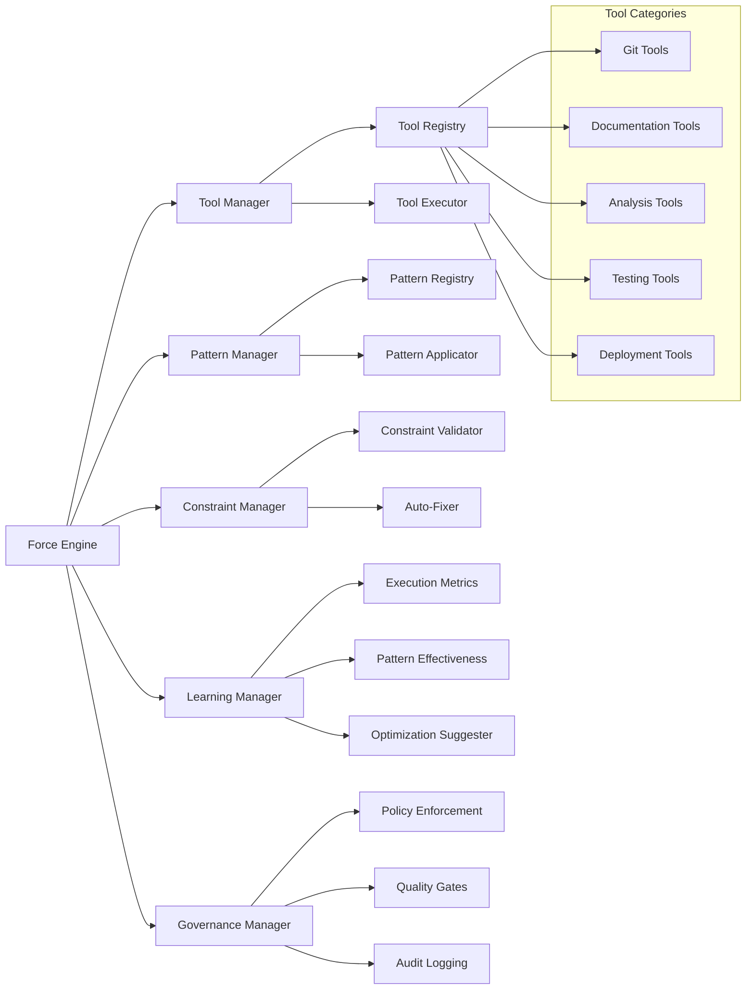
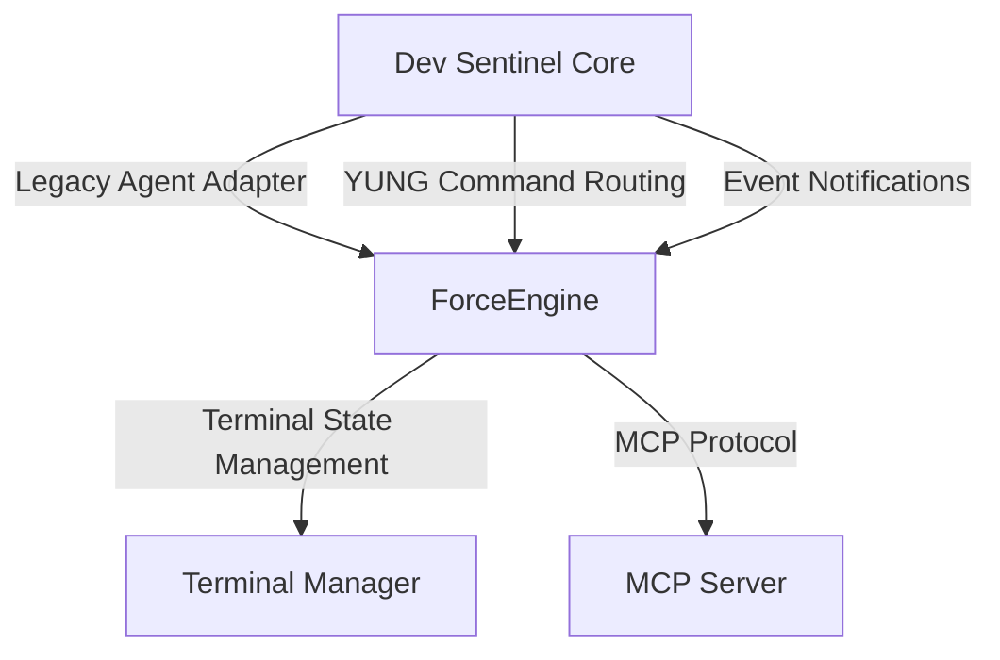

# Force Modularization Architecture

## Overview

This document outlines the modularization scheme for the Force system, including:
1. Agent/Tool Hierarchical Design
2. Component Extensibility Framework
3. Integration Points with Dev Sentinel

## 1. Agent/Tool Hierarchical Design



## 2. Component Extensibility Framework

### Tool Plugin System

Tools are the most extensible component in the Force system. Each tool follows this structure:

1. **Definition**: JSON schema-validated definition in a tool definition file
2. **Implementation**: Python class that inherits from BaseToolExecutor
3. **Registration**: Automatic discovery and registration at runtime

```python
class BaseToolExecutor:
    """Base class for all tool executors."""
    
    def __init__(self, force_engine):
        self.force_engine = force_engine
        
    async def execute(self, parameters, context=None):
        """Execute the tool with the provided parameters."""
        raise NotImplementedError("Tool executors must implement execute()")
        
    def validate_parameters(self, parameters):
        """Validate parameters against tool schema."""
        pass
        
    def get_metadata(self):
        """Return tool metadata."""
        pass
```

### Pattern Extension

Patterns are defined through:
1. **Pattern Definition**: JSON schema-validated definition
2. **Implementation Reference**: Either built-in or custom implementation
3. **Steps**: Sequence of tool executions or custom logic

### Constraint System

Constraints provide validation and enforcement:
1. **Constraint Definition**: JSON schema-validated rules
2. **Validation Logic**: Custom or built-in validators
3. **Auto-Fix Capabilities**: Optional automated corrections

## 3. Integration Points with Dev Sentinel

The Force system integrates with Dev Sentinel through:

1. **Legacy Agent Adapter**: Allows existing agents to use Force tools
2. **YUNG Command Integration**: Routes commands to appropriate Force components
3. **MCP Protocol Support**: Exposes Force capabilities through MCP server
4. **Terminal Manager Integration**: Provides state persistence for Force operations



## Implementation Guidelines

1. **Discovery Mechanism**: Use entry points for tool discovery
2. **Validation**: Always validate against schema before execution
3. **Error Handling**: Implement graceful degradation
4. **Learning**: Collect metrics for optimization
5. **Extension API**: Provide stable API for extensions
