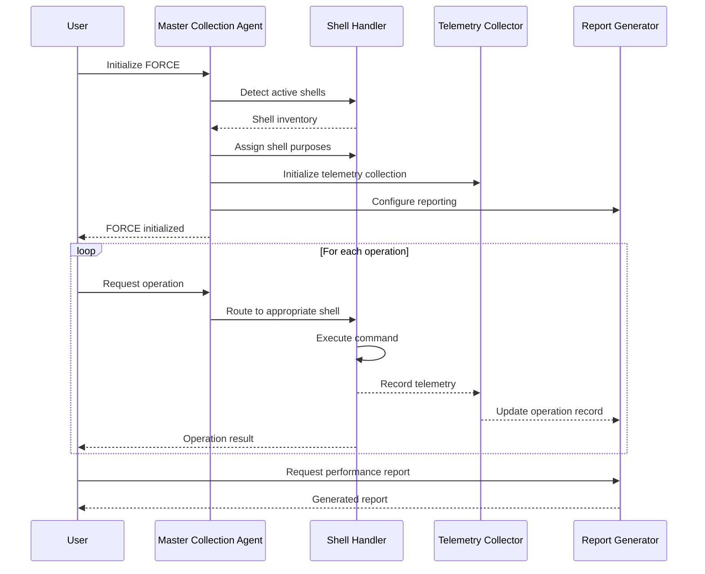

# FORCE: Federated Orchestration & Reporting for Copilot Execution

## Overview

FORCE is an implementation of the YUNG specification that provides a federated approach to agent orchestration, telemetry collection, and operation reporting. It serves as the foundation for multi-agent coordination within a unified copilot workspace.

## Core Principles

1. **Separation of Concerns**: Agents are assigned to specific domains with clear boundaries
2. **Telemetry Collection**: All agent operations are logged and analyzed for performance improvement
3. **Adaptive Shell Management**: Terminal assignments are dynamically allocated based on purpose
4. **Atomic Operations**: All changes follow atomic patterns for better tracking and rollback capability
5. **Self-Learning**: Agents report performance metrics back to a central system for continuous improvement

## Architecture Components

### Master Collection Agent

The Master Collection Agent (MCA) serves as the central orchestration point for all sub-agents. Key responsibilities:

- **Agent Registry**: Maintains a registry of all active agents and their assignments
- **Shell Management**: Allocates and tracks shell environments for different agent tasks
- **Command Validation**: Ensures commands run in appropriate shells based on policies
- **Telemetry Collection**: Aggregates performance data from all sub-agents
- **Performance Analysis**: Analyzes execution patterns to improve future operations
- **Report Generation**: Produces structured reports on agent activities

### Shell Handler

The Shell Handler manages terminal environments with specific responsibilities:

- **Shell Initialization**: Creates and configures shells for specific purposes
- **Command Routing**: Routes commands to appropriate shells based on type
- **Shell State Management**: Tracks active and inactive shells
- **Command Policy Enforcement**: Enforces `run_unlisted_commands` policies

### Telemetry Collector

The Telemetry Collector gathers operational data for analysis:

- **Command Logging**: Records all commands executed by agents
- **Timing Metrics**: Measures execution time for operations
- **Error Tracking**: Captures errors and their resolution workflows
- **Context Switching**: Monitors when agents switch between domains
- **Resource Utilization**: Tracks CPU and memory usage during operations

### Report Generator

The Report Generator produces structured insights from telemetry:

- **Operation Summaries**: Summarizes completed operations
- **Efficiency Analysis**: Calculates efficiency metrics for operations
- **Improvement Recommendations**: Suggests workflow improvements
- **Pattern Recognition**: Identifies common operation sequences
- **Error Analysis**: Reviews error patterns and resolution strategies

## Initialization Process

1. **Environment Detection**: Scan the workspace for current terminal processes
2. **Shell Assignment**: Assign specialized purposes to detected shells
3. **Configuration Creation**: Generate shell configuration file with policies
4. **Registry Initialization**: Create agent registry with roles and permissions
5. **Telemetry Setup**: Establish telemetry collection pipeline
6. **Command Listener Registration**: Register command interception handlers
7. **Directory Structure Creation**: Create YUNG directory structure for artifacts



## Shell Assignment Categories

Shells are assigned to one of the following categories:

| Category | Purpose | Default Command Policy | Typical Commands |
|----------|---------|------------------------|------------------|
| Monitoring | Observe application output | never | docker logs, tail |
| Infrastructure | Manage containers and services | yes-if-relevant | docker-compose, docker |
| Codebase | Handle code and git operations | yes(but in shell more agentically appropriate) | git, filesystem commands |
| Testing | Execute test suites | prompt | pytest, jest |
| Deployment | Handle deployment operations | yes-if-relevant | kubectl, helm |

## Command Execution Policies

The `run_unlisted_commands` property determines how commands are handled:

- **never**: Only explicitly allowed commands can run in this shell
- **always**: Any command can run in this shell
- **prompt**: Request user confirmation before running non-listed commands
- **yes-if-relevant**: Allow if command seems relevant to shell purpose
- **yes(but in shell more agentically appropriate)**: Allow, but suggest better shell
- **yes(in new shell)**: Create new shell for command if not appropriate

## Telemetry Data Structure

```json
{
  "operation_id": "op-uuid",
  "timestamp": "2025-05-01T22:55:00Z",
  "shell": {
    "id": "shell-uuid",
    "pid": 95021,
    "category": "codebase"
  },
  "command": {
    "text": "git commit -m \"fix: handle race condition\"",
    "duration_ms": 235,
    "exit_code": 0
  },
  "context": {
    "previous_commands": ["git add file.py"],
    "working_directory": "/Users/jeremiah/Developer/VibesNow",
    "relevant_files": ["file.py"]
  },
  "resource_usage": {
    "cpu_percent": 2.5,
    "memory_mb": 45.2
  }
}
```

## Reporting Structure

Reports are generated in the following formats:

1. **Session Summary**: Overview of an agent session
2. **Operation Timeline**: Chronological view of operations
3. **Performance Analysis**: Metrics on operation efficiency
4. **Error Report**: Analysis of errors and resolutions
5. **Improvement Suggestions**: Recommendations for future operations

## Integration Points

FORCE integrates with the broader YUNG ecosystem through:

1. **Webhook Reporting**: Sends telemetry to designated webhooks
2. **Pull-based API**: Exposes metrics via local HTTP endpoints
3. **File-based Exchange**: Writes structured reports to designated directories
4. **Stream Processing**: Publishes events to message streams

## Implementation Requirements

To implement FORCE in a project:

1. Create `._YUNG` directory structure
2. Initialize shell configuration file
3. Implement telemetry collection hooks
4. Configure report generation templates
5. Establish command routing logic
6. Set up agent registry

## Compliance Requirements

FORCE implementations must adhere to:

1. **Data Minimization**: Collect only necessary telemetry
2. **Local Processing**: Process telemetry locally when possible
3. **Secure Storage**: Encrypt sensitive telemetry data
4. **User Control**: Allow users to disable telemetry collection
5. **Transparency**: Clearly document what is collected and why

## Roadmap

Future enhancements to FORCE include:

1. **Autonomous Mode**: Self-directing agent operations
2. **Cross-Repository Awareness**: Understanding multi-repo dependencies
3. **Advanced Pattern Recognition**: ML-based workflow optimization
4. **Collaborative Agents**: Multiple agents working in coordination
5. **Predictive Assistance**: Anticipating next required operations

## Version History

- **0.1.0**: Initial specification (2025-05-01)
- **0.2.0**: Enhanced shell management (planned)
- **0.3.0**: Advanced telemetry collection (planned)
- **1.0.0**: Initial stable release (planned)