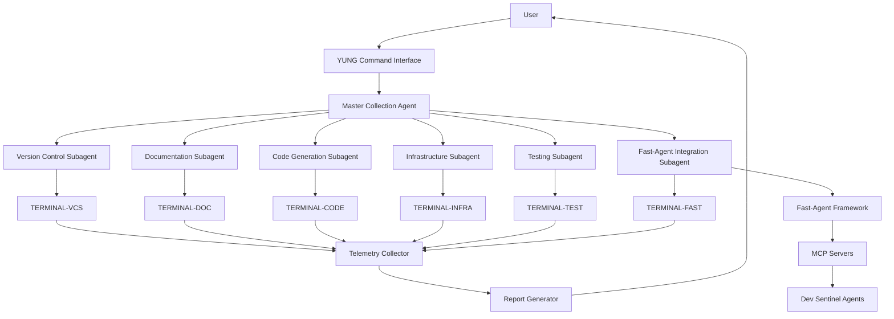
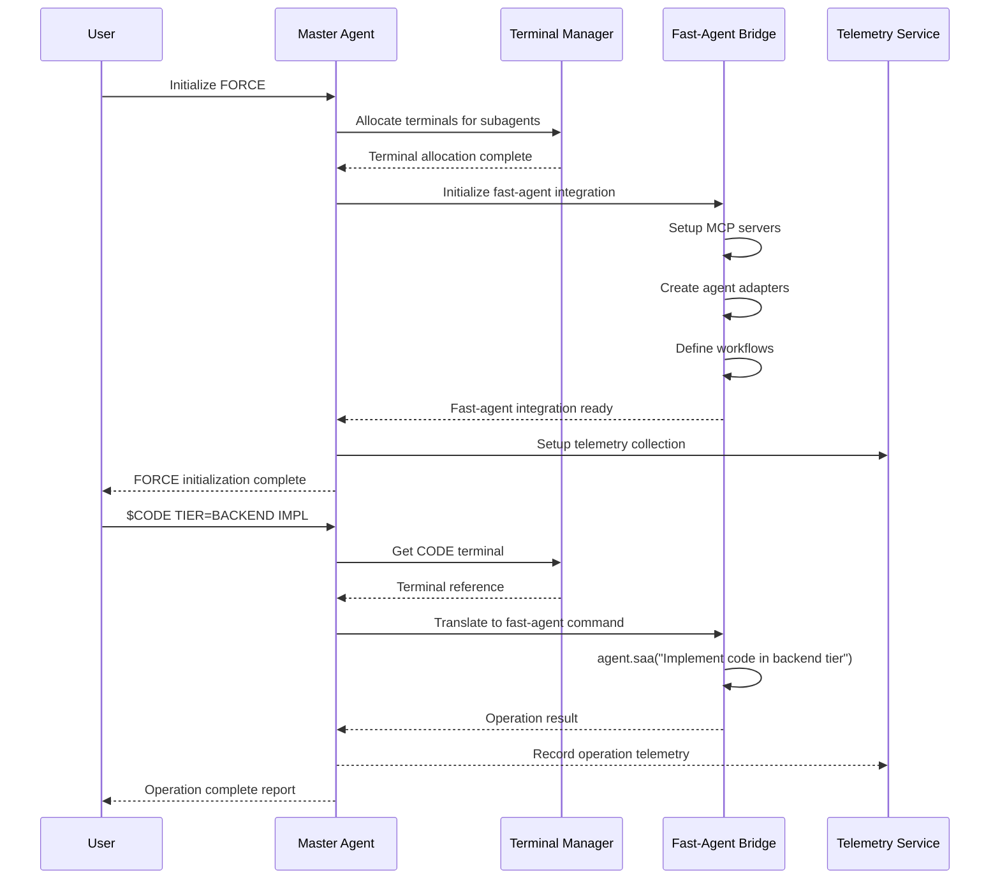

# FORCE: Federated Orchestration & Reporting for Copilot Execution

## Overview

FORCE is an implementation of the YUNG specification that provides a federated approach to agent orchestration, telemetry collection, and operation reporting. It serves as the foundation for multi-agent coordination within a unified copilot workspace.

## Core Principles

1. **Separation of Concerns**: Agents are assigned to specific domains with clear boundaries
2. **Telemetry Collection**: All agent operations are logged and analyzed for performance improvement
3. **Adaptive Shell Management**: Terminal assignments are dynamically allocated based on purpose
4. **Atomic Operations**: All changes follow atomic patterns for better tracking and rollback capability
5. **Self-Learning**: Agents report performance metrics back to a central system for continuous improvement

## Agent Hierarchy and Terminal Allocation

### Master Agent

The Master Agent serves as the orchestration layer for all specialized subagents, following the YUNG universal instruction set. The master agent:

- Interprets and routes YUNG commands to appropriate subagents
- Maintains a persistent terminal for high-level coordination
- Manages the lifecycle of all subagents
- Consolidates reporting from all subagents

**YUNG Syntax**: `$MASTER [ACTION] [OPTIONS]`

**Terminal**: Master terminal (ID: TERMINAL-MASTER)

### Subagent Definitions

Each subagent operates within a specific domain and maintains its own dedicated terminal that persists across operations within that domain.

#### 1. Version Control Subagent

**Topic**: Version Control
**Tasks**:
- Repository initialization and configuration
- Branch management
- Commit operations
- Code merge and conflict resolution
- Remote repository synchronization

**YUNG Syntax**: `$VCS [ACTION] [SCOPE] [OPTIONS]`

**Examples**:
```
$VCS COMMIT "Fix race condition in auth service"
$VCS BRANCH new dev-feature-x
$VCS MERGE feature-branch main
```

**Terminal**: Version Control terminal (ID: TERMINAL-VCS)

#### 2. Documentation Subagent

**Topic**: Documentation
**Tasks**:
- README generation and updates
- API documentation maintenance
- Code comment quality assessment
- Documentation gap analysis
- Documentation format standardization

**YUNG Syntax**: `$VIC [SCOPE] [OPTIONS]`

**Examples**:
```
$VIC DOCS
$VIC FILE=README.md
$VIC ALL
```

**Terminal**: Documentation terminal (ID: TERMINAL-DOC)

#### 3. Code Generation Subagent

**Topic**: Code Generation
**Tasks**:
- Implementation of new features
- Code refactoring
- Bug fixes
- Test generation
- Performance optimizations

**YUNG Syntax**: `$CODE [SCOPE] [ACTIONS] [STAGE]`

**Examples**:
```
$CODE TIER=BACKEND IMPL
$CODE TIER=ALL TEST
$CODE ALL PKG=tgz Stage F-1
```

**Terminal**: Code Generation terminal (ID: TERMINAL-CODE)

#### 4. Infrastructure Subagent

**Topic**: Infrastructure
**Tasks**:
- Container management
- Service orchestration
- CI/CD pipeline management
- Environment configuration
- Deployment operations

**YUNG Syntax**: `$INFRA [SERVICE] [ACTION] [OPTIONS]`

**Examples**:
```
$INFRA DOCKER BUILD .
$INFRA K8S DEPLOY deploy.yaml
$INFRA ENV SET production
```

**Terminal**: Infrastructure terminal (ID: TERMINAL-INFRA)

#### 5. Testing Subagent

**Topic**: Testing
**Tasks**:
- Unit test execution
- Integration test execution
- Test report generation
- Coverage analysis
- Performance testing

**YUNG Syntax**: `$TEST [TYPE] [SCOPE] [OPTIONS]`

**Examples**:
```
$TEST UNIT src/auth
$TEST INTEGRATION ALL
$TEST COVERAGE --report=xml
```

**Terminal**: Testing terminal (ID: TERMINAL-TEST)

#### 6. Fast-Agent Integration Subagent

**Topic**: Fast-Agent Integration
**Tasks**:
- MCP server management
- Fast-agent workflow orchestration
- Model switching and configuration
- Fast-agent API integration
- Performance monitoring

**YUNG Syntax**: `$FAST [ACTION] [OPTIONS] [MODEL]`

**Examples**:
```
$FAST WORKFLOW run researcher
$FAST MODEL switch o3-mini
$FAST SERVER restart documentation
```

**Terminal**: Fast-Agent terminal (ID: TERMINAL-FAST)

## Terminal Persistence and State Management

Each subagent's terminal maintains state across operations within its domain. The state includes:

1. **Working Context**: Current directory, active branches, relevant files
2. **Operation History**: Recent commands and their outcomes
3. **Resource Allocations**: CPU/memory resources assigned
4. **Cached Assets**: Frequently accessed files or command outputs
5. **Configuration Context**: Environment variables and settings

```json
{
  "terminal_id": "TERMINAL-VCS",
  "subagent": "version_control",
  "state": {
    "working_directory": "/Users/jeremiah/Developer/dev_sentinel",
    "active_branch": "fast-agent-integration",
    "last_commands": [
      {"command": "git status", "timestamp": "2025-05-01T22:55:00Z", "exit_code": 0},
      {"command": "git add integration/", "timestamp": "2025-05-01T22:56:30Z", "exit_code": 0}
    ],
    "tracked_files": [
      "integration/fast_agent/adapter.py",
      "integration/fast_agent/setup.py"
    ],
    "env_vars": {
      "GIT_AUTHOR_NAME": "Dev Sentinel",
      "GIT_AUTHOR_EMAIL": "sentinel@example.com"
    }
  }
}
```

## Cross-Agent Communication

Subagents communicate through structured message passing using the following patterns:

1. **Command Delegation**: Master agent delegates YUNG commands to subagents
2. **Event Notification**: Subagents publish events for other interested subagents
3. **Resource Request**: Subagents request resources or information from other subagents
4. **Completion Report**: Subagents report task completion to the master agent

Message structure follows YUNG integration requirements:

```json
{
  "messageId": "msg-uuid",
  "correlationId": "task-uuid",
  "sender": {
    "agentId": "code_generation",
    "agentType": "CodeSubagent"
  },
  "recipient": {
    "agentId": "version_control",
    "agentType": "VCSSubagent"
  },
  "messageType": "Command",
  "priority": "Normal",
  "payload": {
    "command": "$VCS COMMIT",
    "options": {
      "message": "Implement fast-agent integration adapter",
      "files": ["integration/fast_agent/adapter.py"]
    }
  },
  "timestamp": "2025-05-01T23:15:00Z"
}
```

## Fast-Agent Integration Architecture

The integration with fast-agent follows a layered approach:

1. **Command Interpretation Layer**:
   - Translates YUNG commands to fast-agent workflows
   - Routes commands to appropriate MCP servers

2. **MCP Server Layer**:
   - Provides Model Context Protocol servers for Dev Sentinel capabilities
   - Maps Dev Sentinel operations to fast-agent compatible formats

3. **Agent Adapter Layer**:
   - Wraps Dev Sentinel agents in fast-agent compatible interfaces
   - Provides bidirectional message translation

4. **Workflow Definition Layer**:
   - Defines fast-agent workflows that utilize Dev Sentinel agents
   - Creates chains and orchestrations across multiple agents



## Implementation Process

To implement this architecture:

1. **Terminal Manager Setup**:
   - Create a terminal manager service that allocates and tracks terminals
   - Implement terminal state persistence
   - Configure terminal-specific environment variables

2. **Subagent Implementation**:
   - Create a subagent base class implementing common functionality
   - Extend base class for each specialized subagent
   - Implement YUNG command parsing for each subagent

3. **Fast-Agent Integration**:
   - Implement fast-agent adapters for Dev Sentinel agents
   - Create MCP servers for Dev Sentinel capabilities
   - Define fast-agent workflows that utilize Dev Sentinel agents

4. **Master Agent Implementation**:
   - Create master agent for YUNG command routing
   - Implement subagent lifecycle management
   - Create reporting aggregation services

5. **Telemetry and Reporting**:
   - Implement telemetry collection across all terminals
   - Create unified reporting system
   - Implement performance analysis

## Fast-Agent YUNG Command Mappings

The following mappings translate between YUNG commands and fast-agent operations:

| YUNG Command | Fast-Agent Operation |
|--------------|---------------------|
| `$VIC [SCOPE]` | agent.cdia("Validate integrity with scope [SCOPE]") |
| `$VIC DOCS` | agent.rdia("Validate documentation integrity") |
| `$CODE TIER=X IMPL` | agent.saa("Implement code in tier X") |
| `$VCS COMMIT "msg"` | agent.vcma("Commit changes with message: msg") |
| `$FAST WORKFLOW run X` | await agent.X() |
| `$FAST SERVER restart X` | (Restart MCP server X) |

## Initialization Sequence



## Architecture Benefits

This integration architecture provides the following benefits:

1. **Domain Specialization**: Each subagent focuses on a specific domain with dedicated tools and context
2. **Context Persistence**: Terminal state persists across operations within a domain
3. **Unified Command Interface**: YUNG provides a consistent interface across all agents
4. **Enhanced Capabilities**: Fast-agent integration adds MCP capabilities to Dev Sentinel
5. **Comprehensive Telemetry**: All operations are tracked across the system
6. **Flexible Scalability**: New subagents and capabilities can be added with minimal changes
7. **Technology Agnosticism**: Architecture supports multiple agent technologies and frameworks