# Dev Sentinel: Force-Enabled Autonomous Development Platform

<div align="center">
  
  
  **Version: 2.0.0**  
  **Date: June 24, 2025**  
  **Author: Jeremiah Pegues <jeremiah@pegues.io>**  
  **Organization: Pegues OPSCORP LLC**  
  **License: [MIT](LICENSE-MIT.md)**
  
  [](https://www.python.org/)
  [](docs/.force/README.md)
  [](docs/diagrams/)
  [](docs/.force/)
</div>

## 📋 Overview

Dev Sentinel is a modernized, schema-driven autonomous development platform that combines proven agent-based architecture with the sophisticated Force agentic framework. The system provides comprehensive development assistance through intelligent tools, proven patterns, automated constraints, continuous learning, and governance enforcement.

### 🚀 What's New in Version 2.0

- **Force System Integration**: Complete schema-driven development framework
- **Enhanced MCP Support**: Advanced Model Context Protocol integration for VS Code
- **Self-Learning Capabilities**: System learns and optimizes from usage patterns
- **Governance Framework**: Automated quality gates and compliance enforcement
- **Pattern-Driven Development**: Codified best practices with measurable outcomes
- **Advanced Tool System**: Parameterized, validated tools with comprehensive error handling

### Key Features

- **🛠️ Schema-Driven Tools**: Validated, parameterized development tools with comprehensive monitoring
- **📋 Pattern Management**: Proven development workflows with context-aware application
- **🔒 Constraint Enforcement**: Automated quality gates with auto-fix capabilities
- **🧠 Learning System**: Continuous optimization through execution analytics and pattern recognition
- **🏛️ Governance Framework**: Policy enforcement with configurable quality gates
- **🤖 Autonomous Agents**: Legacy agent compatibility with modern Force integration
- **📊 Real-time Analytics**: Performance monitoring and optimization insights
- **🔌 MCP Integration**: Full Model Context Protocol support with Force capabilities
- **🔄 Version Control Intelligence**: Advanced git workflow management with semantic versioning
- **📚 Documentation Quality**: Automated analysis, validation, and synchronization

## 🏛️ System Architecture

Dev Sentinel is built on a modular, event-driven architecture with specialized agents that communicate through a central message bus. The diagram below illustrates the high-level architecture:

<details>
<summary>System Architecture Diagram (PlantUML)</summary>

```plantuml
@startuml Dev Sentinel Architecture Overview
!theme plain
skinparam backgroundColor transparent
skinparam defaultFontSize 14
skinparam componentStyle rectangle
skinparam linetype ortho

' Define colors
!$core_color = "#4D7A97"
!$agent_color = "#6597B2"
!$integration_color = "#F3B95F"
!$external_color = "#93A1A1"
!$message_color = "#D6EAF8"
!$task_color = "#FADBD8"

' Set component styles
skinparam component {
    BackgroundColor<<Core>> $core_color
    BackgroundColor<<Agent>> $agent_color
    BackgroundColor<<Integration>> $integration_color
    BackgroundColor<<External>> $external_color
    BorderColor black
    ArrowColor black
}

' Core Components
package "Dev Sentinel Core" {
    component "Message Bus" as MB <<Core>> {
        component "Topic Registry" as TR
        component "Subscription Manager" as SM
        component "Message Queue" as MQ
    }
    component "Task Manager" as TM <<Core>> {
        component "Task Queue" as TQ
        component "Task Dispatcher" as TD
        component "Result Collector" as RC
    }
    interface "Agent API" as API
}

' Agent Components
package "Specialized Agents" {
    component "Version Control\nMaster Agent\n(VCMA)" as VCMA <<Agent>> {
        component "Repository Monitor" as RM
        component "Commit Analyzer" as CA
        component "VCLA Coordinator" as VC
    }
    component "Version Control\nListener Agent\n(VCLA)" as VCLA <<Agent>> {
        component "Path Monitor" as PM
        component "Change Detector" as CD
    }
    component "Code Documentation\nInspector Agent\n(CDIA)" as CDIA <<Agent>> {
        component "DocString Parser" as DSP
        component "Coverage Analyzer" as COA
    }
    component "README\nInspector Agent\n(RDIA)" as RDIA <<Agent>> {
        component "Markdown Parser" as MP
        component "Section Validator" as SV
    }
    component "Static Analysis\nAgent\n(SAA)" as SAA <<Agent>> {
        component "Multi-language\nAnalyzer" as MLA
        component "Issue Detector" as ID
    }
}

' Integration Layer
package "Integration Layer" {
    component "FORCE" as FORCE <<Integration>> {
        component "Terminal Manager" as TM_FORCE
        component "Command Processor" as CP_FORCE
        component "Master Agent" as MA_FORCE
    }
    component "Fast-Agent" as FAST <<Integration>> {
        component "Adapter" as ADAPTER
        component "MCP Servers" as MCP
    }
    component "Diagram Generator" as DIAG <<Integration>> {
        component "PlantUML Engine" as PUML
        component "Mermaid Engine" as MERM
    }
}

' External Systems
package "External Systems" {
    component "Git" as GIT <<External>>
    component "CI/CD" as CICD <<External>>
    component "Development\nEnvironment" as IDE <<External>>
}

' Core Connections
MB -- API : provides >
API -- TM : coordinates >

' Agent connections to core
VCMA -- API : implements >
VCLA -- API : implements >
CDIA -- API : implements >
RDIA -- API : implements >
SAA -- API : implements >

' Agent relationships
VCMA *-- VCLA : coordinates >
VCMA -- CDIA : notifies changes >
VCMA -- RDIA : triggers inspection >
CDIA -- SAA : shares analysis >

' Integration connections
FORCE -- MB : subscribes to >
FAST -- FORCE : extends >
DIAG -- MB : monitors >

' External system connections
VCMA --- GIT : manages >
VCLA --- GIT : monitors >
FAST --- CICD : integrates with >
IDE --- FORCE : commands from >

' Message flow examples
MB ..> VCMA : "vc.commit_analyzed" #$message_color
VCMA ..> MB : "vc.new_commits" #$message_color
MB ..> CDIA : "vc.file_changed" #$message_color
CDIA ..> MB : "cdia.inspection_complete" #$message_color
TM ..> SAA : "analyze_code_task" #$task_color
SAA ..> TM : "task_result" #$task_color

@enduml
```
</details>

<details>
<summary>System Architecture Diagram (Mermaid)</summary>

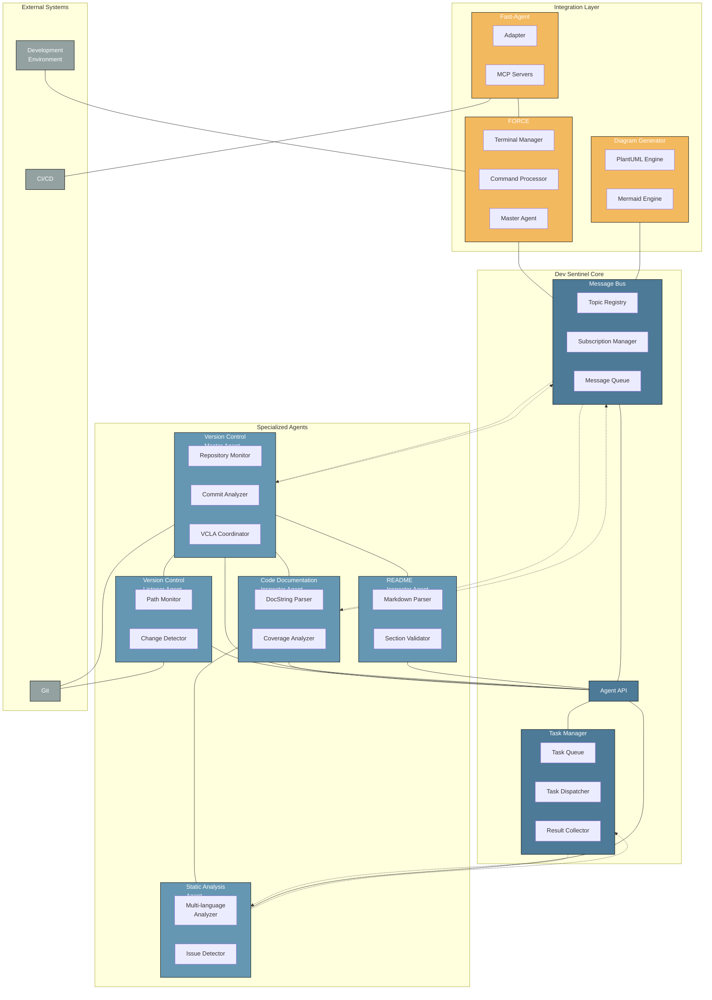
</details>

### Core Components

The Dev Sentinel system is built around these core components:

#### Message Bus

The Message Bus provides a pub/sub mechanism for asynchronous communication between agents:

<details>
<summary>Message Bus Architecture (PlantUML)</summary>

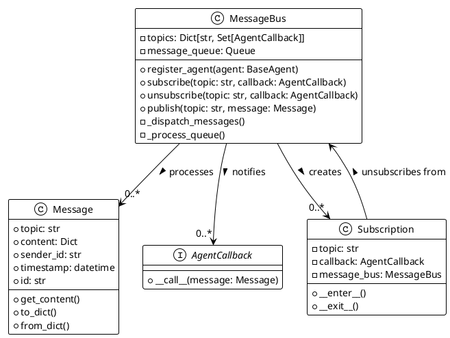
</details>

<details>
<summary>Message Bus Architecture (Mermaid)</summary>

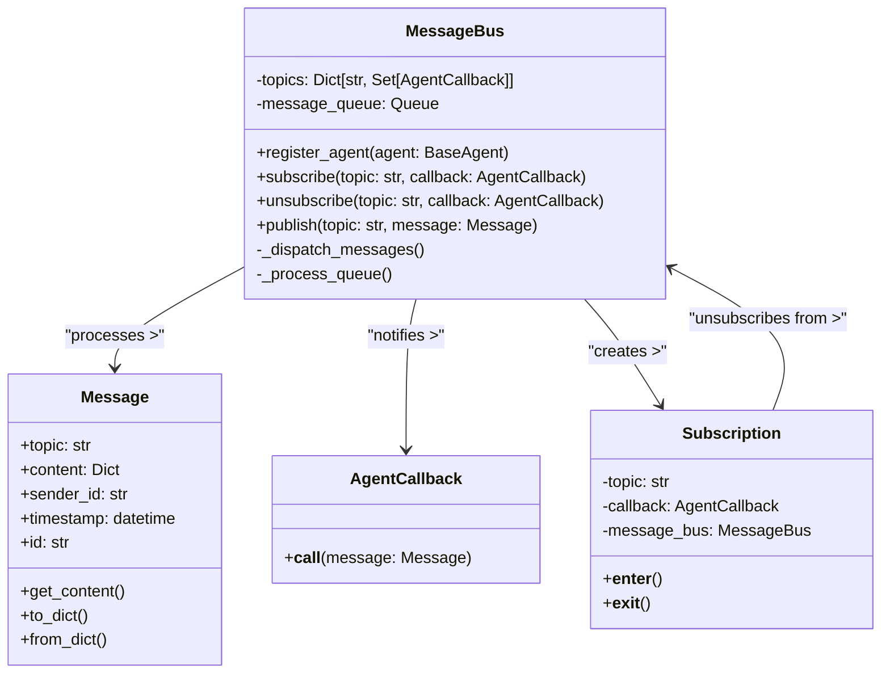
</details>

The Message Bus uses a topic-based publish-subscribe pattern, allowing agents to communicate without direct dependencies.

#### Task Manager

Handles the creation, distribution, and tracking of tasks across the system, enabling asynchronous workload management.

<details>
<summary>Task Manager Architecture (PlantUML)</summary>

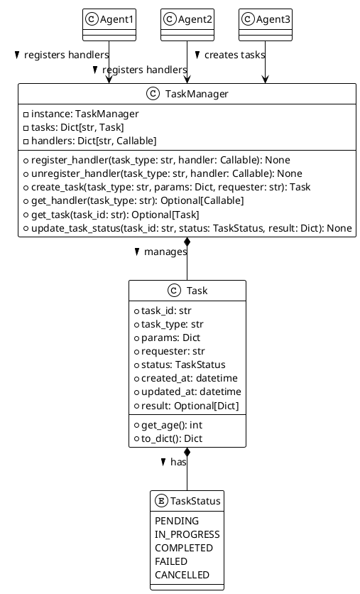
</details>

<details>
<summary>Task Manager Architecture (Mermaid)</summary>

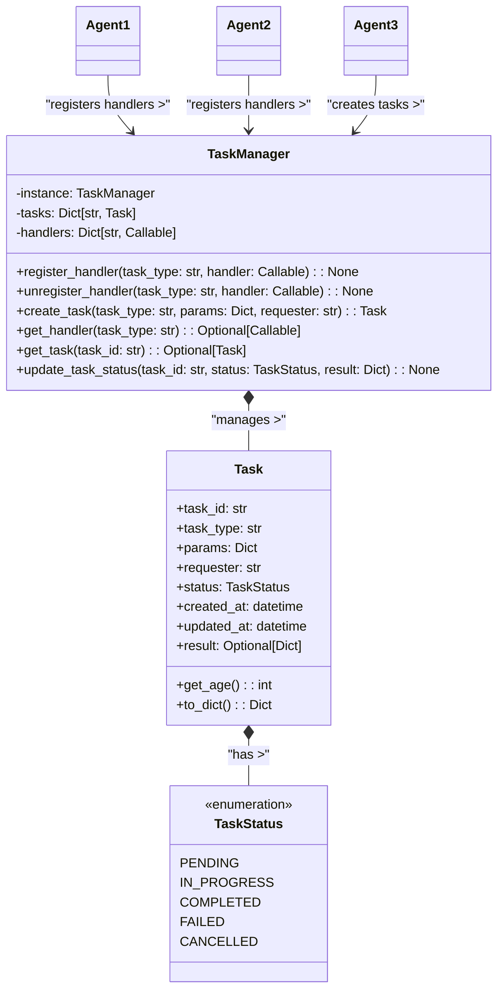
</details>

#### BaseAgent

The foundation for all agent implementations in the system, providing common functionality and lifecycle management.

<details>
<summary>BaseAgent Architecture (PlantUML)</summary>

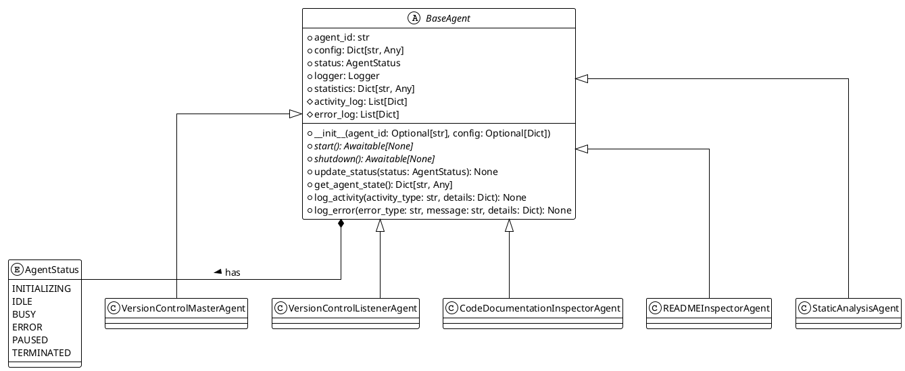
</details>

<details>
<summary>BaseAgent Architecture (Mermaid)</summary>

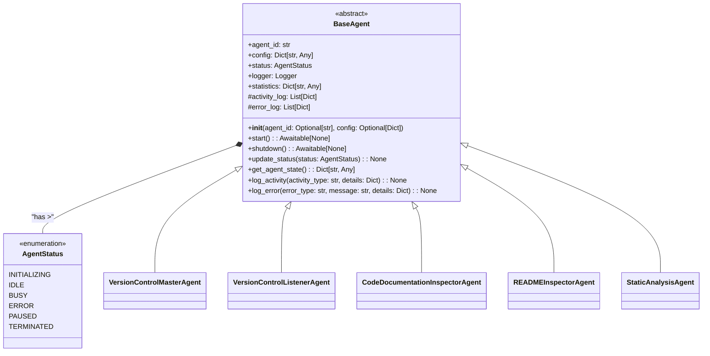
</details>

## 🤖 Agent Components

Dev Sentinel uses specialized agents for different aspects of the development workflow:

### Version Control Master Agent (VCMA)

Proactively manages version control operations by observing code changes and making intelligent decisions about when and what to commit.

<details>
<summary>VCMA Architecture (PlantUML)</summary>

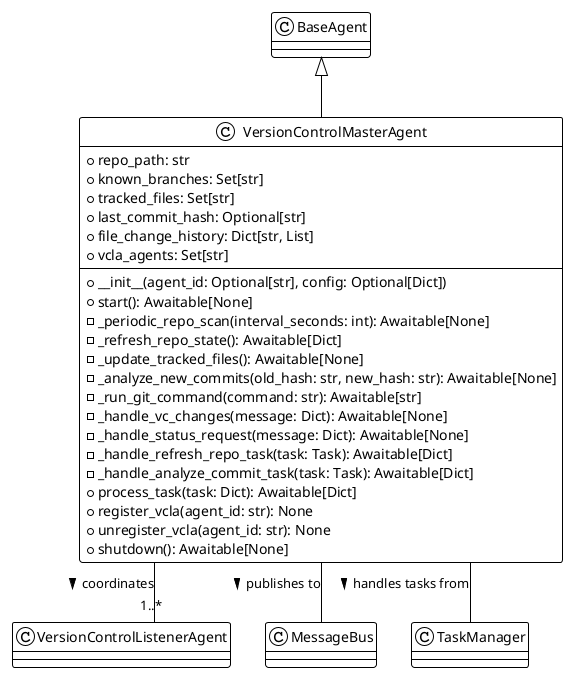
</details>

<details>
<summary>VCMA Architecture (Mermaid)</summary>

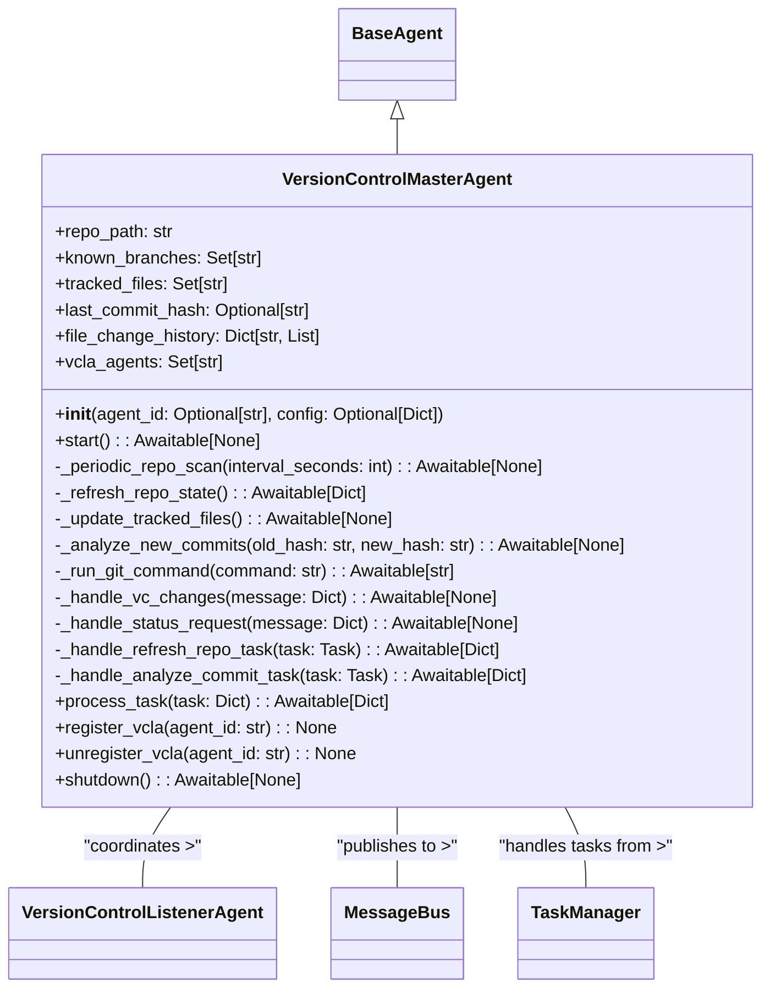
</details>

**Key Responsibilities:**
- Repository state tracking and versioning
- Commit analysis and history management
- VCLA coordination and delegation
- Smart commit decision-making

[View the complete VCMA specification](vc_master_agent_spec.md)

### Version Control Listener Agent (VCLA)

Monitors specific aspects of the repository, focusing on particular paths, file types, or behaviors as delegated by the VCMA.

<details>
<summary>VCLA Architecture (PlantUML)</summary>

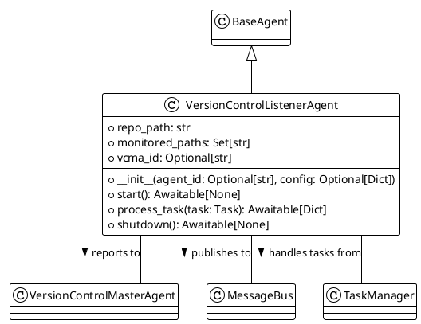
</details>

<details>
<summary>VCLA Architecture (Mermaid)</summary>

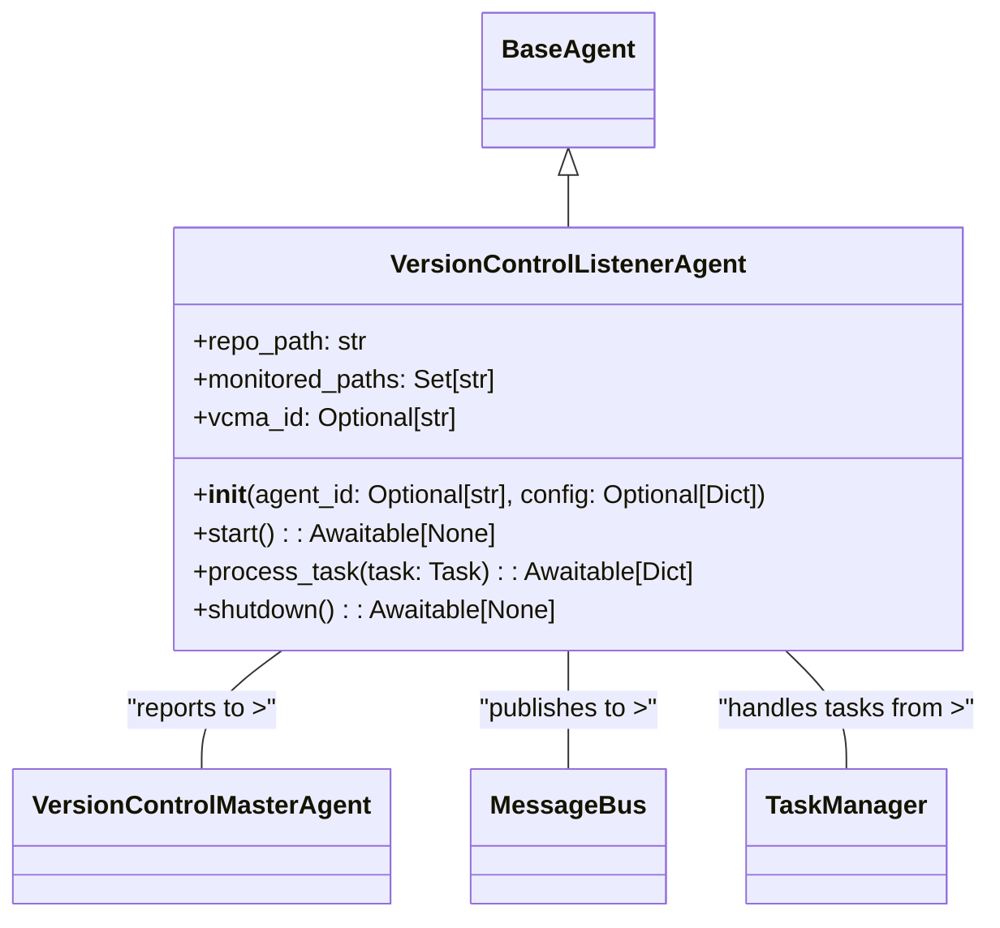
</details>

**Key Responsibilities:**
- Path-specific file monitoring
- Change detection and notification
- Specialized observation of repository components

[View the complete VCLA specification](vc_listener_agent_spec.md)

### Code Documentation Inspector Agent (CDIA)

Evaluates and improves in-code documentation quality across a codebase, supporting multiple programming languages.

<details>
<summary>CDIA Architecture (PlantUML)</summary>

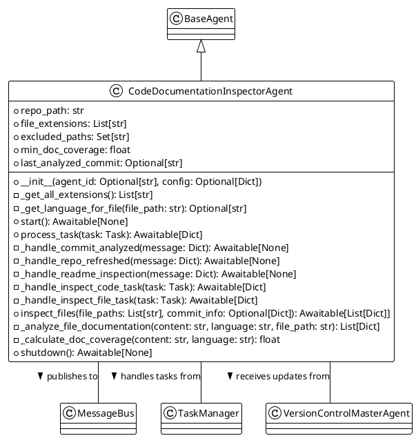
</details>

<details>
<summary>CDIA Architecture (Mermaid)</summary>

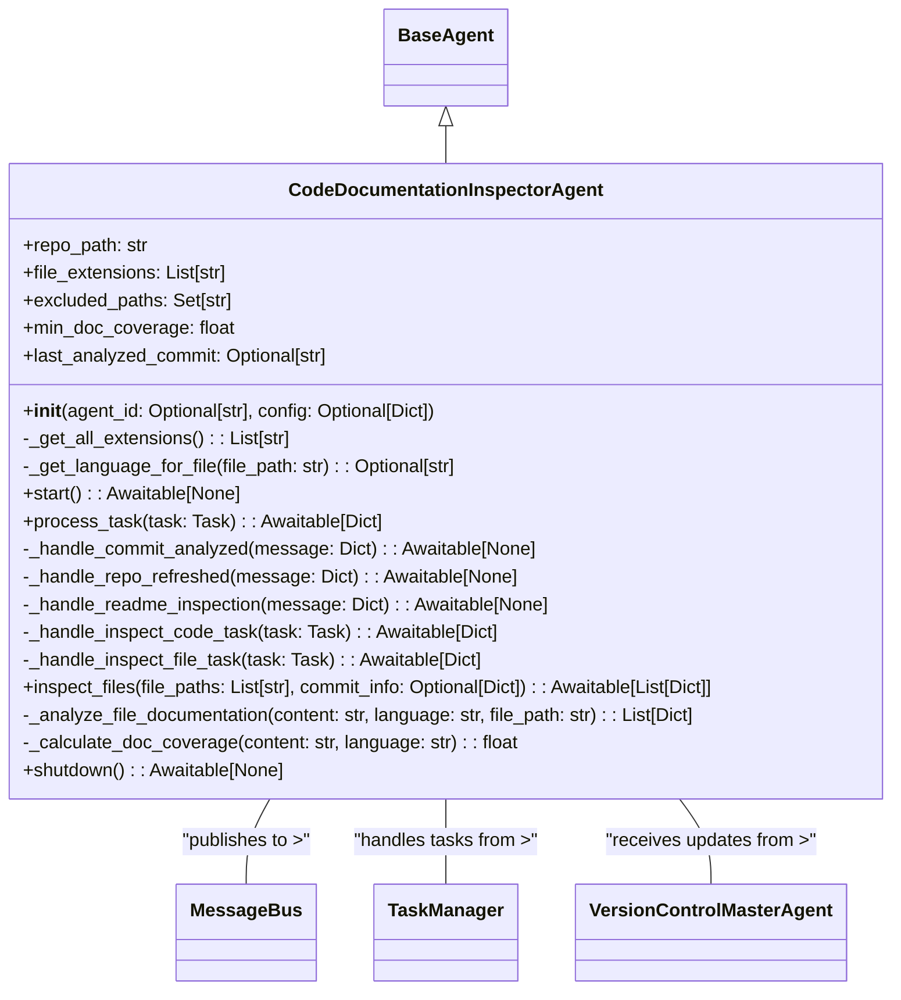

</details>

**Key Responsibilities:**
- Documentation pattern detection
- Coverage calculation and reporting
- Multi-language support
- Issue identification and notification

[View the complete CDIA specification](code_doc_inspector_agent_spec.md)

### README Inspector Agent (RDIA)

Ensures README files align with best practices, providing suggestions for improvement.

<details>
<summary>RDIA Architecture (PlantUML)</summary>

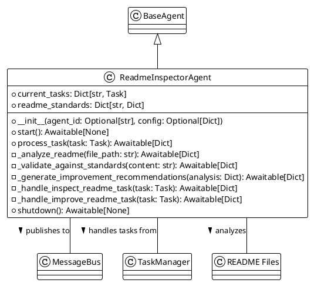
</details>

<details>
<summary>RDIA Architecture (Mermaid)</summary>

```mermaid
classDiagram
    class ReadmeInspectorAgent {
        +current_tasks: Dict[str, Task]
        +readme_standards: Dict[str, Dict]
        +__init__(agent_id: Optional[str], config: Optional[Dict])
        +start(): Awaitable[None]
        +process_task(task: Task): Awaitable[Dict]
        -_analyze_readme(file_path: str): Awaitable[Dict]
        -_validate_against_standards(content: str): Awaitable[Dict]
        -_generate_improvement_recommendations(analysis: Dict): Awaitable[Dict]
        -_handle_inspect_readme_task(task: Task): Awaitable[Dict]
        -_handle_improve_readme_task(task: Task): Awaitable[Dict]
        +shutdown(): Awaitable[None]
    }

    BaseAgent <|-- ReadmeInspectorAgent

    ReadmeInspectorAgent -- MessageBus : "publishes to >"
    ReadmeInspectorAgent -- TaskManager : "handles tasks from >"
    ReadmeInspectorAgent -- "README Files" : "analyzes >"
```
</details>

**Key Responsibilities:**
- README section validation
- Content quality assessment
- Markdown structure analysis
- Cross-referencing with codebase

[View the complete RDIA specification](readme_inspector_agent_spec.md)

### Static Analysis Agent (SAA)

Analyzes code for potential issues, security vulnerabilities, and adherence to best practices.

<details>
<summary>SAA Architecture (PlantUML)</summary>

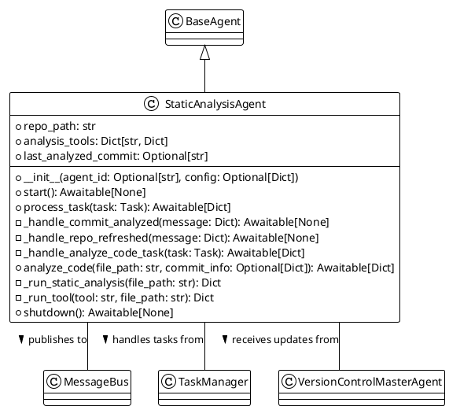
</details>

<details>
<summary>SAA Architecture (Mermaid)</summary>

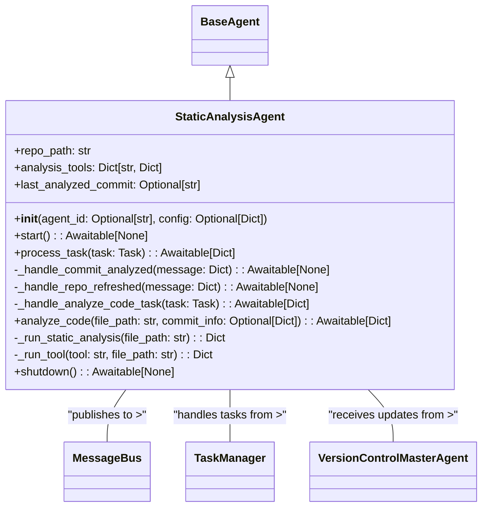
</details>

**Key Responsibilities:**
- Multi-language code analysis
- Code quality issue detection
- Static analysis tool integration
- Issue reporting and tracking

## 🔌 Integration Architecture

### FORCE: Federated Orchestration & Reporting

The [FORCE architecture](FORCE.spec.md) provides a federated approach to agent orchestration, telemetry collection, and operation reporting:

<details>
<summary>FORCE Architecture (PlantUML)</summary>

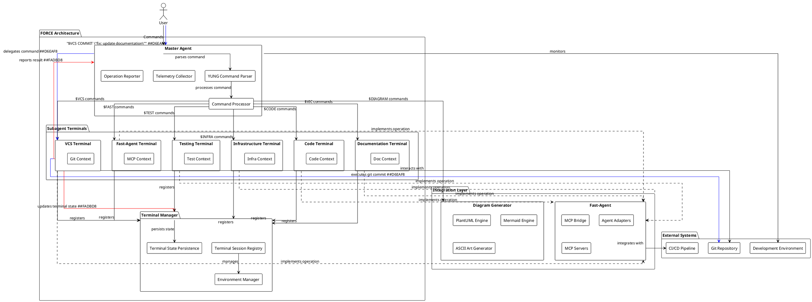
</details>

<details>
<summary>FORCE Architecture (Mermaid)</summary>

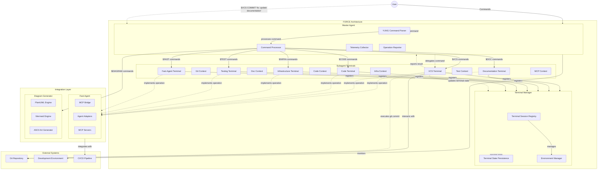
</details>

### Terminal State Management

The Terminal Manager maintains persistent state for each specialized agent terminal:

<details>
<summary>Terminal State Management (PlantUML)</summary>

```plantuml
@startuml Terminal State Management
!theme plain
skinparam backgroundColor transparent
skinparam defaultFontSize 14
skinparam linetype ortho

class TerminalSession {
  +terminal_id: str
  +subagent_name: str
  +working_dir: str
  +env_vars: Dict[str, str]
  +command_history: List[Dict]
  +active: bool
  +last_active: datetime
  +tracked_files: List[str]
  +cached_assets: Dict[str, Any]
  +initialize(): bool
  +execute_command(command: str): Dict[str, Any]
  +get_state(): Dict[str, Any]
  +update_state(state_updates: Dict[str, Any]): None
  +add_to_history(command: str, result: Dict): None
  +get_history(limit: int): List[Dict]
  +get_tracked_files(): List[str]
  +add_tracked_file(file_path: str): None
  +remove_tracked_file(file_path: str): None
}

class TerminalManager {
  -instance: TerminalManager
  +terminals: Dict[str, TerminalSession]
  +state_dir: str
  +create_terminal(subagent_name: str, terminal_id: str, working_dir: str): str
  +get_terminal(terminal_id: str): Optional[TerminalSession]
  +execute_in_terminal(terminal_id: str, command: str): Dict[str, Any]
  -_save_terminal_state(terminal: TerminalSession): None
  -_load_terminal_state(terminal_id: str): Optional[TerminalSession]
  +get_or_create_terminal(subagent_name: str): TerminalSession
  +list_terminals(): List[Dict[str, Any]]
  +get_terminal_state(terminal_id: str): Dict[str, Any]
  +update_terminal_state(terminal_id: str, state_updates: Dict): None
  +restore_terminal_state(terminal_id: str): bool
}

class TerminalSessionState {
  +terminal_id: str
  +subagent_name: str
  +working_dir: str
  +env_vars: Dict[str, str]
  +command_history: List[Dict]
  +active: bool
  +last_active: datetime
  +tracked_files: List[str]
  +cached_assets: Dict[str, Any]
  +to_dict(): Dict[str, Any]
  +from_dict(data: Dict): TerminalSessionState
  +save_to_file(file_path: str): None
  +load_from_file(file_path: str): TerminalSessionState
}

class TerminalCommand {
  +command: str
  +timestamp: datetime
  +result: Dict
  +execution_time: float
  +to_dict(): Dict[str, Any]
  +from_dict(data: Dict): TerminalCommand
}

TerminalManager o-- "0..*" TerminalSession : manages
TerminalSession *-- "1" TerminalSessionState : has state
TerminalSession *-- "0..*" TerminalCommand : has history

@enduml
```
</details>

<details>
<summary>Terminal State Management (Mermaid)</summary>

```mermaid
classDiagram
    class TerminalSession {
        +terminal_id: str
        +subagent_name: str
        +working_dir: str
        +env_vars: Dict[str, str]
        +command_history: List[Dict]
        +active: bool
        +last_active: datetime
        +tracked_files: List[str]
        +cached_assets: Dict[str, Any]
        +initialize(): bool
        +execute_command(command: str): Dict[str, Any]
        +get_state(): Dict[str, Any]
        +update_state(state_updates: Dict[str, Any]): None
        +add_to_history(command: str, result: Dict): None
        +get_history(limit: int): List[Dict]
        +get_tracked_files(): List[str]
        +add_tracked_file(file_path: str): None
        +remove_tracked_file(file_path: str): None
    }

    class TerminalManager {
        -instance: TerminalManager
        +terminals: Dict[str, TerminalSession]
        +state_dir: str
        +create_terminal(subagent_name: str, terminal_id: str, working_dir: str): str
        +get_terminal(terminal_id: str): Optional[TerminalSession]
        +execute_in_terminal(terminal_id: str, command: str): Dict[str, Any]
        -_save_terminal_state(terminal: TerminalSession): None
        -_load_terminal_state(terminal_id: str): Optional[TerminalSession]
        +get_or_create_terminal(subagent_name: str): TerminalSession
        +list_terminals(): List[Dict[str, Any]]
        +get_terminal_state(terminal_id: str): Dict[str, Any]
        +update_terminal_state(terminal_id: str, state_updates: Dict): None
        +restore_terminal_state(terminal_id: str): bool
    }

    class TerminalSessionState {
        +terminal_id: str
        +subagent_name: str
        +working_dir: str
        +env_vars: Dict[str, str]
        +command_history: List[Dict]
        +active: bool
        +last_active: datetime
        +tracked_files: List[str]
        +cached_assets: Dict[str, Any]
        +to_dict(): Dict[str, Any]
        +from_dict(data: Dict): TerminalSessionState
        +save_to_file(file_path: str): None
        +load_from_file(file_path: str): TerminalSessionState
    }

    class TerminalCommand {
        +command: str
        +timestamp: datetime
        +result: Dict
        +execution_time: float
        +to_dict(): Dict[str, Any]
        +from_dict(data: Dict): TerminalCommand
    }

    TerminalManager o-- "0..*" TerminalSession : manages
    TerminalSession *-- "1" TerminalSessionState : has state
    TerminalSession *-- "0..*" TerminalCommand : has history
```
</details>

## � MCP Integration

Dev Sentinel provides modern integration with the Model Context Protocol (MCP), enabling seamless integration with VS Code and other MCP-compatible development tools. The MCP integration allows you to interact with Dev Sentinel agents directly from your development environment.

### Features

- **Direct Tool Integration**: Access Dev Sentinel capabilities as VS Code tools
- **Async Command Processing**: Full async/await support for responsive interactions
- **Agent-Specific Adapters**: Specialized adapters for each agent type with tailored command vocabularies
- **Dynamic Capability Discovery**: Runtime discovery of agent capabilities and supported commands
- **Error Recovery**: Graceful handling of errors with informative feedback

### Architecture

The MCP integration consists of three main components:

1. **MCP Server** (`integration/fast_agent/mcp_servers.py`)
   - Implements the MCP protocol for tool integration
   - Provides standardized tool schemas for external systems
   - Handles command routing and response formatting

2. **Adapter Framework** (`integration/fast_agent/adapter.py`)
   - Abstract base classes for extensible adapter patterns
   - MCP-specific adapters with async initialization
   - Dynamic capability reporting and error handling

3. **Specialized Adapters** (`integration/fast_agent/specialized_adapters.py`)
   - Agent-specific adapters for each Dev Sentinel agent:
     - `VCMAAdapter` - Version Control Master Agent operations
     - `VCLAAdapter` - Version Control Listener Agent monitoring
     - `CDIAAdapter` - Code Documentation Inspector operations
     - `RDIAAdapter` - README Documentation Inspector operations
     - `SAAAdapter` - Static Analysis Agent operations

### Usage

#### Basic Agent Interaction
```python
from integration.fast_agent.specialized_adapters import create_specialized_adapter

# Create specialized adapter for any agent
adapter = await create_specialized_adapter(agent, adapter_type="mcp")

# Execute agent-specific commands
result = await adapter.process_command("analyze_commits", {
    "repository_path": "/path/to/repo",
    "branch": "main"
})
```

#### Running the MCP Server
```python
from integration.fast_agent.mcp_servers import DevSentinelMCPServer

# Initialize and run MCP server
server = DevSentinelMCPServer()
await server.run()
```

### Installation

To use MCP integration, install the MCP package:

```bash
pip install mcp
```

### VS Code Integration

1. Install a compatible MCP client for VS Code
2. Configure the client to connect to Dev Sentinel's MCP server
3. Access Dev Sentinel tools directly from the VS Code command palette

The MCP integration provides a modern, standards-compliant way to integrate Dev Sentinel with contemporary development workflows and tools.

## �🚀 Getting Started

Dev Sentinel requires Python 3.12 and several dependencies to run its agent-based architecture. Follow these steps to set up and start using the system:

### Prerequisites

- **Python 3.12** - [Download Python](https://www.python.org/downloads/)
- **Git** - [Download Git](https://git-scm.com/downloads)
- **Virtual Environment** - Recommended for dependency isolation

### Initial Setup

```bash
# Clone the repository
git clone https://github.com/pegues/dev-sentinel.git

# Navigate to the project directory
cd dev-sentinel

# Set up a virtual environment (recommended)
python -m venv .venv

# Activate the virtual environment
# On Windows:
.venv\Scripts\activate
# On macOS/Linux:
source .venv/bin/activate

# Install dependencies
pip install -r requirements.txt

# Initialize the system
python -m integration.force.initialize
```

This initialization process sets up the FORCE architecture, including the message bus, task manager, terminal manager, and fast-agent integration. The command will provide a summary of successful component initializations.

### Starting the FORCE System

The FORCE (Federated Orchestration & Reporting for Copilot Execution) system is the coordination layer that manages agent communication. To start it:

```bash
# Start the master agent
python -m integration.force.master_agent
```

Once the master agent is running, you can interact with Dev Sentinel using YUNG commands in the terminal interface.

### Using YUNG Commands

YUNG (YES Ultimate Net Good) is the command language used to interact with Dev Sentinel. Some essential command examples:

```bash
# Version control operations
$VCS STATUS                    # Check repository status
$VCS COMMIT "fix: update docs" # Commit changes with a message

# Documentation inspection
$VIC DOCS                      # Validate documentation integrity
$VIC FILE=README.md            # Inspect specific file

# Code operations
$CODE TIER=BACKEND IMPL        # Implement backend code
$CODE ALL ANALYZE              # Analyze all code

# Diagram generation
$DIAGRAM ARCH FORMAT=svg       # Generate architecture diagram
$DIAGRAM FORCE FORMAT=png      # Generate FORCE integration diagram
```

For a complete reference of YUNG commands, see the [YUNG specification](YUNG_spec.md).

### MCP Server Setup for VS Code Integration

Dev Sentinel can be integrated with VS Code through the Model Context Protocol (MCP):

```bash
# Start the MCP server
python -m integration.fast_agent.dev_sentinel_server --http-port 8000 --mcp-port 8090
```

This starts two servers:
- An HTTP API server on port 8000 for command execution
- An MCP server on port 8090 for VS Code integration

To connect VS Code to Dev Sentinel:

1. Open VS Code settings and configure the MCP connection:
   ```json
   {
     "mcp.connections": [
       {
         "name": "Dev Sentinel",
         "url": "localhost:8090"
       }
     ]
   }
   ```
2. Connect to Dev Sentinel through the MCP panel in VS Code

VS Code now has native support for the Model Context Protocol, eliminating the need for additional extensions.

## 📊 User Journey Workflows

### Command Line Workflow

```mermaid
sequenceDiagram
    participant User
    participant MasterAgent as FORCE Master Agent
    participant SubagentTerminal as Subagent Terminal
    participant Agents as Specialized Agents
    participant Repository as Git Repository

    User->>MasterAgent: Start master_agent.py
    activate MasterAgent
    MasterAgent-->>User: Terminal ready for commands
    
    User->>MasterAgent: $VCS STATUS
    MasterAgent->>SubagentTerminal: Route to VCS terminal
    SubagentTerminal->>Repository: git status
    Repository-->>SubagentTerminal: Status results
    SubagentTerminal-->>MasterAgent: Command results
    MasterAgent-->>User: Display repository status
    
    User->>MasterAgent: $VIC DOCS
    MasterAgent->>SubagentTerminal: Route to documentation terminal
    SubagentTerminal->>Agents: Invoke RDIA for analysis
    Agents-->>SubagentTerminal: Analysis results
    SubagentTerminal-->>MasterAgent: Documentation validation results
    MasterAgent-->>User: Display validation summary and recommendations
    
    User->>MasterAgent: $DIAGRAM ARCH
    MasterAgent->>SubagentTerminal: Route to diagram generator
    SubagentTerminal->>Agents: Generate architecture diagram
    Agents-->>SubagentTerminal: Diagram generation complete
    SubagentTerminal-->>MasterAgent: Diagram location
    MasterAgent-->>User: Display diagram generation results
    deactivate MasterAgent
```

### VS Code Integration Workflow

```mermaid
sequenceDiagram
    participant User
    participant VSCode as VS Code
    participant FastAgent as Fast Agent Extension
    participant MCPServer as MCP Server
    participant DevSentinel as Dev Sentinel System
    participant Repository as Git Repository
    
    User->>User: Start MCP Server
    User->>VSCode: Open VS Code
    User->>FastAgent: Connect to Dev Sentinel (localhost:8090)
    FastAgent->>MCPServer: Establish connection
    MCPServer-->>FastAgent: Connection established
    
    User->>FastAgent: Enter prompt about code documentation
    FastAgent->>MCPServer: Send prompt
    MCPServer->>DevSentinel: Process prompt as YUNG command
    DevSentinel->>Repository: Analyze repository
    Repository-->>DevSentinel: Repository data
    DevSentinel-->>MCPServer: Analysis and recommendations
    MCPServer-->>FastAgent: Response with action plan
    FastAgent-->>VSCode: Display response and actions
    VSCode-->>User: Show recommendations
    
    User->>FastAgent: Accept recommendations
    FastAgent->>MCPServer: Execute recommended actions
    MCPServer->>DevSentinel: Process actions
    DevSentinel->>Repository: Make changes
    Repository-->>DevSentinel: Update confirmation
    DevSentinel-->>MCPServer: Action results
    MCPServer-->>FastAgent: Update status
    FastAgent-->>VSCode: Refresh with changes
    VSCode-->>User: Show updated code
```

### Python API Integration Workflow

```mermaid
sequenceDiagram
    participant Application as Python Application
    participant MessageBus as Message Bus
    participant TaskManager as Task Manager
    participant Agents as Specialized Agents
    participant Repository as External Systems
    
    Application->>MessageBus: Initialize MessageBus
    Application->>TaskManager: Initialize TaskManager(message_bus)
    
    Application->>Agents: Create and initialize agents
    Agents-->>MessageBus: Subscribe to relevant topics
    
    Application->>TaskManager: create_task("analyze_repo", params)
    TaskManager->>Agents: Route task to appropriate agent
    Agents->>Repository: Perform operations
    Repository-->>Agents: Operation results
    Agents->>TaskManager: update_task_status(results)
    TaskManager-->>Application: Task completion status
    
    Application->>MessageBus: publish("vc.analyze", message)
    MessageBus->>Agents: Notify subscribed agents
    Agents->>Repository: Process message
    Repository-->>Agents: Processing results
    Agents->>MessageBus: publish("vc.analysis_complete", results)
    MessageBus-->>Application: Notification of completion
```

## 📚 Implementation Resources

Resources for setting up and extending Dev Sentinel:

### Core Dependencies

- **Python 3.12+**: [Python Documentation](https://docs.python.org/3.12/)
- **Pydantic 2.0+**: [Pydantic Documentation](https://docs.pydantic.dev/latest/) - Data validation
- **aiohttp**: [aiohttp Documentation](https://docs.aiohttp.org/en/stable/) - Async HTTP client/server

### MCP and Fast Agent Integration

- **Model Context Protocol**: [MCP Documentation](https://github.com/microsoft/model-context-protocol) - Protocol for integrating AI models
- **Fast Agent for VS Code**: [Fast Agent Extension](https://marketplace.visualstudio.com/items?itemName=FastAGI.fast-agent-agent) - VS Code integration

### Diagramming Tools

- **PlantUML**: [PlantUML Documentation](https://plantuml.com/guide) - UML diagram generation
- **Mermaid.js**: [Mermaid Documentation](https://mermaid.js.org/intro/) - Markdown-based diagramming

### Version Control Integration

- **GitPython**: [GitPython Documentation](https://gitpython.readthedocs.io/en/stable/) - Git repository management

For detailed specifications of Dev Sentinel components, refer to:
- [FORCE Architecture Specification](FORCE.spec.md)
- [YUNG Command Specification](YUNG_spec.md)
- [README Inspector Agent (RDIA) Specification](readme_inspector_agent_spec.md)
- [Code Documentation Inspector Agent (CDIA) Specification](code_doc_inspector_agent_spec.md)