# Dev Sentinel: Autonomous Development Agent Architecture

<div align="center">
  
  
  **Version: 0.2.0**  
  **Date: May 2, 2025**  
  **Author: Jeremiah Pegues <jeremiah@pegues.io>**  
  **Organization: Pegues OPSCORP LLC**  
  **License: [MIT](LICENSE-MIT.md)**
  
  [](https://www.python.org/)
  [](docs/markdown/architecture.md)
  [](docs/diagrams/)
</div>

## 📋 Overview

Dev Sentinel is a comprehensive framework for autonomous development agents that collaborate to streamline software development, enforce best practices, and ensure high-quality documentation. The system consists of specialized intelligent agents that work together through a shared message bus to manage version control, inspect documentation, analyze code quality, and integrate with external systems.

### Key Features

- **Autonomous Version Control Management**: Intelligent commit, branch, and merge operations
- **Documentation Quality Assurance**: Automated inspection and improvement of READMEs and code documentation
- **Code Quality Analysis**: Static analysis integration with multi-language support
- **Agent Collaboration Framework**: Event-driven architecture with message bus communication
- **Terminal State Persistence**: Context-aware management of development environments
- **Extensible Architecture**: Plug-in model for adding new agent capabilities
- **Visualization Capabilities**: Automated generation of system diagrams and documentation

## 🏛️ System Architecture

Dev Sentinel is built on a modular, event-driven architecture with specialized agents that communicate through a central message bus. The diagram below illustrates the high-level architecture:

```plantuml
@startuml Dev Sentinel Architecture Overview
!theme plain
skinparam backgroundColor transparent
skinparam defaultFontSize 14
skinparam componentStyle rectangle
skinparam linetype ortho

' Define colors
!$core_color = "#4D7A97"
!$agent_color = "#6597B2"
!$integration_color = "#F3B95F"
!$external_color = "#93A1A1"
!$message_color = "#D6EAF8"
!$task_color = "#FADBD8"

' Set component styles
skinparam component {
    BackgroundColor<<Core>> $core_color
    BackgroundColor<<Agent>> $agent_color
    BackgroundColor<<Integration>> $integration_color
    BackgroundColor<<External>> $external_color
    BorderColor black
    ArrowColor black
}

' Core Components
package "Dev Sentinel Core" {
    component "Message Bus" as MB <<Core>> {
        component "Topic Registry" as TR
        component "Subscription Manager" as SM
        component "Message Queue" as MQ
    }
    component "Task Manager" as TM <<Core>> {
        component "Task Queue" as TQ
        component "Task Dispatcher" as TD
        component "Result Collector" as RC
    }
    interface "Agent API" as API
}

' Agent Components
package "Specialized Agents" {
    component "Version Control\nMaster Agent\n(VCMA)" as VCMA <<Agent>> {
        component "Repository Monitor" as RM
        component "Commit Analyzer" as CA
        component "VCLA Coordinator" as VC
    }
    component "Version Control\nListener Agent\n(VCLA)" as VCLA <<Agent>> {
        component "Path Monitor" as PM
        component "Change Detector" as CD
    }
    component "Code Documentation\nInspector Agent\n(CDIA)" as CDIA <<Agent>> {
        component "DocString Parser" as DSP
        component "Coverage Analyzer" as COA
    }
    component "README\nInspector Agent\n(RDIA)" as RDIA <<Agent>> {
        component "Markdown Parser" as MP
        component "Section Validator" as SV
    }
    component "Static Analysis\nAgent\n(SAA)" as SAA <<Agent>> {
        component "Multi-language\nAnalyzer" as MLA
        component "Issue Detector" as ID
    }
}

' Integration Layer
package "Integration Layer" {
    component "FORCE" as FORCE <<Integration>> {
        component "Terminal Manager" as TM_FORCE
        component "Command Processor" as CP_FORCE
        component "Master Agent" as MA_FORCE
    }
    component "Fast-Agent" as FAST <<Integration>> {
        component "Adapter" as ADAPTER
        component "MCP Servers" as MCP
    }
    component "Diagram Generator" as DIAG <<Integration>> {
        component "PlantUML Engine" as PUML
        component "Mermaid Engine" as MERM
    }
}

' External Systems
package "External Systems" {
    component "Git" as GIT <<External>>
    component "CI/CD" as CICD <<External>>
    component "Development\nEnvironment" as IDE <<External>>
}

' Core Connections
MB -- API : provides >
API -- TM : coordinates >

' Agent connections to core
VCMA -- API : implements >
VCLA -- API : implements >
CDIA -- API : implements >
RDIA -- API : implements >
SAA -- API : implements >

' Agent relationships
VCMA *-- VCLA : coordinates >
VCMA -- CDIA : notifies changes >
VCMA -- RDIA : triggers inspection >
CDIA -- SAA : shares analysis >

' Integration connections
FORCE -- MB : subscribes to >
FAST -- FORCE : extends >
DIAG -- MB : monitors >

' External system connections
VCMA --- GIT : manages >
VCLA --- GIT : monitors >
FAST --- CICD : integrates with >
IDE --- FORCE : commands from >

' Message flow examples
MB ..> VCMA : "vc.commit_analyzed" #$message_color
VCMA ..> MB : "vc.new_commits" #$message_color
MB ..> CDIA : "vc.file_changed" #$message_color
CDIA ..> MB : "cdia.inspection_complete" #$message_color
TM ..> SAA : "analyze_code_task" #$task_color
SAA ..> TM : "task_result" #$task_color

@enduml
```

### Core Components

The Dev Sentinel system is built around these core components:

#### Message Bus

The central nervous system of Dev Sentinel, facilitating asynchronous communication between agents through a publish-subscribe pattern.

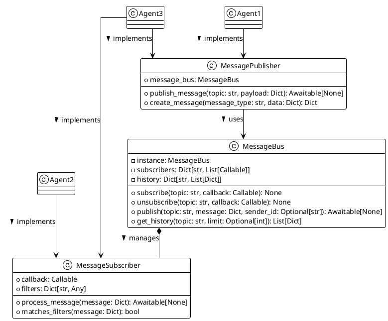

#### Task Manager

Handles the creation, distribution, and tracking of tasks across the system, enabling asynchronous workload management.

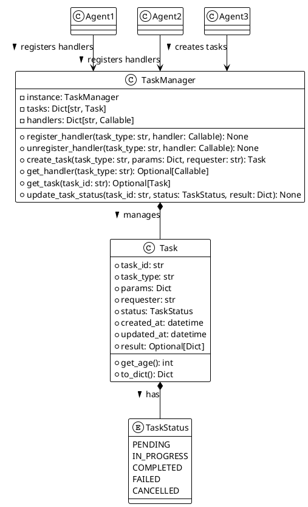

#### BaseAgent

The foundation for all agent implementations in the system, providing common functionality and lifecycle management.

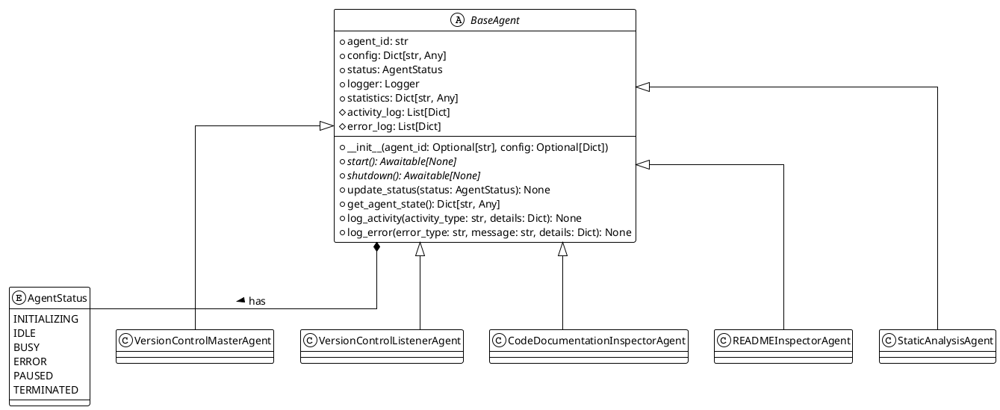

## 🤖 Agent Components

Dev Sentinel uses specialized agents for different aspects of the development workflow:

### Version Control Master Agent (VCMA)

Proactively manages version control operations by observing code changes and making intelligent decisions about when and what to commit.

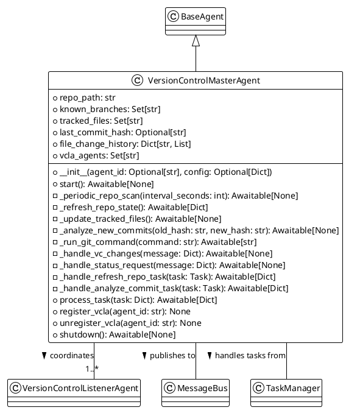

**Key Responsibilities:**
- Repository state tracking and versioning
- Commit analysis and history management
- VCLA coordination and delegation
- Smart commit decision-making

[View the complete VCMA specification](vc_master_agent_spec.md)

### Version Control Listener Agent (VCLA)

Monitors specific aspects of the repository, focusing on particular paths, file types, or behaviors as delegated by the VCMA.

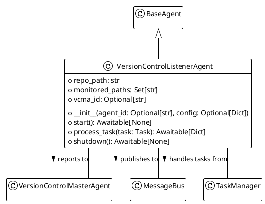

**Key Responsibilities:**
- Path-specific file monitoring
- Change detection and notification
- Specialized observation of repository components

[View the complete VCLA specification](vc_listener_agent_spec.md)

### Code Documentation Inspector Agent (CDIA)

Evaluates and improves in-code documentation quality across a codebase, supporting multiple programming languages.

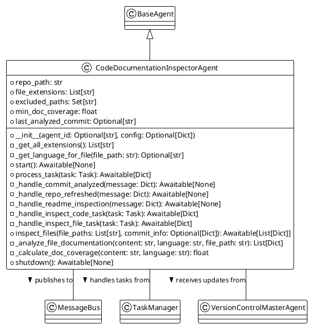

**Key Responsibilities:**
- Documentation pattern detection
- Coverage calculation and reporting
- Multi-language support
- Issue identification and notification

[View the complete CDIA specification](code_doc_inspector_agent_spec.md)

### README Inspector Agent (RDIA)

Ensures that project documentation is comprehensive, accurate, up-to-date, and follows best practices.

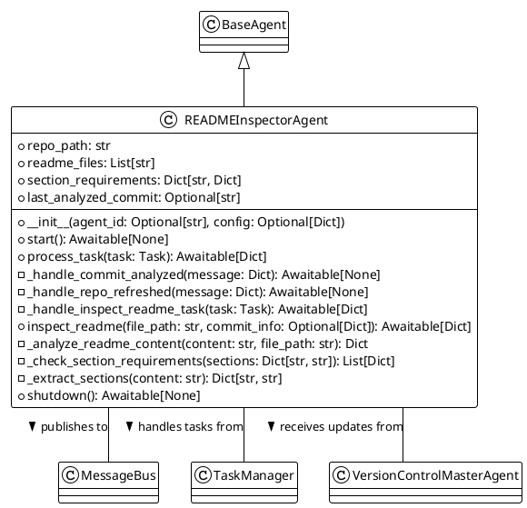

**Key Responsibilities:**
- README section validation
- Content quality assessment
- Markdown structure analysis
- Cross-referencing with codebase

[View the complete RDIA specification](readme_inspector_agent_spec.md)

### Static Analysis Agent (SAA)

Applies static analysis techniques to identify code quality issues, potential bugs, and anti-patterns across multiple programming languages.

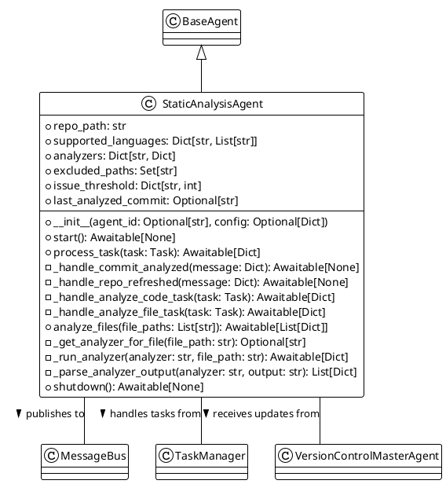

**Key Responsibilities:**
- Multi-language code analysis
- Code quality issue detection
- Static analysis tool integration
- Issue reporting and tracking

## 🔌 Integration Architecture

### FORCE: Federated Orchestration & Reporting

The [FORCE architecture](FORCE.spec.md) provides a federated approach to agent orchestration, telemetry collection, and operation reporting:

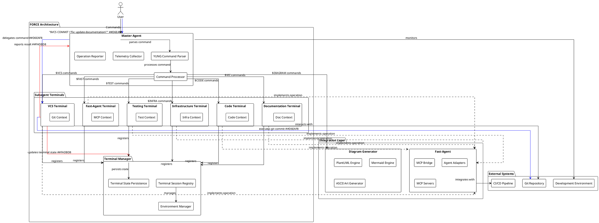

### Terminal State Management

The Terminal Manager maintains persistent state for each specialized agent terminal:

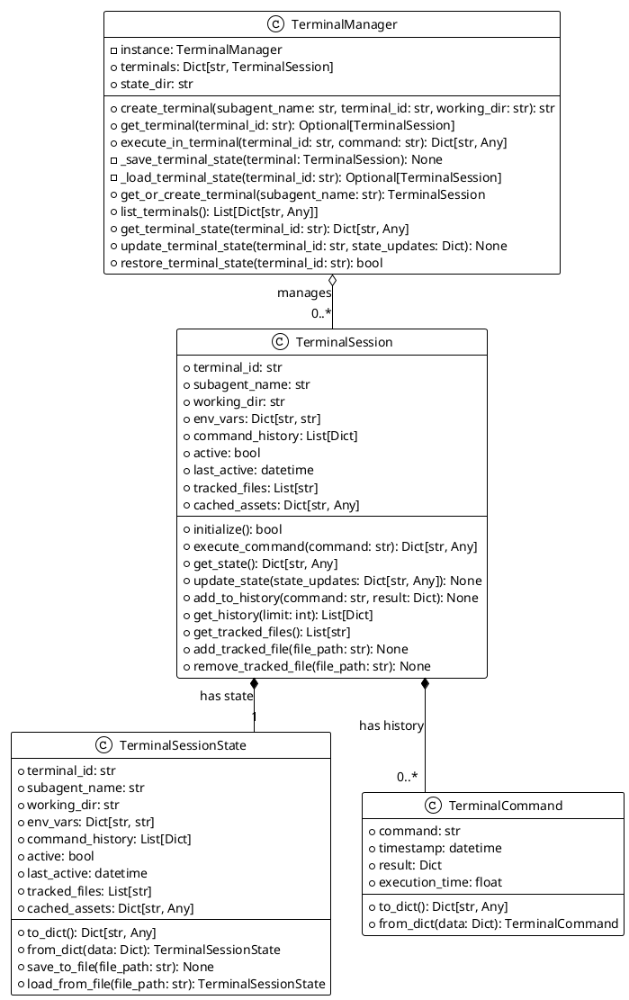

## 📊 Command Structure: YUNG Specification

Dev Sentinel implements the [YUNG (YES Ultimate Net Good)](YUNG_spec.md) universal instruction set for standardized command execution across autonomous agents:

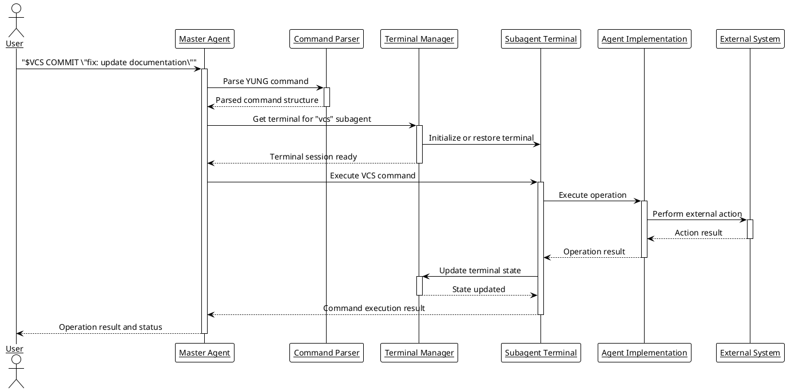

### Key Command Structure

Each YUNG command follows a consistent structure:

```
$COMMAND_TYPE [SUBCOMMAND] [PARAM1=VALUE1 PARAM2=VALUE2 ...] [POSITIONAL_ARGS...]
```

For example:
- `$VCS COMMIT "fix: update documentation"` - Commit changes with a message
- `$CODE TIER=BACKEND IMPL` - Implement backend code
- `$VIC DOCS` - Validate the integrity of documentation
- `$DIAGRAM ARCH FORMAT=svg` - Generate system architecture diagrams

See the complete [YUNG specification](YUNG_spec.md) for more details.

## 📊 Workflow Integration

Dev Sentinel integrates with development workflows through multiple channels:

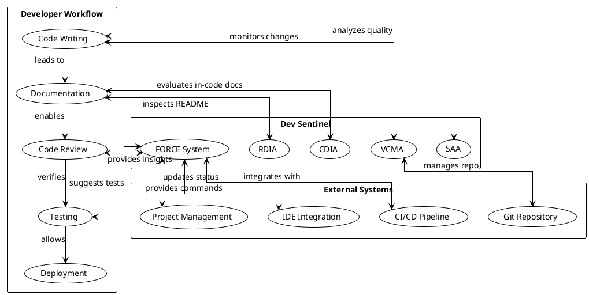

## 🚀 Getting Started

```bash
# Clone the repository
git clone https://github.com/pegues/dev-sentinel.git

# Install dependencies
cd dev-sentinel
pip install -r requirements.txt

# Install diagram dependencies (optional, but recommended for visualization)
pip install plantuml
npm install -g @mermaid-js/mermaid-cli

# Initialize and run the system
python -m integration.force.initialize
```

After initialization, you'll see a summary of all initialized components. The system will generate initial diagrams in the `docs/diagrams` directory.

### Starting the FORCE System

Once initialized, start the master agent to begin using the system:

```bash
python -m integration.force.master_agent
```

You can now use YUNG commands to interact with the system through the master agent's interface.

### Visualizing System Architecture

The initialization process generates key system diagrams automatically. To regenerate or create additional diagrams:

```bash
# In the master agent terminal
$DIAGRAM ARCH FORMAT=svg
$DIAGRAM FORCE FORMAT=png
$DIAGRAM TERM FORMAT=svg
```

### Diagram Dependencies

For full diagram generation support:
- Java JRE (for PlantUML)
- PlantUML JAR file
- Node.js and NPM (for Mermaid CLI)

## 📄 License

Dev Sentinel is available under the MIT License. See the [LICENSE-MIT.md](LICENSE-MIT.md) file for more information.

## 📊 Component Reference

| Component | Purpose | Documentation |
|-----------|---------|---------------|
| VCMA | Version Control Master Agent | [Specification](vc_master_agent_spec.md) |
| VCLA | Version Control Listener Agent | [Specification](vc_listener_agent_spec.md) |
| CDIA | Code Documentation Inspector Agent | [Specification](code_doc_inspector_agent_spec.md) |
| RDIA | README Inspector Agent | [Specification](readme_inspector_agent_spec.md) |
| SAA | Static Analysis Agent | [Architecture](docs/markdown/saa_architecture.md) |
| FORCE | Federated Orchestration & Reporting | [Specification](FORCE.spec.md) |
| YUNG | Command Specification | [Specification](YUNG_spec.md) |