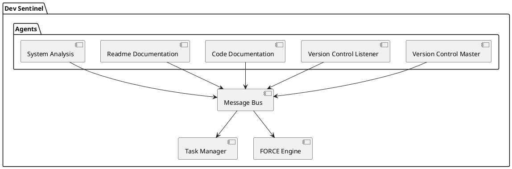
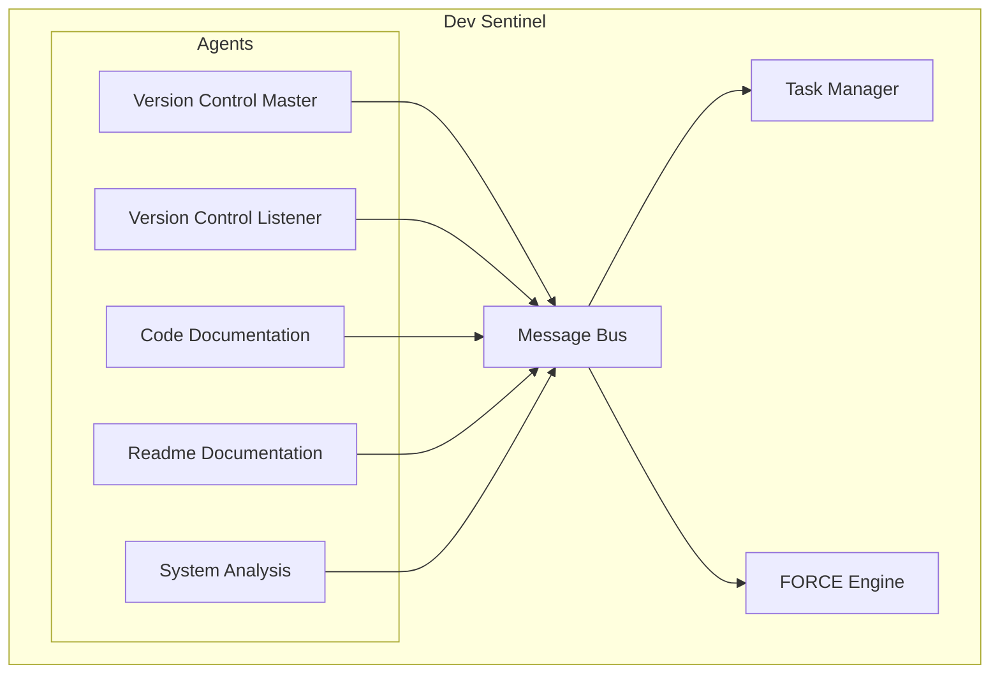
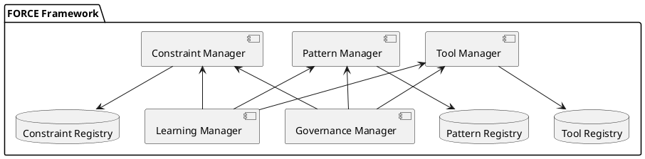

# Dev Sentinel: Force-Enabled Development Assistant

<div align="center">
  
  
  [](force/version.py)
  [](https://www.python.org/)
  [](docs/architecture/force/index.md)
  [](docs/diagrams/)
  [](docs/reference/tools/force-tools.md)
</div>

## Overview

Dev Sentinel is an autonomous development assistant that combines intelligent agents with the FORCE development framework. The system helps automate and streamline development tasks through tools, patterns, constraints, and continuous learning.

**Latest Release (v0.3.0)** brings enhanced Force tools structure, comprehensive git workflow automation, improved MCP server implementations, and modular documentation capabilities.

### Key Components

1. **Dev Sentinel Core**: Event-driven agent system that coordinates development tasks
2. **FORCE Framework**: Modular schema-driven development engine with:
   - **Tools**: Executable development actions
   - **Patterns**: Reusable workflows for common tasks
   - **Constraints**: Quality rules and validations
   - **Learning**: System improvement through execution analysis
   - **Governance**: Policy enforcement for security and compliance
3. **Autonomous Agents**: Specialized agents for version control, documentation, and analysis
4. **Model Context Protocol**: VS Code integration for intelligent assistance

## Getting Started

### Prerequisites

- Python 3.10 or later
- Git
- VS Code (for MCP integration)

### Quick Install

```bash
# Clone the repository
git clone https://github.com/peguesj/yj-dev_sentinel.git
cd yj-dev_sentinel

# Create and activate virtual environment
python -m venv .venv
source .venv/bin/activate  # Linux/macOS
# or
.venv\\Scripts\\activate   # Windows

# Install dependencies
pip install -r requirements.txt
```

## FORCE MCP Server Integration

The Force MCP server provides seamless integration with VS Code Copilot and other MCP clients, offering direct access to Force tools, patterns, constraints, and the extended schema system.

### Features

- **🛠️ Direct Tool Execution**: Access 38+ Force tools through MCP
- **📋 Pattern Application**: Execute development patterns with executable and descriptive steps
- **✅ Schema Validation**: Flexible validation with extended schema support
- **🔄 Real-time Monitoring**: Live execution feedback and error handling
- **🎯 Context-Aware**: Project-specific tool discovery and configuration

### Quick Setup for VS Code

1. **Create MCP Configuration**

   Create `.vscode/mcp.json` in your workspace:

   ```json
   {
     "servers": {
       "force_mcp_stdio": {
         "command": "${workspaceFolder}/.venv/bin/python",
         "args": ["${workspaceFolder}/integration/fast_agent/force_mcp_server.py"],
         "cwd": "${workspaceFolder}",
         "env": {
           "PYTHONPATH": "${workspaceFolder}",
           "PYTHONUNBUFFERED": "1"
         },
         "pattern": ".*(?:Force MCP server|Starting Force MCP server|Listening).*",
         "transport": "stdio",
         "timeout": 30000
       }
     }
   }
   ```

2. **Initialize Force System** (Optional)

   ```bash
   # Initialize .force directory structure with schema and tools
   python -c "
   import sys; sys.path.append('.')
   from force.tools.system.force_init_system import force_init_system
   force_init_system('.')
   "
   ```

3. **Test Integration**

   In VS Code Copilot Chat:

   ```text
   @force_mcp_stdio list all available Force tools
   @force_mcp_stdio execute force_tool_generator to create a new tool
   @force_mcp_stdio apply pattern atomic_commit_pattern
   ```

### Configuration for Other MCP Clients

For **Claude Desktop** or other MCP clients, adapt the configuration:

```json
{
  "mcpServers": {
    "force_mcp_stdio": {
      "command": "/path/to/your/python",
      "args": ["/path/to/dev_sentinel/integration/fast_agent/force_mcp_server.py"],
      "cwd": "/path/to/dev_sentinel",
      "env": {
        "PYTHONPATH": "/path/to/dev_sentinel"
      }
    }
  }
}
```

### Extended Schema System

The Force MCP server leverages the new **Extended Schema System** for flexible validation:

- **✅ Automatic Schema Detection**: Prefers `force-extended-schema.json` over strict schema
- **🔄 Flexible Categories**: Supports custom tool categories (security, release, monitoring, etc.)
- **⚡ Enhanced Error Handling**: Open-ended error handling strategies
- **📊 Improved Loading**: 38+ tools load successfully vs. 31 with strict schema

### Available MCP Tools

The server exposes these key Force capabilities:

| Tool | Description |
|------|-------------|
| `force_list_tools` | List all available Force tools with metadata |
| `force_execute_tool` | Execute any Force tool with validation |
| `force_apply_pattern` | Apply development patterns with step execution |
| `force_list_patterns` | Browse available patterns by category |
| `force_check_constraints` | Validate code against Force constraints |
| `force_get_insights` | Retrieve learning insights and recommendations |
| `force_component_validator` | Validate Force components for schema compliance |

### Troubleshooting

1. **Server Won't Start**

   ```bash
   # Check Python path and dependencies
   python integration/fast_agent/force_mcp_server.py --version
   ```

2. **Schema Validation Errors**

   ```bash
   # Verify extended schema is present
   ls -la .force/schemas/force-extended-schema.json
   ```

3. **Tool Loading Issues**

   ```bash
   # Test tool discovery
   python -c "from force import ForceEngine; f = ForceEngine(); print(f.list_tools())"
   ```

For detailed documentation, see [MCP Integration Guide](docs/integration/mcp-integration.md).

## Documentation

Comprehensive documentation is available in the `docs/` directory:

- [📚 Documentation Home](docs/index.md) - Start here for all documentation
- [🏛️ Architecture Documentation](docs/architecture/overview.md) - System design and architecture
- [🧩 Component Documentation](docs/components/index.md) - Details of each component
- [📝 API Reference](docs/api/index.md) - API documentation
- [👤 User Guide](docs/user/getting-started.md) - Getting started and user documentation
- [💻 Developer Guide](docs/developer/index.md) - Contributing and development documentation
- [📋 Reference](docs/reference/index.md) - Tools, patterns, and constraints reference

### Basic Usage

1. **Start the Server**:
   ```bash
   python run_server.py
   ```

2. **Configure Project**:
   ```bash
   # Initialize FORCE configuration
   mkdir .force
   cp config/fastagent.config.yaml .force/
   ```

3. **Connect VS Code**:
   - Install the Dev Sentinel VS Code extension
   - Use Command Palette: `Dev Sentinel: Connect to Server`

## Architecture

<details>
<summary>Core System Architecture</summary>




</details>

<details>
<summary>FORCE Framework Architecture</summary>



```mermaid
flowchart TB
    subgraph "FORCE Framework"
        TM["Tool Manager"]
        PM["Pattern Manager"]
        CM["Constraint Manager"]
        LM["Learning Manager"]
        GM["Governance Manager"]
        TR["Tool Registry"]
        PR["Pattern Registry"]
        CR["Constraint Registry"]
    end
    TM --> TR
    PM --> PR
    CM --> CR
    TM <-- LM
    PM <-- LM
    CM <-- LM
    TM <-- GM
    PM <-- GM
    CM <-- GM
```
</details>
    CM <-- GM
@enduml
    SAA --> MB
@enduml

## Core Features

### 1. Enhanced Development Tools (v0.3.0)

- **Git Workflow Management**: Smart commit grouping, atomic commits, and semantic versioning
- **Documentation Analysis**: Quality checks, completeness validation, and sync capabilities
- **Code Analysis**: Static analysis, quality scoring, and release readiness assessment
- **Release Management**: Automated changelog generation and dependency analysis

### 2. Advanced Pattern Application

- **Development Patterns**: Atomic commit grouping, branch end tasks, continuous changelog
- **Documentation Patterns**: Handoff documentation, modular structure, cross-referencing
- **Git Patterns**: Grouped commit workflows, semantic versioning, release management

### 3. Comprehensive Quality Constraints

- **Code Quality**: Automated style checks, complexity analysis, and best practices
- **Documentation Quality**: Structure validation, completeness scoring, and consistency
- **Git Quality**: Commit message standards, history validation, and workflow compliance
- **Security**: Infrastructure security checks, secrets scanning, and compliance validation

### 4. Intelligent Learning System

- **Pattern Recognition**: Learn from successful development workflows
- **Task Optimization**: Improve efficiency based on execution metrics
- **Suggestion Engine**: Context-aware recommendations and automation
- **Performance Analytics**: Track tool usage and success patterns

## Documentation

- [Core Architecture](docs/01-architecture/): System design and components
- [Development Guide](docs/02-development/): Setup and contribution
- [Agent Reference](docs/03-agents/): Agent specifications
- [FORCE Framework](docs/04-force/): Tools and patterns
- [MCP Integration](docs/05-mcp/): VS Code extension

## Contributing

See our [Contributing Guide](CONTRIBUTING.md) for details on:
- Development setup
- Code style
- Pull request process
- Documentation standards

## License

This project is licensed under the MIT License - see [LICENSE-MIT.md](LICENSE-MIT.md) for details.

## Acknowledgments

- FORCE framework inspired by advanced software development practices
- Agent architecture based on proven autonomous systems
- Diagrams created with [PlantUML](https://plantuml.com/)
</edit_file>
