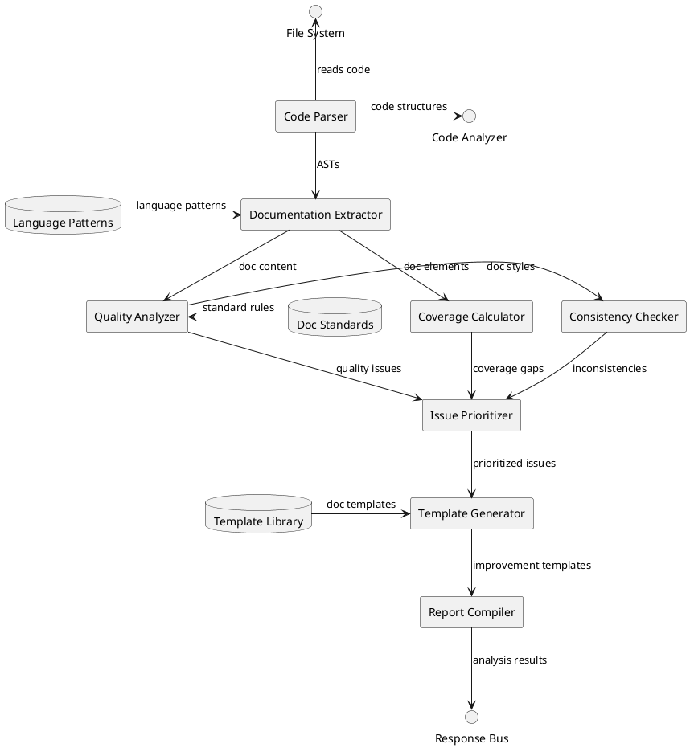

# Code Documentation Inspector Agent (CDIA) Specification

**Version: 0.1.0**  
**Date: April 21, 2025**  
**Author: Jeremiah Pegues <jeremiah@pegues.io>**  
**Organization: Pegues OPSCORP LLC**  
**License: MIT**

## 1. Overview

The Code Documentation Inspector Agent (CDIA) is an autonomous agent responsible for evaluating and improving in-code documentation quality across a project's codebase. It focuses on ensuring that the code is appropriately documented with comments, docstrings, type annotations, and other forms of code-level documentation according to language-specific standards and best practices.

## 2. Core Capabilities

### 2.1 Documentation Detection and Analysis

The CDIA comprehensively analyzes code-level documentation:

* Identification of docstrings, comments, and annotations
* Parsing of documentation according to language-specific formats
* Classification of documentation types (explanatory, API, reference)
* Extraction of documented parameters, return values, and exceptions

### 2.2 Coverage Assessment

The agent evaluates documentation coverage across the codebase:

* Calculation of documentation coverage percentages
* Identification of undocumented or under-documented elements
* Prioritization of documentation gaps by importance and visibility
* Cross-referencing with code complexity to identify high-value targets

### 2.3 Quality Evaluation

Documentation quality is assessed against established standards:

* Validation against language-specific documentation formats
* Assessment of completeness, accuracy, and clarity
* Detection of outdated documentation that doesn't match implementation
* Identification of inconsistencies across similar elements

### 2.4 Enhancement Generation

The agent provides concrete documentation improvements:

* Generation of docstring templates for undocumented elements
* Suggestions for improvement of existing documentation
* Addition of missing parameter, return value, and exception documentation
* Creation of contextual explanations for complex code

## 3. System Interfaces

### 3.1 Input Interfaces

```typescript
interface CodeDocInspectionRequest {
  codebase: {
    rootPath: string;
    includePaths: string[];
    excludePaths: string[];
    languages: string[];
  };
  standards: {
    global: string[];                     // Global documentation standards
    languageSpecific: {                   // Language-specific standards
      [language: string]: string[];
    };
  };
  options: {
    minCoverage: number;                  // Minimum acceptable coverage %
    priorityElements: string[];           // Element types to prioritize
    maxIssues: number;                    // Maximum issues to report
    generateTemplates: boolean;           // Whether to generate templates
    checkConsistency: boolean;            // Whether to check style consistency
  };
  metadata: {
    requestId: string;
    requestor: string;
    priority: 'low' | 'medium' | 'high';
    timestamp: string;
  };
}
```

### 3.2 Output Interfaces

```typescript
interface CodeDocAnalysisResult {
  requestId: string;
  summary: {
    overallCoverage: number;              // 0-100 percentage
    filesAnalyzed: number;
    elementsAnalyzed: number;
    documentsIssuesFound: number;
    improvementsSuggested: number;
    estimatedCompletionEffort: string;    // e.g., "3 person-days"
  };
  coverageByLanguage: {
    [language: string]: {
      coverage: number;
      fileCount: number;
      elementCount: number;
    };
  };
  fileAnalysis: FileDocAnalysis[];
  priorityIssues: DocIssue[];
  globalRecommendations: DocRecommendation[];
  metadata: {
    analysisTimestamp: string;
    engineVersion: string;
    standardsApplied: string[];
  };
}

interface FileDocAnalysis {
  filePath: string;
  language: string;
  coverage: number;
  elements: {
    [elementId: string]: {
      type: 'class' | 'function' | 'method' | 'property' | 'module';
      name: string;
      lineStart: number;
      lineEnd: number;
      complexity: number;
      hasDocumentation: boolean;
      docQuality?: number;
      issues?: DocIssue[];
    };
  };
  fileIssues: DocIssue[];
  recommendations: DocRecommendation[];
}

interface DocIssue {
  id: string;
  elementId?: string;
  type: 'missing' | 'incomplete' | 'outdated' | 'incorrect' | 'inconsistent' | 'format';
  severity: 'critical' | 'major' | 'minor' | 'suggestion';
  description: string;
  impacts: string[];
  location: {
    file: string;
    lineStart: number;
    lineEnd?: number;
  };
}

interface DocRecommendation {
  issueId?: string;
  elementId?: string;
  type: 'add' | 'update' | 'format' | 'standardize';
  description: string;
  suggestedContent?: string;
  rationale: string;
  effort: 'low' | 'medium' | 'high';
  impact: 'low' | 'medium' | 'high';
}
```

## 4. Internal Architecture



## 5. Documentation Analysis Process

```plantuml
@startuml
!define PROCESS rectangle
!define DECISION diamond
!define START circle
!define END circle
!define DATA database

skinparam backgroundColor transparent

START as S
PROCESS "Parse code files into ASTs" as P1
PROCESS "Extract existing documentation" as P2
PROCESS "Identify code elements" as P3
PROCESS "Match docs to code elements" as P4
PROCESS "Calculate documentation coverage" as P5
DECISION "Coverage meets\nthreshold?" as D1
PROCESS "Identify high-priority\nundocumented elements" as P6
PROCESS "Analyze documentation quality" as P7
DECISION "Quality meets\nstandards?" as D2
PROCESS "Identify quality issues" as P8
PROCESS "Check documentation consistency" as P9
DECISION "Consistent\nstyle?" as D3
PROCESS "Identify consistency issues" as P10
PROCESS "Generate documentation templates" as P11
PROCESS "Build improvement suggestions" as P12
DATA "Documentation Standards DB" as DB
PROCESS "Compile analysis report" as P13
END as E

S --> P1
P1 --> P2
P1 --> P3
P2 --> P4
P3 --> P4
P4 --> P5
P5 --> D1
D1 -right-> P6 : No
D1 -down-> P7 : Yes
P6 --> P7
P7 --> D2
D2 -right-> P8 : No
D2 -down-> P9 : Yes
P8 --> P9
P9 --> D3
D3 -right-> P10 : No
D3 -down-> P11 : Yes
P10 --> P11
P11 --> P12
DB -right-> P7
DB -right-> P9
DB -right-> P11
P12 --> P13
P13 --> E

@enduml
```

## 6. Language-Specific Documentation Standards

The CDIA enforces different documentation standards based on programming language:

### 6.1 Python

Standards for Python documentation:

- Google-style or NumPy-style docstrings
- PEP 257 compliance
- Type hints (PEP 484)
- Module-level docstrings
- Function parameter and return documentation

### 6.2 JavaScript/TypeScript

Standards for JavaScript/TypeScript documentation:

- JSDoc format
- TypeScript interface and type documentation
- Component documentation (React/Vue/Angular)
- Function parameter and return type documentation
- Module export documentation

### 6.3 Java/Kotlin

Standards for Java/Kotlin documentation:

- Javadoc/KDoc format
- Class documentation
- Method parameter and return documentation
- Exception documentation
- Inheritance documentation

### 6.4 C#

Standards for C# documentation:

- XML documentation comments
- Method parameter and return documentation
- Property documentation
- Exception documentation
- Interface implementation documentation

### 6.5 Ruby/Rails

Standards for Ruby and Rails documentation:

- YARD documentation format
- RDoc compatibility
- Rails-specific idioms and conventions
- Controller action documentation
- Model relationship documentation
- Helper method documentation
- API endpoint documentation with request/response examples
- Database migration documentation

### 6.6 Elixir/Phoenix

Standards for Elixir and Phoenix documentation:

- ExDoc format with markdown
- Module documentation with `@moduledoc`
- Function documentation with `@doc`
- Type specifications with `@spec`
- Callback definitions with `@callback`
- Phoenix controller action documentation
- Phoenix channel documentation
- Ecto schema and changeset documentation
- Plugs documentation with preconditions and side effects

### 6.7 Erlang

Standards for Erlang documentation:

- EDoc documentation format
- Module header documentation
- Function specification with `-spec`
- Type definitions with `-type`
- OTP behavior implementations documentation
- Message pattern documentation
- State transition documentation for gen_servers
- Error handling and recovery strategy documentation

### 6.8 Swift/Objective-C

Standards for Swift and Objective-C documentation:

- Swift-style documentation comments with `///` or `/***/`
- Objective-C documentation with `/***/` or pragma marks
- Markup syntax for Swift (parameter, returns, throws)
- Header documentation for Objective-C interfaces
- Protocol conformance documentation
- Delegate method documentation
- Memory management annotations for Objective-C
- Thread safety documentation
- UIKit/AppKit component lifecycle documentation

### 6.9 PHP

Standards for PHP documentation:

- PHPDoc format
- Class and interface documentation
- Method parameter and return type documentation
- Property documentation
- Exception documentation
- Framework-specific documentation (Laravel, Symfony, etc.)
- Security considerations for user input handling
- Database interaction documentation
- API endpoint documentation

### 6.10 PowerShell

Standards for PowerShell documentation:

- Comment-based help with `.SYNOPSIS`, `.DESCRIPTION`, etc.
- Parameter documentation with `.PARAMETER`
- Example usage with `.EXAMPLE`
- Input/output documentation
- Error handling documentation
- Pipeline behavior documentation
- Required privilege documentation
- Module and function documentation
- Script behavior documentation

### 6.11 Perl/Shell

Standards for Perl and Shell script documentation:

#### Perl
- POD (Plain Old Documentation) format
- Module documentation
- Subroutine documentation
- Parameter and return value documentation
- CPAN module style compliance
- Edge case handling documentation
- Regular expression explanation

#### Shell
- Script header documentation block
- Function documentation
- Parameter usage documentation
- Exit code documentation
- Environment variable documentation
- Dependency documentation
- Platform compatibility notes

### 6.12 AppleScript

Standards for AppleScript documentation:

- Script header documentation with purpose and author
- Handler (function) documentation with parameters and results
- Object model documentation
- Application-specific terminology documentation
- Script property documentation
- Error handling documentation
- Example usage documentation
- UI scripting documentation, if applicable

### 6.13 YAML/Configuration Files

Standards for YAML and other configuration files:

- File header documentation with purpose and scope
- Section documentation with purpose and constraints
- Field documentation with type, purpose, default values
- Environment variable references documentation
- Access control and security implications documentation
- Integration points documentation
- Schema/validation information
- Examples for complex configurations

### 6.14 Project Definition Files

Standards for project definition files:

#### Package Managers
- **package.json (Node.js)**: Documentation for scripts, dependencies, configuration
- **Gemfile (Ruby)**: Documentation for gem dependencies and version constraints
- **pyproject.toml/setup.py (Python)**: Documentation for dependencies and build process
- **composer.json (PHP)**: Documentation for package dependencies and autoloading
- **Cargo.toml (Rust)**: Documentation for crate dependencies and features

#### Build Tools
- **Makefile**: Documentation for targets, variables, and usage
- **Gradle/Maven**: Documentation for build phases and custom tasks
- **Rakefile (Ruby)**: Documentation for tasks and dependencies
- **CMakeLists.txt**: Documentation for build configurations and dependencies

#### CI/CD Configuration
- **.github/workflows**: Documentation for GitHub Actions workflows
- **.gitlab-ci.yml**: Documentation for GitLab CI pipelines
- **azure-pipelines.yml**: Documentation for Azure Pipelines
- **Jenkinsfile**: Documentation for Jenkins pipeline stages

### 6.15 Manifest and Ignore Files

Standards for manifest and ignore files:

- **.gitignore**: Documentation for exclusion patterns and rationale
- **.dockerignore**: Documentation for Docker build context exclusions
- **MANIFEST.in (Python)**: Documentation for package inclusion/exclusion rules
- **.npmignore**: Documentation for npm package exclusions
- **Procfile (Heroku)**: Documentation for process types and commands

### 6.16 Database Definition Files

Standards for database definition files:

- **SQL migration files**: Documentation for schema changes and data migrations
- **ORM model definitions**: Documentation for fields, relationships, and constraints
- **GraphQL schemas**: Documentation for types, queries, and mutations
- **MongoDB/NoSQL schemas**: Documentation for document structures and indexes
- **Liquibase/Flyway**: Documentation for database change sets

## 7. Documentation Quality Criteria

### 7.1 Completeness

Criteria for documentation completeness:

* All parameters documented
* Return values documented
* Exceptions/errors documented
* Purpose/behavior described
* Usage examples where appropriate

### 7.2 Clarity

Criteria for documentation clarity:

* Concise descriptions
* Appropriate technical level
* Minimal jargon or defined terms
* Grammatically correct
* Logical organization

### 7.3 Accuracy

Criteria for documentation accuracy:

* Matches actual implementation
* Parameter types correctly specified
* Return values accurately described
* Edge cases and limitations noted
* Version information current

### 7.4 Consistency

Criteria for documentation consistency:

* Uniform style across similar elements
* Consistent terminology
* Similar detail level for similar importance
* Aligned format with project standards
* Consistent tone and voice

## 8. Template Generation Logic

### 8.1 Template Selection

The CDIA selects documentation templates based on multiple factors:

```python
def select_template(element, context):
    # Determine the appropriate template based on element type and context
    if element.type == 'function':
        complexity = calculate_complexity(element)
        visibility = determine_visibility(element)
        importance = assess_importance(element, context)
        
        if complexity > HIGH_COMPLEXITY_THRESHOLD:
            return 'detailed_function_template'
        elif is_api_boundary(element, context):
            return 'api_function_template'
        elif visibility == 'public':
            return 'standard_function_template'
        else:
            return 'minimal_function_template'
    
    # Similar logic for other element types
    # ...
```

### 8.2 Template Customization

Templates are customized based on element analysis:

* Parameter information extracted from signatures
* Return types inferred from code
* Usage examples generated from test cases
* Behavior descriptions generated from code analysis
* Exception documentation from exception paths

### 8.3 Template Examples

Example template for a Python function:

```python
"""
{function_description}

Args:
{param_docs}

Returns:
{return_doc}

Raises:
{exception_docs}

Examples:
{examples}
"""
```

Example template for a JavaScript class:

```javascript
/**
 * {class_description}
 * 
 * @class
 * @classdesc {class_description_extended}
 {constructor_params}
 * 
 * @example
 * {usage_example}
 */
```

Example template for a Ruby method:

```ruby
# {method_description}
#
# @param [Type] {param_name} {param_description}
# @return [Type] {return_description}
# @raise [ExceptionClass] {exception_description}
# @example
#   {usage_example}
#
def method_name(params)
  # Implementation
end
```

Example template for an Elixir function:

```elixir
@moduledoc """
{module_description}
"""

@doc """
{function_description}

## Parameters

  - {param_name}: {param_description}

## Returns

{return_description}

## Examples

```
{usage_example}
```
"""
@spec function_name(param_type) :: return_type
def function_name(param) do
  # Implementation
end
```

Example template for an Erlang function:

```erlang
%% @doc {function_description}
%%
%% @param {ParamName} {param_description}
%% @returns {return_description}
%% @throws {exception_class} {exception_reason}
-spec function_name(ParamType()) -> ReturnType().
function_name(Param) ->
    % Implementation.
```

Example template for a Swift method:

```swift
/// {function_description}
///
/// - Parameters:
///   - {param_name}: {param_description}
/// - Returns: {return_description}
/// - Throws: {exception_description}
///
/// - Example:
///   ```swift
///   {usage_example}
///   ```
func methodName(param: ParamType) throws -> ReturnType {
    // Implementation
}
```

Example template for an Objective-C method:

```objectivec
/**
 * {method_description}
 *
 * @param {param_name} {param_description}
 * @return {return_description}
 * @exception {exception_name} {exception_description}
 * @discussion {detailed_description}
 *
 * Example:
 * @code
 * {usage_example}
 * @endcode
 */
- (ReturnType)methodName:(ParamType)paramName;
```

Example template for a PHP method:

```php
/**
 * {method_description}
 *
 * @param Type $paramName {param_description}
 * @return Type {return_description}
 * @throws ExceptionClass {exception_description}
 *
 * @example
 * ```php
 * {usage_example}
 * ```
 */
public function methodName($paramName): ReturnType
{
    // Implementation
}
```

Example template for a PowerShell function:

```powershell
<#
.SYNOPSIS
{brief_description}

.DESCRIPTION
{detailed_description}

.PARAMETER ParameterName
{parameter_description}

.OUTPUTS
{output_description}

.EXAMPLE
{usage_example}

.NOTES
{additional_notes}
#>
function Verb-Noun {
    [CmdletBinding()]
    param(
        [Parameter(Mandatory=$true, HelpMessage="Enter parameter value")]
        [Type]$ParameterName
    )

    # Implementation
}
```

Example template for a Perl subroutine:

```perl
=head1 NAME

subroutine_name - {brief_description}

=head1 SYNOPSIS

  {usage_synopsis}

=head1 DESCRIPTION

{detailed_description}

=head1 PARAMETERS

=over 4

=item {param_name}

{param_description}

=back

=head1 RETURN VALUE

{return_description}

=head1 EXAMPLES

{usage_examples}

=cut

sub subroutine_name {
    my ($param) = @_;
    # Implementation
}
```

Example template for a Shell function:

```bash
# --------------------------------------------------------
# Function: function_name
# Description: {function_description}
# 
# Arguments:
#   $1 - {argument_description}
# 
# Outputs:
#   {output_description}
# 
# Returns:
#   {return_code_description}
# 
# Example:
#   {usage_example}
# --------------------------------------------------------
function_name() {
    local param="$1"
    # Implementation
}
```

Example template for an AppleScript handler:

```applescript
(*
 * Handler: handler_name
 * Description: {handler_description}
 *
 * Parameters:
 *   paramName - {param_description}
 *
 * Returns: {return_description}
 *
 * Example Usage:
 *   {usage_example}
 *)
on handler_name(paramName)
	-- Implementation
end handler_name
```

Example template for a YAML configuration file:

```yaml
# -----------------------------------------------------
# {file_title}
# -----------------------------------------------------
# Description: {file_description}
# Version: {version}
# Last Updated: {date}
# -----------------------------------------------------

# {section_name}
# Description: {section_description}
section_key:
  # {field_name}: {field_description}
  # Type: {field_type}, Default: {default_value}
  field_key: value
  
  # {sub_field_name}: {sub_field_description}
  # Environment Variable: ${ENV_VAR_NAME}
  sub_field: value
```

Example template for a package.json file:

```json
{
  "name": "package-name",
  "version": "1.0.0",
  // Description of the package and its purpose
  "description": "{package_description}",
  // Main entry point for the package
  "main": "index.js",
  // Package scripts documentation
  "scripts": {
    // Runs the test suite
    "test": "jest",
    // Builds the project for production
    "build": "webpack --mode production"
  },
  // Package dependencies with version constraints
  "dependencies": {
    // {package_explanation}
    "package-name": "^1.0.0"
  }
}
```

## 9. Integration with Knowledge Base

### 9.1 Documentation Pattern Learning

The CDIA learns from existing high-quality documentation:

* Extracting common patterns for similar elements
* Learning domain-specific terminology and explanations
* Building a corpus of effective documentation examples
* Adapting to project-specific documentation styles

### 9.2 Knowledge Contribution

The agent contributes to the shared knowledge base:

* Effective documentation patterns by language and element type
* Common documentation deficiencies and solutions
* Project-specific documentation conventions
* Terminology and explanation patterns for specific domains

### 9.3 Continuous Improvement

The CDIA improves through feedback cycles:

* Learning from accepted vs. rejected documentation suggestions
* Adapting templates based on developer modifications
* Refining quality assessment based on manual reviews
* Building project-specific documentation preferences

## 10. Configuration Options

```json
{
  "languages": {
    "python": {
      "docstyle": "google",
      "enforceTypeHints": true,
      "requiredSections": ["Args", "Returns", "Raises"],
      "minimumDetailLevel": "medium"
    },
    "javascript": {
      "docstyle": "jsdoc",
      "enforceTypes": true,
      "requireExamples": true
    },
    "typescript": {
      "inheritFromJavaScript": true,
      "preferInlineTypeAnnotations": false
    },
    "ruby": {
      "docstyle": "yard",
      "enforceParamTypes": true,
      "requireReturnDoc": true,
      "railsConventions": true
    },
    "elixir": {
      "enforceModuleDocs": true,
      "enforceSpecTypes": true,
      "checkCallbackDocs": true,
      "phoenixSpecific": true
    },
    "erlang": {
      "docstyle": "edoc",
      "enforceSpecTypes": true,
      "checkOtpBehaviors": true,
      "documentStateTransitions": true
    },
    "swift": {
      "markupStyle": "swift",
      "requireParameterDocs": true,
      "checkProtocolConformance": true,
      "uikitLifecycleDoc": true
    },
    "objectivec": {
      "headerDocStyle": "appledoc",
      "checkMemoryAnnotations": true,
      "requireDelegateDocs": true
    },
    "php": {
      "docstyle": "phpdoc",
      "frameworkSpecific": "laravel",
      "checkSecurityDocs": true,
      "apiDocConventions": true
    },
    "powershell": {
      "useCommentBasedHelp": true,
      "requireExamples": true,
      "documentPrivileges": true,
      "checkPipelineSupport": true
    },
    "perl": {
      "docstyle": "pod",
      "checkCpanCompliance": true,
      "documentRegexPatterns": true
    },
    "shell": {
      "requireHeaderDocs": true,
      "documentExitCodes": true,
      "checkPlatformNotes": true
    },
    "applescript": {
      "documentHandlers": true,
      "objectModelDoc": true,
      "requireExamples": true
    },
    "yaml": {
      "enforceHeaderComments": true,
      "requireFieldDescriptions": true,
      "documentEnvVars": true,
      "schemaReference": true
    }
  },
  "configurationFiles": {
    "enforcePackageDocs": true,
    "checkBuildToolDocs": true,
    "requireCiCdDocs": true,
    "validateManifestComments": true,
    "databaseSchemaDocs": true
  },
  "coverage": {
    "minOverallCoverage": 75,
    "minPublicApiCoverage": 95,
    "minClassCoverage": 80,
    "minFunctionCoverage": 70,
    "configFileCoverage": 60
  },
  "prioritization": {
    "byComplexity": true,
    "byVisibility": true,
    "byUsage": true,
    "byRecentChanges": true
  },
  "analysis": {
    "checkConsistency": true,
    "validateAccuracy": true,
    "deepInspection": true,
    "maxIssuesPerFile": 25,
    "includeConfigFiles": true
  },
  "generation": {
    "generateTemplates": true,
    "includeExamples": true,
    "adaptToExistingStyle": true,
    "verbosityLevel": "medium"
  },
  "languageDetection": {
    "enableAutoDetection": true,
    "useGitattributes": true,
    "useFileExtensions": true,
    "useShebang": true
  }
}
```

## 11. Performance Considerations

### 11.1 Scalability

Strategies for handling large codebases:

* Incremental analysis for large projects
* Prioritization of recently changed files
* Caching of analysis results
* Parallel processing of independent files
* Focus on public API vs. internal implementation

### 11.2 Resource Management

Techniques for efficient resource usage:

* Configurable analysis depth
* Selective parsing based on file types
* Memory-efficient AST representations
* Stream processing for large files
* Background analysis during idle times

### 11.3 Integration Performance

Optimization for CI/CD environments:

* Differential analysis based on changes
* Pre-configured analysis profiles for speed
* Caching documentation templates
* Limiting reports to actionable items
* Scheduled comprehensive analysis

## 12. Metrics and Evaluation

### 12.1 Coverage Metrics

* **Overall Documentation Coverage**: Percentage of elements with documentation
* **Public API Coverage**: Documentation coverage of public/exposed elements
* **Complex Code Coverage**: Coverage of high-complexity elements
* **Recent Changes Coverage**: Documentation coverage of recently modified code

### 12.2 Quality Metrics

* **Completeness Score**: Average completeness of existing documentation
* **Clarity Score**: Readability and understandability assessment
* **Accuracy Score**: Correlation between docs and implementation
* **Consistency Score**: Uniformity of style and terminology

### 12.3 Agent Performance Metrics

* **Analysis Speed**: Time to analyze code documentation
* **Suggestion Accuracy**: Acceptance rate of generated documentation
* **Issue Detection Rate**: Percentage of issues found vs. manual review
* **Template Quality**: How much editing is needed for generated templates


