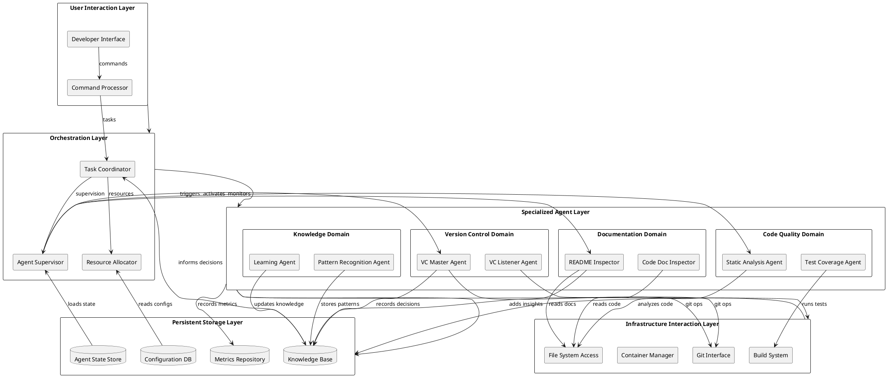
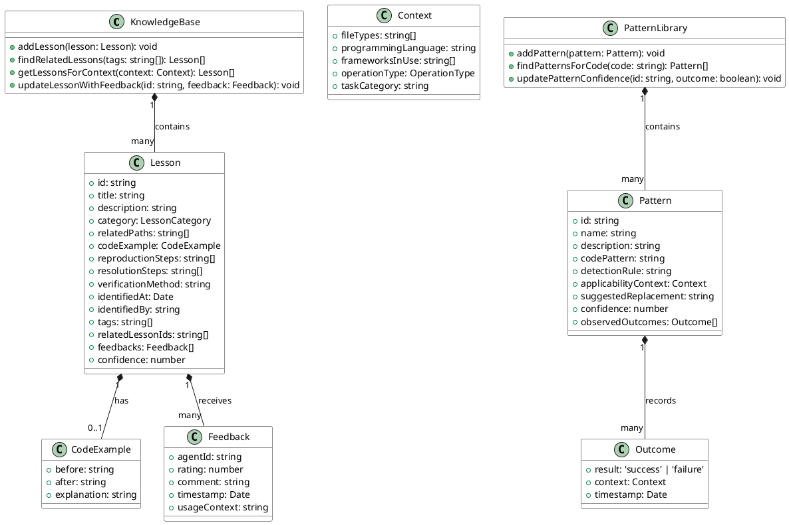
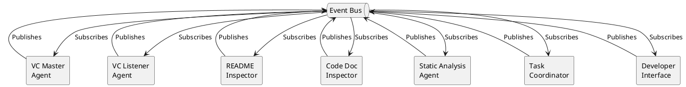
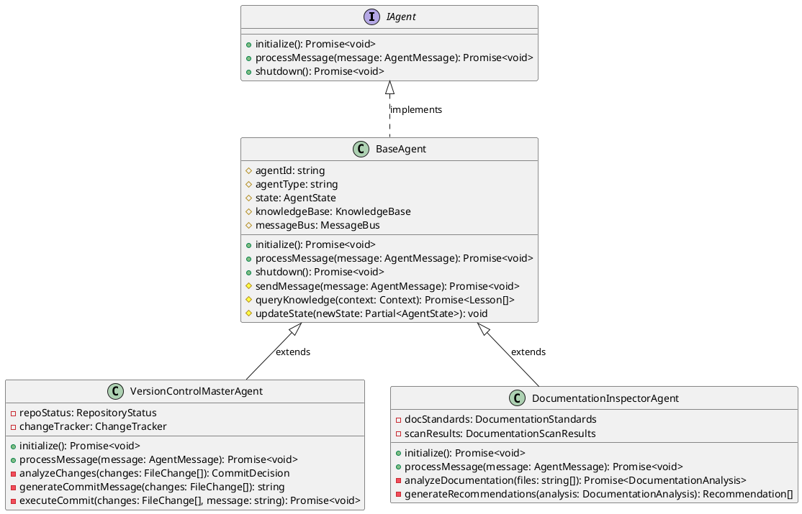
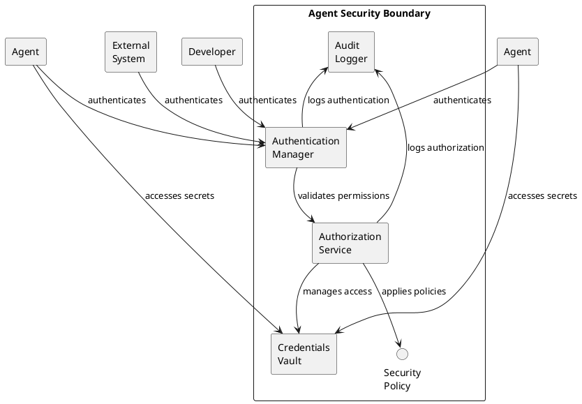
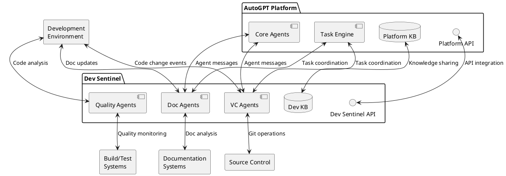

# Dev Sentinel: Autonomous Development Agent Architecture

**Version: 0.1.0**  
**Date: April 21, 2025**  
**Author: Jeremiah Pegues <jeremiah@pegues.io>**  
**Organization: Pegues OPSCORP LLC**  
**License: MIT**

## Executive Summary

This design document describes Dev Sentinel, a comprehensive framework for autonomous development agents that work together to streamline software development, enforce best practices, and ensure high-quality documentation. The system builds upon the existing AutoGPT Platform's agent architecture and extends it with specialized agents for version control management, documentation inspection, code quality assurance, and more.

## 1. Introduction

### 1.1 Purpose

Dev Sentinel aims to transform software development by creating an ecosystem of specialized, cooperating AI agents that can automate routine development tasks, ensure consistent code quality, maintain comprehensive documentation, and provide valuable insights to human developers.

### 1.2 Scope

The system encompasses:
- Autonomous version control management
- Documentation quality assurance
- Code quality monitoring
- Knowledge accumulation and sharing
- Developer assistance and insights

### 1.3 Design Goals

- **Modularity**: Agents with clear, focused responsibilities
- **Extensibility**: Easy integration of new specialized agents
- **Self-improvement**: Learning from past operations
- **Transparency**: Clear visibility into agent actions and decisions
- **Developer Collaboration**: Enhancement of human developers' capabilities, not replacement

## 2. System Architecture Overview

The Dev Sentinel architecture follows a modular, event-driven design organized in layers.



## 3. Agent Subsystems

### 3.1 Version Control Agents

#### 3.1.1 Version Control Master Agent (VCMA)

The VCMA acts as an autonomous observer of the development process, making decisions about when and how to commit code changes.

**Key Responsibilities:**
- Monitor file system changes in the workspace
- Analyze commit-worthiness of changes
- Group logically related changes
- Generate meaningful commit messages
- Manage branch creation and merging

**Decision Making Algorithm:**
```
function evaluateCommitWorthiness(changes):
    if changes contain compilable/runnable state:
        if changes represent complete feature/fix:
            return HIGH_PRIORITY
        else if changes represent meaningful progress:
            return MEDIUM_PRIORITY
    else if changes > significant_threshold AND time_since_last_commit > max_interval:
        return LOW_PRIORITY
    return NO_COMMIT
```

**State Management:**
The VCMA maintains an internal state model tracking:
- Current branch status
- Files under observation
- Change history
- Commit patterns

#### 3.1.2 Version Control Listener Agent (VCLA)

The VCLA provides a service interface for on-demand VC operations requested by other agents or developers.

**Operation Interface:**
```typescript
interface VCOperation {
  operation: 'commit' | 'branch' | 'merge' | 'push' | 'pull' | 'status' | 'reset' | 'checkout';
  parameters: {
    [key: string]: any;  // Operation-specific parameters
  };
  priority: 'high' | 'medium' | 'low';
  requestor: string;  // ID of requesting agent or developer
  dryRun?: boolean;   // If true, simulate but don't execute
}
```

**Safety Protocols:**
- All destructive operations require confirmation
- Branch protection rules prevent direct pushes to protected branches
- Operations are logged for audit
- Automatic backup of workspace state before risky operations

### 3.2 Documentation Inspection Agents

#### 3.2.1 README Documentation Inspector Agent (RDIA)

The RDIA ensures project documentation remains accurate, comprehensive, and useful.

**Documentation Analysis Process:**
1. Parse README and related documentation files
2. Extract structured sections (installation, usage, API docs)
3. Compare against actual project capabilities
4. Identify gaps, inconsistencies, and outdated information
5. Generate improvement recommendations

**Quality Metrics:**
- Coverage: % of features documented
- Accuracy: % of documentation matching actual functionality
- Clarity: Readability scores of documentation text
- Completeness: Presence of expected sections
- Code example validity: Working status of included examples

#### 3.2.2 Code Documentation Inspector Agent (CDIA)

The CDIA focuses on inline code documentation quality and adherence to standards.

**Documentation Standards Application:**
```
function evaluateDocumentation(codeEntity, entityType, language):
    standardsToApply = loadStandards(language, entityType)
    docString = extractDocString(codeEntity)
    
    evaluations = []
    for standard in standardsToApply:
        compliance = standard.evaluate(docString)
        evaluations.push({standard: standard.name, compliance: compliance})
        
    return generateReport(codeEntity, evaluations)
```

**Improvement Generation:**
The CDIA can generate docstring templates adhering to the appropriate standard (JSDoc, NumPy, Google style, etc.) for missing or incomplete documentation.

### 3.3 Code Quality Agents

#### 3.3.1 Static Analysis Agent (SAA)

The SAA applies static analysis techniques to identify code quality issues, potential bugs, and anti-patterns.

**Capabilities:**
- Linting against configurable rule sets
- Complexity analysis (cyclomatic complexity, etc.)
- Type checking and inference
- Security vulnerability detection
- Performance issue identification

#### 3.3.2 Test Coverage Agent (TCA)

The TCA analyzes and reports on test coverage, identifying under-tested areas of the codebase.

**Metrics Tracked:**
- Line coverage
- Branch coverage
- Function coverage
- Integration test coverage
- Edge case coverage

## 4. Knowledge Management System

The Knowledge Management System is central to Dev Sentinel's ability to learn and improve over time.

### 4.1 Knowledge Structure



### 4.2 Learning Mechanisms

Dev Sentinel employs several learning mechanisms:

1. **Supervised Learning**: Human feedback on agent actions
2. **Reinforcement Learning**: Tracking outcomes of decisions
3. **Pattern Recognition**: Identifying recurring code and solution patterns
4. **Case-Based Reasoning**: Applying solutions from similar past problems
5. **Collaborative Learning**: Sharing insights across agent instances

### 4.3 Knowledge Application Flow

```plantuml
@startuml
!define PROCESS rectangle
!define DATA database
!define DECISION diamond
!define START circle
!define END circle

skinparam backgroundColor transparent

START as S
PROCESS "Agent encounters\nproblem/decision point" as P1
DECISION "Known pattern\nor precedent?" as D1
PROCESS "Query knowledge base\nfor relevant lessons" as P2
DATA "Knowledge Base" as KB
PROCESS "Apply lesson/pattern\nto current situation" as P3
DECISION "Application\nsuccessful?" as D2
PROCESS "Record positive\noutcome" as P4
PROCESS "Record negative\noutcome" as P5
PROCESS "Generate new\nsolution approach" as P6
PROCESS "Execute solution" as P7
DECISION "Solution\nsuccessful?" as D3
PROCESS "Add new lesson/pattern\nto knowledge base" as P8
END as E

S --> P1
P1 --> D1
D1 -right-> P2 : No
D1 -down-> P3 : Yes
P2 --> KB : Query
KB --> P2 : Results
P2 --> P3
P3 --> D2
D2 -right-> P4 : Yes
D2 -down-> P5 : No
P5 --> P6
P4 --> KB : Update
P6 --> P7
P7 --> D3
D3 -right-> P8 : Yes
D3 -down-> P1 : No, retry
P8 --> KB : Add
P8 --> E

@enduml
```

## 5. Communication Protocol

### 5.1 Message Structure

Agents communicate using a standardized message format:

```typescript
interface AgentMessage {
  messageId: string;             // Unique ID for this message
  correlationId: string;         // ID linking related messages
  sender: {
    agentId: string;
    agentType: string;
  };
  recipient: {
    agentId: string;
    agentType: string;
  };
  messageType: MessageType;      // Command, Event, Query, Response, etc.
  priority: Priority;            // Normal, High, Critical
  payload: any;                  // Message-specific content
  timestamp: string;             // ISO timestamp
  expiresAt?: string;           // Optional expiration time
  metadata: {
    [key: string]: any;          // Additional contextual information
  };
}
```

### 5.2 Communication Patterns

Dev Sentinel employs multiple communication patterns:

1. **Request-Response**: Synchronous communications requiring immediate answers
2. **Publish-Subscribe**: Event notifications to interested parties
3. **Command**: Directives to perform specific actions
4. **Query**: Information requests without side effects
5. **Stream**: Continuous updates during long-running processes

### 5.3 Event Bus Architecture

The system uses a central event bus for decoupled communication:



## 6. Implementation Architecture

### 6.1 Agent Framework

Each agent in Dev Sentinel is built on a common agent framework providing:

1. **Core Agent Capabilities**
   - State management
   - Communication interface
   - Event processing
   - Knowledge base access
   - Self-monitoring

2. **Extension Points**
   - Domain-specific logic
   - Custom decision algorithms
   - Specialized analysis tools
   - Interface customization



### 6.2 Technology Stack

Dev Sentinel will be implemented using the following technologies:

1. **Core Framework**
   - TypeScript/Node.js for agent implementation
   - Redis for event bus and short-term state
   - MongoDB for knowledge storage
   - gRPC for inter-agent communication

2. **Development Tools Integration**
   - Git API libraries for VC operations
   - Docker API for container management
   - Language-specific parsers for code analysis
   - LLM integration for natural language capabilities

3. **Deployment**
   - Containerized microservices architecture
   - Kubernetes for orchestration
   - Prometheus for monitoring
   - Grafana for visualization

### 6.3 Security Architecture



## 7. Implementation Roadmap

The Dev Sentinel system will be implemented in phases:

### 7.1 Phase 1: Foundation (1-2 months)
- Core agent framework implementation
- Knowledge base structure and API
- Communication infrastructure
- Basic version control integration
- Initial deployment architecture

### 7.2 Phase 2: Version Control Agents (2-3 months)
- Version Control Master Agent
- Version Control Listener Agent
- Git integration
- Commit decision algorithm
- Change analysis capabilities

### 7.3 Phase 3: Documentation Agents (2-3 months)
- README Documentation Inspector
- Code Documentation Inspector
- Documentation standards framework
- Quality analysis algorithms
- Recommendation generation

### 7.4 Phase 4: Code Quality Agents (2-3 months)
- Static Analysis Agent
- Test Coverage Agent
- Code quality metrics
- Integration with standard tools
- Visualization of quality issues

### 7.5 Phase 5: Knowledge System Enhancement (Ongoing)
- Advanced learning mechanisms
- Pattern recognition improvements
- Feedback incorporation
- Cross-agent knowledge sharing
- Performance optimization

## 8. Integration with AutoGPT Platform

Dev Sentinel will integrate with the existing AutoGPT Platform in several ways:

### 8.1 Integration Points

1. **Agent Messaging Layer**
   - Compatible message formats
   - Shared event bus
   - Standardized communication patterns

2. **Knowledge Sharing**
   - Bidirectional knowledge flow
   - Common lesson format
   - Unified knowledge query interface

3. **Resource Access**
   - Coordinated resource utilization
   - Shared authentication/authorization
   - Consistent monitoring

4. **Developer Experience**
   - Unified interface for human interaction
   - Consistent command structure
   - Integrated feedback mechanisms

### 8.2 Integration Architecture



## 9. Evaluation and Metrics

### 9.1 Key Performance Indicators

Dev Sentinel's effectiveness will be measured through the following KPIs:

1. **Development Efficiency**
   - Time saved on routine tasks
   - Reduction in commit/push errors
   - Documentation maintenance efficiency

2. **Code Quality**
   - Bug detection rate
   - Technical debt reduction
   - Documentation coverage improvement

3. **Learning Effectiveness**
   - Knowledge application success rate
   - Pattern recognition accuracy
   - Knowledge growth over time

4. **System Performance**
   - Agent response times
   - Resource utilization
   - Scalability under load

### 9.2 Continuous Improvement

The system will employ a feedback loop for continuous improvement:

```plantuml
@startuml
!define PROCESS rectangle
!define DATA database
!define DECISION diamond
!define START circle
!define END circle

skinparam backgroundColor transparent

START as S
PROCESS "Collect metrics\nand feedback" as P1
PROCESS "Analyze performance\nagainst KPIs" as P2
DECISION "Meeting\nperformance\ntargets?" as D1
PROCESS "Identify\nimprovement areas" as P3
PROCESS "Implement\nimprovements" as P4
PROCESS "Document\nsuccess patterns" as P5
DATA "Knowledge Base" as KB
END as E

S --> P1
P1 --> P2
P2 --> D1
D1 -right-> P5 : Yes
D1 -down-> P3 : No
P3 --> P4
P4 --> P1
P5 --> KB
P5 --> E

@enduml
```

## 10. Conclusion

The Dev Sentinel system represents a comprehensive approach to autonomous development assistance. By creating specialized agents that work in concert, the system aims to:

1. **Enhance developer productivity** by automating routine tasks
2. **Improve code quality** through consistent monitoring and feedback
3. **Maintain thorough documentation** at project and code levels
4. **Accumulate and apply development knowledge** for continuous improvement
5. **Support transparent, collaborative development** with clear visibility into agent actions

The modular architecture allows for incremental implementation and extension, with each component providing standalone value while contributing to the overall system's capabilities.