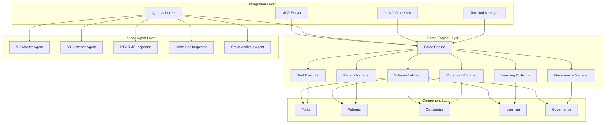

# Dev Sentinel Force System

**Version:** 2.0.0  
**Status:** Active Development  
**Last Updated:** June 24, 2025  
**Schema Version:** 1.0.0  

## Overview

The Dev Sentinel Force System is a modernized, schema-driven agentic development framework that merges the proven agent architecture of Dev Sentinel with the sophisticated, self-improving Force system. This integration provides a comprehensive platform for autonomous development assistance with enhanced scalability, resiliency, and modularity.

## System Architecture



## Key Features

### 🏗️ Modernized Architecture
- **Schema-First Design**: All components validate against comprehensive JSON schemas
- **Modular Components**: Clear separation of tools, patterns, constraints, learning, and governance
- **MCP Integration**: Full Model Context Protocol support for VS Code and other editors
- **Backward Compatibility**: Existing agents continue to function through adapter layers

### 🛠️ Enhanced Tool System
- **Parameterized Execution**: Tools with precise, validated parameters
- **Error Handling**: Comprehensive error handling with fallback mechanisms
- **Performance Monitoring**: Real-time performance tracking and optimization
- **Conditional Logic**: Smart execution based on context and conditions

### 📋 Pattern Management
- **Proven Workflows**: Codified development patterns with measurable outcomes
- **Context-Aware Application**: Patterns adapt to project type and complexity
- **Success Tracking**: Metrics on pattern effectiveness and usage
- **Continuous Improvement**: Patterns evolve based on learning data

### 🔒 Constraint Enforcement
- **Quality Gates**: Automated enforcement of code quality standards
- **Auto-Fix Capability**: Automatic remediation where possible
- **Flexible Severity**: Configurable error, warning, and info levels
- **Real-Time Validation**: Validation on save, commit, and push events

### 🧠 Learning System
- **Execution Analytics**: Detailed tracking of all tool and pattern executions
- **Performance Insights**: Identification of optimization opportunities
- **Error Pattern Recognition**: Learning from failures to prevent recurrence
- **Usage Pattern Analysis**: Understanding how tools and patterns are used

### 🏛️ Governance Framework
- **Quality Gates**: Comprehensive quality assurance at multiple levels
- **Policy Enforcement**: Configurable governance policies for different scopes
- **Risk Management**: Safety controls for high-risk operations
- **Compliance Monitoring**: Automated compliance checking and reporting

## Directory Structure

```
dev_sentinel/
├── docs/.force/                    # Force system configuration
│   ├── schemas/
│   │   └── force-schema.json       # Master validation schema
│   ├── tools/                     # Tool definitions
│   │   └── git-workflow-tools.json
│   ├── patterns/                  # Development patterns
│   │   └── development-patterns.json
│   ├── constraints/               # Quality constraints
│   │   └── quality-constraints.json
│   ├── learning/                  # Learning data and insights
│   │   └── execution-analytics.json
│   ├── governance/                # Governance policies
│   │   └── system-governance.json
│   └── README.md                  # This file
├── force/                         # Force engine implementation
│   ├── __init__.py                # Core Force engine
│   ├── tool_executor.py           # Tool execution system
│   ├── pattern_manager.py         # Pattern application
│   ├── constraint_enforcer.py     # Constraint validation
│   ├── learning_collector.py      # Learning data collection
│   └── governance_manager.py      # Governance enforcement
├── integration/fast_agent/
│   ├── force_mcp_server.py        # Enhanced MCP server
│   └── force_adapters.py          # Legacy agent adapters
└── [existing structure preserved]
```

## Migration from Legacy Architecture

The Force system provides a migration path that preserves existing functionality while adding new capabilities:

### Phase 1: Foundation (Completed)
- ✅ Force directory structure and schemas
- ✅ Core Force engine with validation
- ✅ Initial tool and pattern definitions
- ✅ Basic constraint and governance systems

### Phase 2: Agent Integration (In Progress)
- 🔄 Agent adapter layer for backward compatibility
- 🔄 Enhanced MCP server with Force integration
- 🔄 YUNG command processor with Force tools
- 🔄 Terminal manager with Force pattern support

### Phase 3: Advanced Features (Planned)
- ⏳ Advanced learning system with predictive optimization
- ⏳ Cross-project pattern recognition
- ⏳ Real-time governance enforcement
- ⏳ Performance analytics dashboard

### Phase 4: Full Integration (Planned)
- ⏳ Complete legacy agent replacement
- ⏳ Advanced AI-driven pattern recommendation
- ⏳ Distributed execution and scaling
- ⏳ Enterprise governance and compliance

## Usage Examples

### Tool Execution
```python
from force import ForceEngine

engine = ForceEngine()

# Execute a git workflow tool
result = await engine.execute_tool(
    tool_id="git_workflow_commit",
    parameters={
        "scope": "feature",
        "semanticVersionIncrement": "minor"
    },
    context={
        "projectPhase": "development",
        "complexityLevel": "medium"
    }
)
```

### Pattern Application
```python
# Apply an agent development workflow pattern
patterns = engine.load_patterns()
workflow_pattern = patterns["agent_development_workflow"]

# Execute pattern steps
for step in workflow_pattern["implementation"]["steps"]:
    await engine.execute_tool(
        tool_id=step["toolId"],
        parameters=step["parameters"]
    )
```

### MCP Integration
```json
{
  "tool": "force_execute_tool",
  "parameters": {
    "toolId": "documentation_analysis",
    "parameters": {
      "checkLinks": true,
      "generateReport": true
    }
  }
}
```

## Benefits of the Modernized Architecture

### For Development Teams
- **Reduced Learning Curve**: Schema-driven tools with clear parameter definitions
- **Consistent Quality**: Automated enforcement of coding standards and best practices
- **Faster Development**: Proven patterns accelerate common development tasks
- **Better Insights**: Learning system provides actionable optimization recommendations

### For Project Management
- **Predictable Outcomes**: Deterministic execution with measurable success rates
- **Quality Assurance**: Multi-level quality gates ensure deliverable standards
- **Risk Mitigation**: Governance policies prevent common development risks
- **Progress Tracking**: Detailed metrics on development velocity and quality

### For System Administrators
- **Scalable Architecture**: Modular design supports horizontal and vertical scaling
- **Monitoring and Analytics**: Comprehensive performance and usage monitoring
- **Security Controls**: Built-in security governance and vulnerability detection
- **Maintenance Simplicity**: Self-improving system reduces maintenance overhead

### For Stakeholders
- **Professional Deliverables**: Enterprise-grade quality and documentation standards
- **Continuous Improvement**: System learns and optimizes over time
- **Reduced Project Risk**: Proven patterns and quality gates minimize failure risk
- **Future-Proof Investment**: MCP compatibility ensures long-term viability

## MCP Server Integration

The Force system provides a sophisticated MCP server that exposes all Force capabilities:

### Available Tools
- `force_execute_tool`: Execute any Force tool with validation
- `force_apply_pattern`: Apply development patterns
- `force_check_constraints`: Validate code against constraints
- `force_get_insights`: Retrieve learning insights and recommendations
- `force_list_tools`: List available tools with metadata
- `force_list_patterns`: List available patterns with applicability

### Configuration
```yaml
# .vscode/settings.json
{
  "mcp.servers": {
    "dev-sentinel-force": {
      "command": "python",
      "args": ["-m", "integration.fast_agent.force_mcp_server"],
      "env": {
        "FORCE_DIR": "./docs/.force"
      }
    }
  }
}
```

## Performance and Scaling

### Current Performance Metrics
- **Schema Validation**: ~150ms for typical components
- **Tool Execution**: Variable, optimized based on learning data
- **Pattern Application**: Parallelized for multi-step workflows
- **Constraint Checking**: Real-time validation with minimal overhead

### Scaling Considerations
- **Horizontal Scaling**: Multiple Force engines can share learning data
- **Vertical Scaling**: Memory-efficient design supports large codebases
- **Distributed Execution**: Tool execution can be distributed across systems
- **Caching Strategy**: Intelligent caching of validated components and results

## Contributing to the Force System

### Adding New Tools
1. Define tool using Force schema in `docs/.force/tools/`
2. Implement execution logic in appropriate module
3. Add comprehensive error handling and validation
4. Test across multiple contexts and edge cases
5. Submit for schema validation and quality review

### Creating Patterns
1. Identify successful workflow from learning data
2. Document pattern with clear applicability criteria
3. Define implementation steps with tool references
4. Validate effectiveness across multiple projects
5. Add to pattern library with success metrics

### Defining Constraints
1. Identify quality or compliance requirement
2. Implement validation logic with auto-fix where possible
3. Define enforcement levels and remediation guidance
4. Test constraint effectiveness and performance impact
5. Add to constraint library with governance approval

## Future Roadmap

### Short Term (Q3 2025)
- Complete agent adapter layer implementation
- Enhanced MCP server with full Force integration
- Performance optimization based on learning data
- Basic governance policy enforcement

### Medium Term (Q4 2025)
- Advanced learning system with predictive capabilities
- Cross-project pattern recognition and sharing
- Real-time analytics dashboard
- Enterprise governance and compliance features

### Long Term (2026)
- AI-driven pattern and tool recommendation
- Distributed execution and horizontal scaling
- Advanced security and compliance automation
- Integration with external development tools and platforms

---

## Support and Documentation

- **Schema Reference**: [force-schema.json](schemas/force-schema.json)
- **Tool Library**: [Git Workflow Tools](tools/git-workflow-tools.json)
- **Pattern Library**: [Development Patterns](patterns/development-patterns.json)
- **Constraint Library**: [Quality Constraints](constraints/quality-constraints.json)
- **Learning Analytics**: [Execution Analytics](learning/execution-analytics.json)
- **Governance Policies**: [System Governance](governance/system-governance.json)

---

**Document Control:**
- Created: June 24, 2025
- Schema Version: 1.0.0
- System Status: Active Development
- Next Review: July 1, 2025
- Maintained By: Dev Sentinel Team
