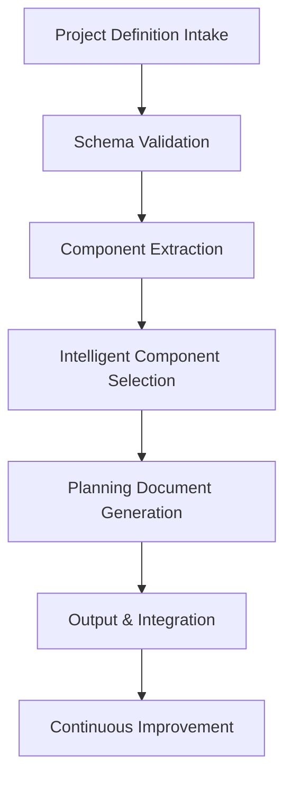
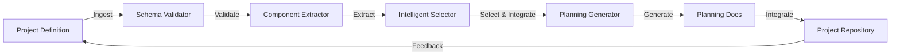
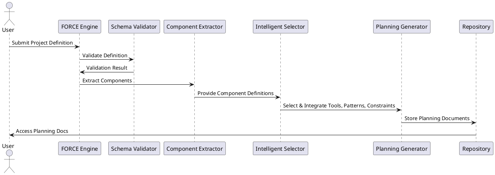
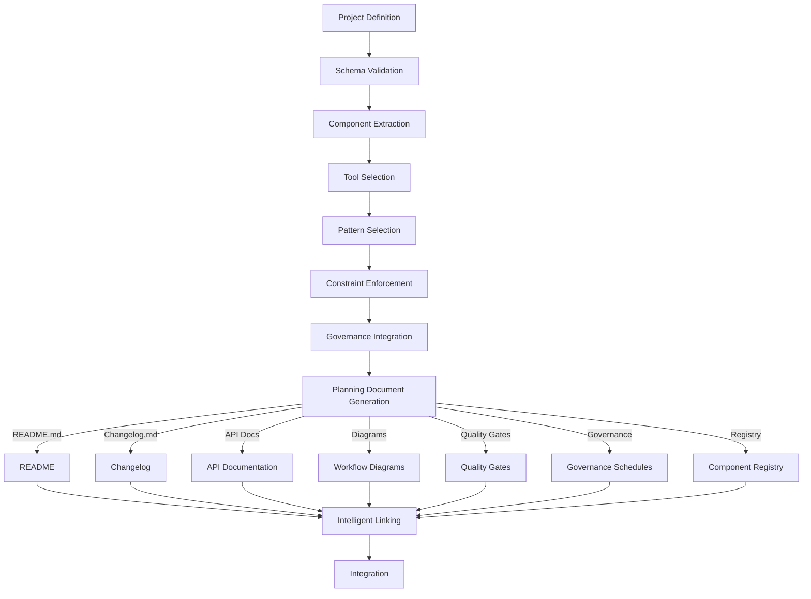
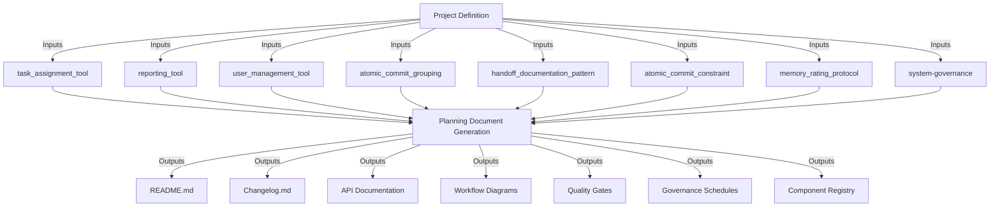
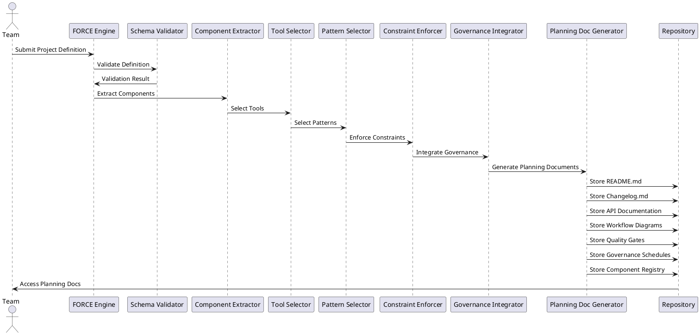

# FORCE Project Planning: Intelligent Component-Driven Process, Flow, and Architecture

<strong>Overview</strong>

FORCE automates project planning by intelligently leveraging available component definitions—tools, patterns, constraints, and governance policies. It transforms a project definition into actionable, validated planning documents, ensuring consistency, compliance, and traceability from inception through delivery.

---

Process Flow (Mermaid Diagram)

---

Architectural Design (Mermaid Diagram)

---

PlantUML Sequence: Intelligent Tool Usage

---

Component Definitions & Intelligent Usage

FORCE maintains a registry of available component definitions:

- **Tools:** Automation, analysis, deployment, validation (e.g., code-quality-check, documentation-analysis, git-commit)
- **Patterns:** Workflow, documentation, commit strategies (e.g., atomic_commit_grouping, handoff_documentation_pattern)
- **Constraints:** Quality, technical, business rules (e.g., atomic_commit_constraint, memory_rating_protocol)
- **Governance:** Review cycles, compliance, reporting (e.g., system-governance)

When a project definition is ingested, FORCE:
1. **Validates** the definition against schemas.
2. **Extracts** required components and matches them to available definitions.
3. **Intelligently selects** the most relevant tools and patterns for each workflow step, based on context (e.g., for an AI task management app, selects task assignment, reporting, and user management tools).
4. **Applies constraints** to enforce quality and compliance.
5. **Integrates governance policies** to schedule reviews and reporting.
6. **Generates planning documents** with all selected components linked and described.

---

Use Case: AI-Powered Task Management App (Context-Driven Illustration)

**Scenario:**
A team wants to build an AI-powered task management app that automates task assignment, tracks progress, and generates reports.

**FORCE Workflow (with Intelligent Component Usage):**
1. **Project Definition:** Team provides goals, deliverables, tech stack, and constraints.
2. **Validation:** FORCE validates the definition against its schema.
3. **Component Extraction:** Key features (task assignment, reporting, user management) are mapped to available tools:
    - `task_assignment_tool` for automated assignment
    - `reporting_tool` for progress and analytics
    - `user_management_tool` for access control
4. **Pattern Selection:** FORCE applies workflow patterns:
    - `atomic_commit_grouping` for code commits
    - `handoff_documentation_pattern` for documentation
5. **Constraint Enforcement:**
    - `atomic_commit_constraint` ensures commit quality
    - `memory_rating_protocol` for agentic memory standards
6. **Governance Integration:**
    - `system-governance` schedules review cycles and compliance checks
7. **Planning Document Generation:**
    - **README.md:**
        - Project overview, goals, and architecture summary
        - Key features and usage instructions
        - Links to component definitions and workflow diagrams
    - **Changelog.md:**
        - Chronological record of all major changes, releases, and updates
        - Follows atomic commit and semantic versioning patterns
        - Includes references to related documentation and implementation anchors
    - **API Documentation:**
        - Detailed endpoint descriptions for task assignment, reporting, and user management
        - Request/response schemas, authentication, and error handling
        - Auto-generated from code and validated against FORCE patterns
    - **Workflow Diagrams:**
        - Mermaid/PlantUML diagrams illustrating task assignment flow, reporting pipeline, and user management lifecycle
        - Embedded in documentation for visual clarity
    - **Quality Gates & Constraints:**
        - Documents outlining enforced constraints (e.g., commit quality, memory rating)
        - Automated validation steps and remediation instructions
    - **Governance Schedules:**
        - Review cycles, compliance checklists, and reporting timelines
        - Roles and responsibilities for stakeholders
    - **Component Registry:**
        - Linked index of all tools, patterns, and constraints used in the project
        - Traceability for audits and future improvements
8. **Intelligent Linking:**
    - All planning docs include links to component definitions for traceability and automated validation
9. **Integration:**
    - Documents are stored in the repo, ready for use and continuous improvement

---

Workflow Diagram: Planning Document Generation

Component Reference Mapping

Sequence Diagram: Planning Document Calls

---

Summary

FORCE provides a robust, intelligent, and automated approach to project planning. By leveraging available component definitions and context-driven selection, it ensures every step from definition to delivery is validated, documented, and optimized for quality, compliance, and traceability.

