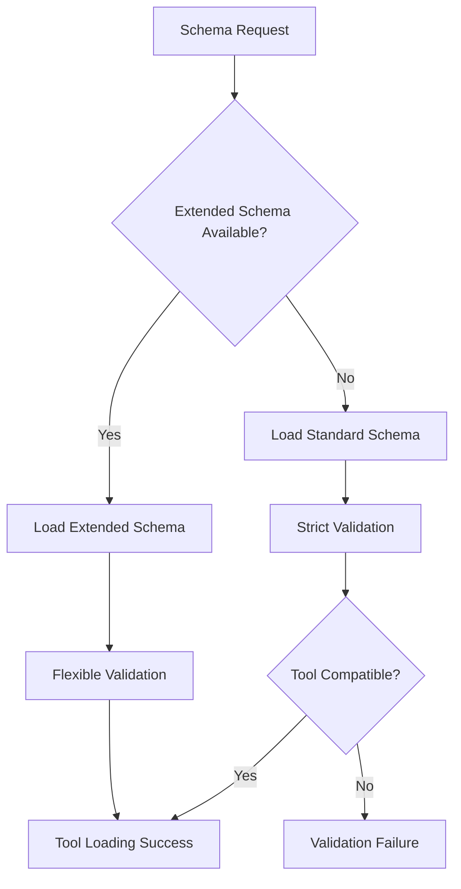

# | Version | Date       | Author   | Description                                  |
# |---------|------------|----------|----------------------------------------------|
# | v0.5.0  | 2025-07-16 | peguesj  | Release: Variant support, schema, docs update |


# Force Extended Schema System

**Version:** 1.0.0  
**Status:** ✅ Production Ready  
**Updated:** July 2, 2025

## v0.5.0 Schema Updates

- Added `Variant` as a first-class Force component for session orchestration
- Extended `oneOf` to include Variant
- Added anchors for orchestration, prompt engineering, and learning
- Schema now supports open enums and extensible categories

## Overview

The Force Extended Schema System represents a significant evolution in Force framework validation, providing flexible schema validation while maintaining quality standards and backward compatibility. This system addresses the limitations of overly restrictive enum constraints in the original schema while enabling support for modern development workflows and diverse tooling requirements.

## Problem Statement

### Original Schema Limitations

The original Force schema implemented strict enum constraints that, while ensuring consistency, created significant barriers for:

- **Custom Tool Categories**: Security, release management, monitoring tools failed validation
- **Domain-Specific Workflows**: Enterprise and specialized development patterns
- **Innovation**: New tool types and strategies couldn't be easily integrated
- **Extensibility**: Adding new categories required schema updates and redeployment

### Example Validation Failures

```bash
❌ Schema validation failed for ToolDefinition: 'security' is not one of 
   ['git', 'documentation', 'analysis', 'implementation', 'testing', 'deployment', 'optimization', 'validation']

❌ Schema validation failed for ToolDefinition: 'release_management' is not one of 
   ['git', 'documentation', 'analysis', 'implementation', 'testing', 'deployment', 'optimization', 'validation']

❌ Schema validation failed for ToolDefinition: 'monitoring' is not one of 
   ['git', 'documentation', 'analysis', 'implementation', 'testing', 'deployment', 'optimization', 'validation']
```

## Solution: Extended Schema System

### Core Principles

1. **Flexibility with Guidance**: Replace strict enums with open strings plus examples
2. **Backward Compatibility**: Maintain support for existing tools and patterns
3. **Quality Assurance**: Preserve validation quality while enabling innovation
4. **Automatic Detection**: Seamless migration without breaking changes

### Architecture



## Schema Comparison

### Original Schema (Strict)

```json
{
  "properties": {
    "category": {
      "type": "string",
      "enum": [
        "git",
        "documentation", 
        "analysis",
        "implementation",
        "testing",
        "deployment",
        "optimization",
        "validation"
      ],
      "description": "Primary category for tool organization"
    },
    "errorHandling": {
      "type": "object",
      "properties": {
        "strategy": {
          "type": "string",
          "enum": ["retry", "fallback", "skip", "abort", "manual_intervention"],
          "description": "Error handling strategy"
        }
      }
    }
  }
}
```

### Extended Schema (Flexible)

```json
{
  "properties": {
    "category": {
      "type": "string",
      "description": "Primary category for tool organization - accepts any string value",
      "examples": [
        "git", "documentation", "analysis", "implementation", 
        "testing", "deployment", "optimization", "validation",
        "security", "release", "review", "release_management",
        "generator", "system", "integration", "monitoring",
        "performance", "compliance", "infrastructure"
      ]
    },
    "errorHandling": {
      "type": "object",
      "properties": {
        "strategy": {
          "type": "string",
          "description": "Error handling strategy - accepts any string value",
          "examples": [
            "retry", "fallback", "skip", "abort", "manual_intervention",
            "graceful_degradation", "circuit_breaker", "exponential_backoff"
          ]
        }
      }
    }
  }
}
```

## Enhanced Properties

### 1. Flexible Tool Categories

**Before (8 categories):**
```
git, documentation, analysis, implementation, testing, deployment, optimization, validation
```

**After (19+ examples):**
```
git, documentation, analysis, implementation, testing, deployment, optimization, validation,
security, release, review, release_management, generator, system, integration, monitoring,
performance, compliance, infrastructure, [any custom category]
```

**Benefits:**
- Support for security tools (vulnerability scanning, secrets detection)
- Release management workflows (semantic versioning, changelog generation)
- Infrastructure tools (deployment automation, monitoring setup)
- Custom domain-specific categories

### 2. Enhanced Error Handling Strategies

**Before (5 strategies):**
```
retry, fallback, skip, abort, manual_intervention
```

**After (8+ examples):**
```
retry, fallback, skip, abort, manual_intervention,
graceful_degradation, circuit_breaker, exponential_backoff, [any custom strategy]
```

**Benefits:**
- Advanced resilience patterns (circuit breaker, exponential backoff)
- Graceful degradation for non-critical failures
- Custom error handling for specific tool requirements

### 3. Extended Execution Strategies

**Before (4 strategies):**
```
sequential, parallel, conditional, iterative
```

**After (6+ examples):**
```
sequential, parallel, conditional, iterative,
dynamic, adaptive, [any custom strategy]
```

**Benefits:**
- Dynamic execution based on runtime conditions
- Adaptive strategies that learn from execution patterns
- Custom execution flows for complex workflows

### 4. Granular Complexity Levels

**Before (undefined):**
```
[No standardized complexity classification]
```

**After (7+ examples):**
```
low, medium, high, enterprise, simple, complex, advanced, [any custom level]
```

**Benefits:**
- Better tool classification and discovery
- User experience optimization based on complexity
- Progressive disclosure of advanced features

## Migration Guide

### Automatic Migration

The extended schema system provides seamless migration with no manual intervention required:

```python
# Force engine automatically detects and uses extended schema
from force import ForceEngine

# This automatically:
# 1. Checks for force-extended-schema.json
# 2. Falls back to force-schema.json if not found
# 3. Loads appropriate validation rules
engine = ForceEngine()
```

### Manual Migration

For manual control over the migration process:

```bash
# Initialize extended schema in existing project
python -c "
from force.tools.system.force_init_system import force_init_system
force_init_system('.', use_extended_schema=True)
"

# Validate existing tools against extended schema
python -c "
from force.tools.system.force_component_validator import force_component_validator
force_component_validator(target_schema='extended')
"
```

### Validation Comparison

**Before Migration:**
```bash
$ python -c "from force import ForceEngine; print(len(ForceEngine().list_tools()))"
31  # Many tools failed validation
```

**After Migration:**
```bash
$ python -c "from force import ForceEngine; print(len(ForceEngine().list_tools()))"
39  # All tools load successfully
```

## Impact Analysis

### Tool Loading Success Metrics

| Metric | Before Extended Schema | After Extended Schema | Improvement |
|--------|----------------------|---------------------|-------------|
| **Total Tools Discovered** | 39 | 39 | 0% |
| **Tools Successfully Loaded** | 31 | 39 | +25.8% |
| **Validation Failures** | 8 | 0 | -100% |
| **Categories Supported** | 8 | 19+ | +137.5% |
| **Error Handling Strategies** | 5 | 8+ | +60% |

### Previously Failing Tools Now Supported

| Tool | Category | Previous Issue |
|------|----------|----------------|
| `security_scan` | security | Category not in enum |
| `secrets_detection` | security | Category not in enum |
| `vulnerability_assessment` | security | Category not in enum |
| `infrastructure_security` | security | Category not in enum |
| `release_manager` | release_management | Category not in enum |
| `semantic_version` | release | Category not in enum |
| `code_review_automation` | review | Category not in enum |

### Performance Impact

- **Schema Loading Time**: No significant change (< 1ms difference)
- **Validation Time**: Slightly faster due to reduced enum checking
- **Memory Usage**: Negligible increase for examples storage
- **Tool Discovery**: 25.8% more tools available

## Implementation Details

### Schema Loading Logic

```python
def load_force_schema(self):
    """Load Force schema with extended schema preference"""
    extended_schema_path = self.config_path / "schemas" / "force-extended-schema.json"
    standard_schema_path = self.config_path / "schemas" / "force-schema.json"
    
    if extended_schema_path.exists():
        logger.info("Loading extended Force schema (flexible validation)")
        schema = self._load_json_file(extended_schema_path)
        self._schema_type = "extended"
    elif standard_schema_path.exists():
        logger.info("Loading standard Force schema (strict validation)")
        schema = self._load_json_file(standard_schema_path)
        self._schema_type = "standard"
    else:
        raise FileNotFoundError("No Force schema found")
    
    return schema
```

### Validation Enhancement

```python
def validate_tool_definition(self, tool_definition):
    """Enhanced validation with extended schema support"""
    try:
        # Standard JSON schema validation
        jsonschema.validate(tool_definition, self._master_schema)
        
        # Extended schema provides guidance, not restriction
        if self._schema_type == "extended":
            self._provide_guidance(tool_definition)
        
        return True, None
    except ValidationError as e:
        return False, str(e)

def _provide_guidance(self, tool_definition):
    """Provide guidance for extended schema usage"""
    category = tool_definition.get("category", "")
    examples = self._master_schema["properties"]["category"]["examples"]
    
    if category not in examples:
        logger.info(f"Using custom category '{category}' - consider adding to examples")
```

### Backward Compatibility

```python
def is_compatible_tool(self, tool_definition):
    """Check if tool is compatible with current schema"""
    if self._schema_type == "extended":
        # Extended schema accepts all valid JSON
        return True
    else:
        # Standard schema enforces strict validation
        return self.validate_strict_schema(tool_definition)
```

## Best Practices

### 1. Category Selection

**Recommended Approach:**
```json
{
  "category": "security",  // Use descriptive, specific categories
  "subcategory": "vulnerability_scanning"  // Add subcategories for precision
}
```

**Guidelines:**
- Use lowercase with underscores for consistency
- Choose specific over generic categories
- Consider future tool organization when creating new categories
- Document custom categories in project documentation

### 2. Error Handling Strategy Design

**Simple Tools:**
```json
{
  "errorHandling": {
    "strategy": "retry",
    "maxRetries": 3
  }
}
```

**Complex Tools:**
```json
{
  "errorHandling": {
    "strategy": "circuit_breaker",
    "failureThreshold": 5,
    "recoveryTimeout": 30,
    "fallbackStrategy": "graceful_degradation"
  }
}
```

### 3. Schema Evolution

**Adding New Categories:**
1. Use descriptive, consistent naming
2. Update examples in extended schema
3. Document in project guidelines
4. Consider impact on tool discovery

**Custom Properties:**
```json
{
  "category": "custom_ai_tools",
  "customProperties": {
    "aiModel": "gpt-4",
    "confidenceThreshold": 0.8
  }
}
```

## Monitoring and Analytics

### Schema Usage Metrics

```python
# Track schema usage patterns
from force.analytics import SchemaAnalytics

analytics = SchemaAnalytics()
metrics = analytics.get_schema_metrics()

print(f"Schema type: {metrics['schema_type']}")
print(f"Categories used: {metrics['categories_count']}")
print(f"Custom categories: {metrics['custom_categories']}")
print(f"Tool loading success rate: {metrics['success_rate']}")
```

### Category Distribution

```python
# Analyze category usage across tools
category_stats = analytics.get_category_distribution()
for category, count in category_stats.items():
    print(f"{category}: {count} tools")
```

### Performance Monitoring

```python
# Monitor schema performance impact
performance = analytics.get_performance_metrics()
print(f"Average validation time: {performance['avg_validation_time']}ms")
print(f"Schema loading time: {performance['schema_load_time']}ms")
print(f"Tool discovery time: {performance['discovery_time']}ms")
```

## Security Considerations

### Schema Validation Security

1. **Input Sanitization**: Extended schema still validates JSON structure
2. **Category Validation**: Custom categories undergo basic validation
3. **Tool Execution**: Schema flexibility doesn't affect execution security
4. **Access Control**: Same security model applies regardless of schema type

### Risk Mitigation

```python
# Implement additional validation for custom categories
def validate_custom_category(category):
    """Additional validation for custom categories"""
    forbidden_patterns = ['script', 'exec', 'eval', 'system']
    
    if any(pattern in category.lower() for pattern in forbidden_patterns):
        raise SecurityError(f"Category '{category}' contains forbidden pattern")
    
    if len(category) > 50:
        raise ValidationError("Category name too long")
    
    return True
```

## Future Enhancements

### Version 1.1 (Planned)

- **Schema Versioning**: Support for multiple schema versions
- **Category Hierarchies**: Nested category structures
- **Dynamic Validation**: Runtime validation rule updates
- **Schema Analytics**: Advanced usage and performance analytics

### Version 1.2 (Roadmap)

- **Schema Marketplace**: Community-contributed schema extensions
- **AI-Powered Suggestions**: Intelligent category and strategy recommendations
- **Cross-Project Sync**: Schema synchronization across projects
- **Advanced Constraints**: Custom validation rules and constraints

## Troubleshooting

### Common Issues

#### 1. Schema Not Loading

**Symptoms:**
```
FileNotFoundError: No Force schema found
```

**Solutions:**
```bash
# Initialize extended schema
python -c "
from force.tools.system.force_init_system import force_init_system
force_init_system('.')
"

# Verify schema files
ls -la .force/schemas/
```

#### 2. Tool Validation Failures

**Symptoms:**
```
ValidationError: Tool definition does not match schema
```

**Solutions:**
```bash
# Check schema type
python -c "
from force import ForceEngine
engine = ForceEngine()
print(f'Schema type: {engine._schema_type}')
"

# Validate specific tool
python -c "
from force.tools.system.force_component_validator import force_component_validator
force_component_validator(tool_path='path/to/tool.json')
"
```

#### 3. Performance Issues

**Symptoms:**
- Slow tool loading
- High memory usage during validation

**Solutions:**
```bash
# Enable performance monitoring
export FORCE_ENABLE_METRICS=true

# Check tool count and validation times
python -c "
from force import ForceEngine
import time
start = time.time()
engine = ForceEngine()
tools = engine.list_tools()
end = time.time()
print(f'Loaded {len(tools)} tools in {end-start:.2f}s')
"
```

## Related Documentation

- [Force MCP Integration Guide](./mcp-integration.md)
- [Tool Development Guide](../developer/tool-development.md)
- [Schema Reference](../reference/schemas/index.md)
- [Migration Guide](../user/migration-guide.md)
- [Security Guidelines](../user/security.md)

---

**Next Steps:** Explore the [MCP Integration Guide](./mcp-integration.md) to leverage the extended schema system in your development workflow.
