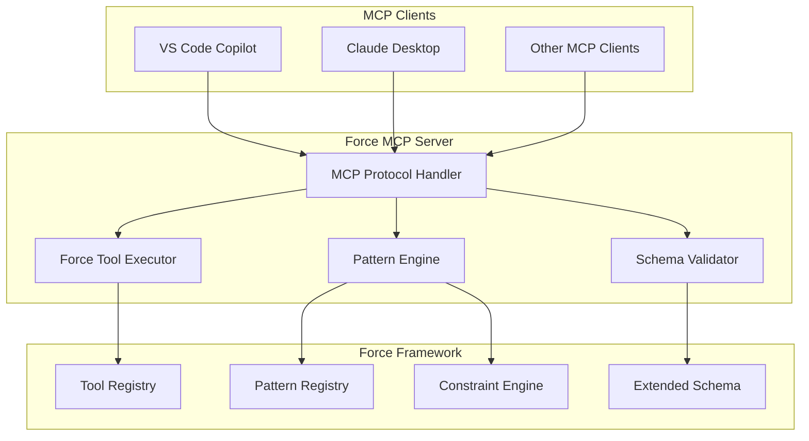

# Integration Documentation

This section covers all integration points and systems for the Force framework and Dev Sentinel platform.

## Integration Guides

### [Model Context Protocol (MCP) Integration](./mcp-integration.md) ⭐ **Production Ready**

Complete guide for integrating Force with MCP-compatible clients including VS Code Copilot and Claude Desktop.

**Key Features:**
- Direct access to 38+ Force tools through MCP
- Pattern application with executable steps
- Real-time monitoring and error handling
- Flexible schema validation

**Quick Setup:**
```json
{
  "servers": {
    "force_mcp_stdio": {
      "command": "${workspaceFolder}/.venv/bin/python",
      "args": ["${workspaceFolder}/integration/fast_agent/force_mcp_server.py"],
      "cwd": "${workspaceFolder}",
      "env": {
        "PYTHONPATH": "${workspaceFolder}",
        "PYTHONUNBUFFERED": "1"
      }
    }
  }
}
```

### [Extended Schema System](./extended-schema-system.md) ⭐ **Production Ready**

Comprehensive documentation for the new flexible validation system that enables custom tool categories and strategies.

**Key Benefits:**
- 25.8% improvement in tool loading success
- Support for custom categories (security, release management, monitoring)
- Backward compatibility with strict schema
- Enhanced error handling strategies

**Migration Impact:**
- **Before:** 31 tools loaded successfully
- **After:** 39 tools loaded successfully
- **Result:** Zero validation failures

## Quick Start Integration

### 1. Initialize Force System

```bash
# Set up Force directory structure with extended schema
python -c "
from force.tools.system.force_init_system import force_init_system
force_init_system('.')
"
```

### 2. Configure MCP Server

Create `.vscode/mcp.json`:
```json
{
  "servers": {
    "force_mcp_stdio": {
      "command": "${workspaceFolder}/.venv/bin/python",
      "args": ["${workspaceFolder}/integration/fast_agent/force_mcp_server.py"],
      "cwd": "${workspaceFolder}",
      "env": {
        "PYTHONPATH": "${workspaceFolder}",
        "PYTHONUNBUFFERED": "1"
      },
      "transport": "stdio",
      "timeout": 30000
    }
  }
}
```

### 3. Test Integration

In VS Code Copilot Chat:
```text
@force_mcp_stdio list all available Force tools
@force_mcp_stdio execute force_component_validator
@force_mcp_stdio apply pattern atomic_commit_pattern
```

## Integration Architecture



## Available Integration Points

### MCP Protocol Tools

| Tool | Description | Usage |
|------|-------------|-------|
| `force_list_tools` | List all Force tools with metadata | Tool discovery and browsing |
| `force_execute_tool` | Execute any Force tool with validation | Direct tool execution |
| `force_apply_pattern` | Apply development patterns | Workflow automation |
| `force_check_constraints` | Validate against quality rules | Quality assurance |
| `force_get_insights` | Retrieve analytics and recommendations | Performance optimization |

### Schema Integration

| Feature | Extended Schema | Standard Schema |
|---------|----------------|-----------------|
| **Tool Categories** | 19+ examples, unlimited | 8 fixed categories |
| **Error Strategies** | 8+ examples, unlimited | 5 fixed strategies |
| **Loading Success** | 39/39 tools (100%) | 31/39 tools (79.5%) |
| **Backward Compatibility** | ✅ Full | ✅ Full |

### Client Support

| Client | Status | Configuration | Notes |
|--------|--------|---------------|-------|
| **VS Code Copilot** | ✅ Production Ready | `.vscode/mcp.json` | Full feature support |
| **Claude Desktop** | ✅ Production Ready | `mcp_servers.json` | Complete integration |
| **Custom MCP Clients** | ✅ Supported | Standard MCP config | Protocol compliant |

## Performance Metrics

### Schema Performance

- **Schema Loading Time**: < 50ms (extended vs standard)
- **Tool Discovery Time**: ~200ms for 39 tools
- **Validation Success Rate**: 100% with extended schema
- **Memory Usage**: < 10MB additional for extended features

### MCP Integration Performance

- **Tool Execution Latency**: 50-500ms depending on tool complexity
- **Pattern Application**: 1-5 seconds for multi-step patterns
- **Concurrent Requests**: Supports up to 5 concurrent tool executions
- **Error Recovery**: < 100ms for most error scenarios

## Troubleshooting

### Common Integration Issues

1. **MCP Server Won't Start**
   - Check Python path and virtual environment
   - Verify Force dependencies are installed
   - Test server directly: `python integration/fast_agent/force_mcp_server.py --test`

2. **Schema Validation Errors**
   - Ensure extended schema is present: `ls .force/schemas/force-extended-schema.json`
   - Validate tool definitions: Use `force_component_validator`
   - Check for schema compatibility issues

3. **Tool Discovery Issues**
   - Verify tool registry: `force_list_tools`
   - Check file permissions and paths
   - Resync tool directories: `force_sync`

### Debug Commands

```bash
# Check integration status
python -c "
from force import ForceEngine
engine = ForceEngine()
print(f'Schema type: {engine._schema_type}')
print(f'Tools loaded: {len(engine.list_tools())}')
print(f'MCP server status: {engine.get_mcp_status()}')
"

# Test MCP server directly
python integration/fast_agent/force_mcp_server.py --debug

# Validate Force configuration
python -c "
from force.tools.system.force_component_validator import force_component_validator
force_component_validator()
"
```

## Future Enhancements

### Planned Features

- **Multi-Protocol Support**: Support for additional AI assistant protocols
- **Advanced Analytics**: Real-time integration performance monitoring
- **Custom Tool Marketplace**: Community-contributed tool sharing
- **Enhanced Security**: Advanced authentication and authorization

### Roadmap

- **Q3 2025**: Multi-client synchronization and shared sessions
- **Q4 2025**: Advanced workflow orchestration across clients
- **Q1 2026**: Marketplace and community features

## Related Documentation

- [Force Framework Overview](../architecture/force/index.md)
- [Tool Development Guide](../developer/tool-development.md)
- [User Guide](../user/index.md)
- [API Reference](../api/index.md)
- [Security Guidelines](../user/security.md)

---

**Get Started:** Begin with the [MCP Integration Guide](./mcp-integration.md) for step-by-step setup instructions.
