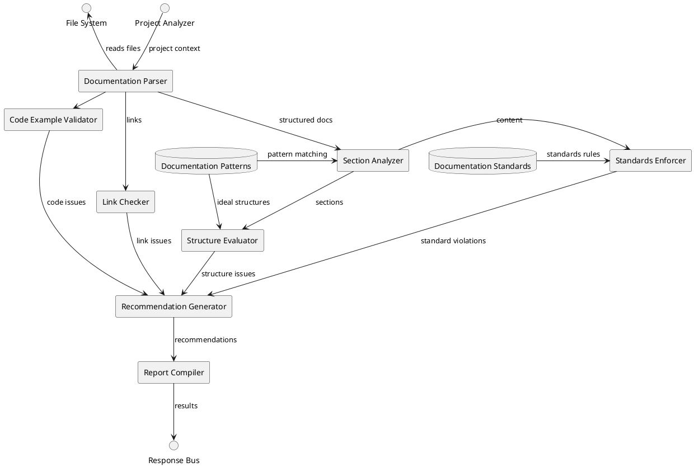

# README Inspector Agent (RDIA) Specification

**Version: 0.1.0**  
**Date: April 21, 2025**  
**Author: Jeremiah Pegues <jeremiah@pegues.io>**  
**Organization: Pegues OPSCORP LLC**  
**License: MIT**

## 1. Overview

The README Inspector Agent (RDIA) is an autonomous agent responsible for evaluating, maintaining, and improving project documentation, with a particular focus on README files and related project documentation. It ensures that documentation is comprehensive, accurate, up-to-date, and follows best practices, ultimately improving project accessibility and usability for developers and users.

## 2. Core Capabilities

### 2.1 Documentation Analysis

The RDIA performs comprehensive analysis of project documentation:

- Parsing and structural analysis of markdown files
- Identification of standard documentation sections
- Extraction of code examples and verification of their validity
- Detection of links and references, with validation

### 2.2 Gap Detection

The agent identifies missing or inadequate documentation elements:

- Comparison of documented features against actual project capabilities
- Identification of undocumented APIs, commands, or components
- Detection of outdated installation or usage instructions
- Recognition of unclear or ambiguous explanations

### 2.3 Quality Assessment

Documentation is evaluated against industry standards and best practices:

- Readability metrics calculation
- Information architecture assessment
- Consistency of terminology and formatting
- Compliance with project-specific documentation standards

### 2.4 Improvement Generation

The agent provides actionable improvements for documentation:

- Generation of templates for missing sections
- Suggestions for clearer explanations
- Updated code examples that reflect current APIs
- Reorganization recommendations for better structure

## 3. System Interfaces

### 3.1 Input Interfaces

```typescript
interface DocumentationInspectionRequest {
  documentPaths: string[];      // Paths to documentation files to inspect
  projectContext: {
    name: string;
    rootDirectory: string;
    language: string;
    technologies: string[];
    repositoryUrl?: string;
  };
  options: {
    standards: string[];       // Documentation standards to apply
    ignorePatterns?: string[]; // Patterns to ignore
    focusSections?: string[];  // Sections to particularly focus on
    followLinks: boolean;      // Whether to inspect linked documents
    verifyCodeExamples: boolean; // Whether to test code examples
  };
  metadata: {
    requestId: string;
    requestor: string;
    priority: 'low' | 'medium' | 'high';
    timestamp: string;
  };
}
```

### 3.2 Output Interfaces

```typescript
interface DocumentationAnalysisResult {
  requestId: string;
  summary: {
    overallQualityScore: number;   // 0-100 score
    documentCount: number;
    wordCount: number;
    issuesFound: number;
    improvementsSuggested: number;
  };
  documentAnalysis: DocumentAnalysis[];
  globalRecommendations: Recommendation[];
  metadata: {
    analysisTimestamp: string;
    engineVersion: string;
    standardsApplied: string[];
  };
}

interface DocumentAnalysis {
  path: string;
  qualityScore: number;
  metrics: {
    readabilityScore: number;
    completenessScore: number;
    accuracyScore: number;
    consistencyScore: number;
  };
  sections: {
    name: string;
    present: boolean;
    contentQuality: number;
    wordCount: number;
    issues: Issue[];
  }[];
  issues: Issue[];
  recommendations: Recommendation[];
}

interface Issue {
  type: 'missing' | 'outdated' | 'unclear' | 'inaccurate' | 'broken' | 'formatting';
  severity: 'critical' | 'major' | 'minor' | 'suggestion';
  description: string;
  location: {
    section?: string;
    lineStart?: number;
    lineEnd?: number;
  };
  impact: string;
}

interface Recommendation {
  issueId?: string;
  type: 'add' | 'update' | 'remove' | 'restructure';
  description: string;
  suggestedContent?: string;
  rationale: string;
  effort: 'low' | 'medium' | 'high';
  impact: 'low' | 'medium' | 'high';
}
```

## 4. Internal Architecture



## 5. Documentation Analysis Process

```plantuml
@startuml
!define PROCESS rectangle
!define DECISION diamond
!define START circle
!define END circle
!define DOCUMENT note

skinparam backgroundColor transparent

START as S
PROCESS "Load documentation files" as P1
PROCESS "Parse documentation structure" as P2
PROCESS "Identify standard sections" as P3
PROCESS "Extract code examples" as P4
PROCESS "Analyze project features" as P5
PROCESS "Compare docs to features" as P6
DECISION "Documentation\ncomplete?" as D1
PROCESS "Generate missing content\nrecommendations" as P7
PROCESS "Evaluate existing content" as P8
DECISION "Content meets\nstandards?" as D2
PROCESS "Generate improvement\nrecommendations" as P9
PROCESS "Check links and examples" as P10
DECISION "Links and examples\nvalid?" as D3
PROCESS "Generate fix\nrecommendations" as P11
PROCESS "Compile quality metrics" as P12
DOCUMENT "Documentation\nAnalysis Report" as DOC
END as E

S --> P1
P1 --> P2
P2 --> P3
P2 --> P4
P3 --> P6
P4 --> P10
P5 --> P6
P6 --> D1
D1 -right-> P7 : No
D1 -down-> P8 : Yes
P7 --> P8
P8 --> D2
D2 -right-> P9 : No
D2 -down-> P10 : Yes
P9 --> P10
P10 --> D3
D3 -right-> P11 : No
D3 -down-> P12 : Yes
P11 --> P12
P12 --> DOC
DOC --> E

@enduml
```

## 6. Documentation Standards

The RDIA applies different documentation standards based on project type:

### 6.1 General Standards

Applied to all README documentation:

- Clear project name and description
- Concise explanation of purpose and value
- Installation instructions
- Basic usage examples
- License information
- Contribution guidelines

### 6.2 Framework/Library Standards

Additional standards for frameworks and libraries:

- API documentation with input/output specifications
- Architecture overview
- Advanced usage examples
- Integration guidelines
- Performance considerations
- Upgrade/migration guides

### 6.3 Application Standards

Additional standards for end-user applications:

- User interface screenshots
- Feature list
- Configuration options
- Troubleshooting guide
- System requirements
- Security considerations

## 7. Quality Metrics

### 7.1 Coverage Metrics

Measure completeness of documentation:

```python
def calculate_coverage_score(documented_features, actual_features):
    if not actual_features:
        return 100.0  # No features to document
        
    covered = set(documented_features).intersection(set(actual_features))
    return (len(covered) / len(actual_features)) * 100.0
```

### 7.2 Readability Metrics

Measure how easily documentation can be understood:

- **Flesch Reading Ease**: 0-100 score (higher is more readable)
- **Average sentence length**: Target 15-20 words
- **Technical jargon density**: Percentage of technical terms
- **Heading clarity**: Score based on heading descriptiveness

### 7.3 Accuracy Metrics

Measure correctness of documentation:

- **API accuracy**: Match between documentation and actual API
- **Example validity**: Percentage of working code examples
- **Procedural correctness**: Whether steps work as described
- **Version alignment**: Match between docs and software version

### 7.4 Consistency Metrics

Measure uniformity of documentation style:

- **Terminology consistency**: Consistent use of terms
- **Format consistency**: Uniform formatting of similar elements
- **Voice consistency**: Consistent tone and writing style
- **Structure consistency**: Similar organization across sections

## 8. Integration with Knowledge Base

### 8.1 Pattern Recognition

The RDIA learns from existing documentation:

- Identifying common project documentation structures
- Learning effective explanation patterns
- Recognizing documentation anti-patterns
- Building templates from high-quality examples

### 8.2 Knowledge Contribution

The agent contributes to the knowledge base:

- Documentation best practices derived from analysis
- Common documentation issues and solutions
- Project-specific terminology and explanation patterns
- Effective documentation structures by project type

### 8.3 Continuous Learning

The RDIA improves through feedback:

- Learning from accepted vs. rejected recommendations
- Adapting standards based on project preferences
- Improving recommendation quality through user feedback
- Building project-specific documentation preferences

## 9. Customization and Configuration

```json
{
  "documentationStandards": {
    "baseStandards": ["essential", "markdown-best-practices"],
    "projectTypeStandards": ["library", "api"],
    "customStandards": ["company-docs-template"]
  },
  "analysisSettings": {
    "minReadabilityScore": 70,
    "requiredSections": ["installation", "usage", "contributing", "license"],
    "codeExampleValidation": true,
    "linkValidation": true,
    "maxRecommendations": 20
  },
  "projectSpecific": {
    "terminologyFile": "docs/terminology.json",
    "ignorePatterns": ["**/generated/**", "**/.temp/**"],
    "customSections": [
      {
        "name": "Security Considerations",
        "required": true,
        "position": "afterUsage"
      }
    ]
  },
  "reporting": {
    "includeMetrics": true,
    "generateTemplates": true,
    "prioritizeIssues": true,
    "includePositiveFeedback": true
  }
}
```

## 10. Metrics and Evaluation

### 10.1 Agent Performance Metrics

- **Analysis Speed**: Time to analyze documentation
- **Recommendation Quality**: Acceptance rate of suggestions
- **Issue Detection Rate**: Percentage of issues found vs. manual review
- **Learning Rate**: Improvement in recommendations over time

### 10.2 Documentation Quality Tracking

- **Quality Trend**: Change in documentation quality over time
- **Issue Resolution Rate**: Speed of addressing documentation issues
- **Documentation Debt**: Accumulated documentation shortcomings
- **User Feedback**: Feedback on documentation usability