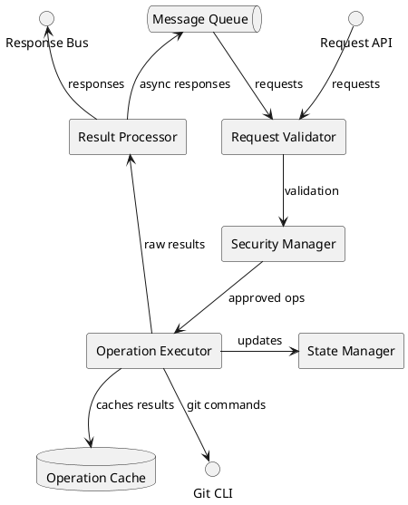

# Version Control Listener Agent (VCLA) Specification

**Version: 0.1.0**  
**Date: April 21, 2025**  
**Author: Jeremiah Pegues <jeremiah@pegues.io>**  
**Organization: Pegues OPSCORP LLC**  
**License: MIT**

## 1. Overview

The Version Control Listener Agent (VCLA) is an agent designed to respond to explicit version control operation requests from other agents or developers. Unlike the VCMA which acts autonomously, the VCLA functions as a service provider that executes requested operations on-demand, handles authentication, provides comprehensive feedback, and maintains operational safety.

## 2. Core Capabilities

### 2.1 Command Interface

The VCLA provides a standardized interface for version control operations:

- Support for all common git operations
- Parameter validation and normalization
- Operation confirmation for destructive actions
- Consistent error handling and reporting

### 2.2 Operation Execution

Secure and reliable execution of requested operations:

- Access control enforcement
- Execution of git operations with proper credentials
- Transactional execution with rollback capabilities
- Conflict detection and resolution assistance

### 2.3 Status Reporting

Comprehensive feedback on operation execution:

- Detailed operation result reporting
- Error contextualizing and troubleshooting guidance
- Operation metrics collection
- System status information

### 2.4 Safety Management

Protection against unintended consequences:

- Pre-operation validation checks
- Repository state preservation
- Protected branch enforcement
- Operation impact assessment

## 3. System Interfaces

### 3.1 Request Interface

```typescript
interface VCOperationRequest {
  operationType: string;  // git operation type
  params: {
    [key: string]: any;  // Operation-specific parameters
  };
  options: {
    dryRun?: boolean;             // Simulate but don't execute
    ignoreWarnings?: boolean;      // Proceed despite warnings
    timeout?: number;             // Operation timeout in ms
    notifyOnCompletion?: boolean;  // Whether to notify when complete
  };
  requestMeta: {
    requestId: string;            // Unique request identifier
    requestor: string;            // Agent or user ID making request
    priority: 'low' | 'medium' | 'high' | 'critical';
    timestamp: string;            // Request time
    callbackTopic?: string;       // Optional topic for async response
  };
}
```

### 3.2 Response Interface

```typescript
interface VCOperationResponse {
  requestId: string;           // The ID from the original request
  success: boolean;            // Whether operation succeeded
  operationType: string;       // The operation that was performed
  result: any;                 // Operation-specific result data
  repositoryState: {           // Current state after operation
    branch: string;
    commit: string;
    clean: boolean;
    pendingChanges: number;
  };
  warnings: string[];          // Any warnings encountered
  error?: {                    // Present only if success is false
    code: string;
    message: string;
    details: any;
    recoveryOptions?: string[];  // Possible ways to recover
  };
  metrics: {                   // Operational metrics
    durationMs: number;
    resourceUsage: any;
    timestamp: string;
  };
}
```

### 3.3 Supported Operations

The VCLA supports the following version control operations:

#### Repository Operations
- `clone` - Clone a repository
- `init` - Initialize a new repository
- `fetch` - Fetch from remote
- `pull` - Pull from remote
- `push` - Push to remote

#### Change Operations
- `status` - Check working tree status
- `add` - Stage files for commit
- `commit` - Create a new commit
- `stash` - Stash changes
- `pop` - Apply stashed changes
- `reset` - Reset current HEAD
- `revert` - Revert commits
- `clean` - Remove untracked files

#### Branch Operations
- `branch` - Create, list, or delete branches
- `checkout` - Switch branches or restore files
- `merge` - Join two or more development histories
- `rebase` - Reapply commits on top of another base
- `tag` - Create, list, delete, or verify tags

#### Analysis Operations
- `log` - Show commit logs
- `diff` - Show changes between commits
- `blame` - Show what revision last modified each line

## 4. Internal Architecture



## 5. Operation Execution Flow

```plantuml
@startuml
!define PROCESS rectangle
!define DECISION diamond
!define START circle
!define END circle
!define DATABASE cylinder

skinparam backgroundColor transparent

START as S
PROCESS "Receive operation request" as P1
DECISION "Is request valid?" as D1
PROCESS "Validate requestor permissions" as P2
DECISION "Has permission?" as D2
PROCESS "Check operation safety" as P3
DECISION "Is operation safe?" as D3
PROCESS "Prepare operation" as P4
PROCESS "Execute git operation" as P5
DECISION "Operation succeeded?" as D4
PROCESS "Process results" as P6
PROCESS "Handle error" as P7
PROCESS "Update repository state" as P8
DATABASE "Knowledge Base" as KB
PROCESS "Generate response" as P9
END as E

S --> P1
P1 --> D1
D1 -right-> P7 : No
D1 -down-> P2 : Yes
P2 --> D2
D2 -right-> P7 : No
D2 -down-> P3 : Yes
P3 --> D3
D3 -right-> P7 : No
D3 -down-> P4 : Yes
P4 --> P5
P5 --> D4
D4 -right-> P7 : No
D4 -down-> P6 : Yes
P6 --> P8
P7 --> P9
P8 --> KB
P8 --> P9
P9 --> E

@enduml
```

## 6. Safety Mechanisms

### 6.1 Pre-Operation Validation

Before executing operations, the VCLA performs several validation checks:

1. **Syntax validation**: Ensures operation parameters meet required format
2. **Semantic validation**: Verifies operation makes sense in current context
3. **Authorization check**: Confirms requestor has necessary permissions
4. **Impact assessment**: Evaluates potential consequences of the operation
5. **State validation**: Verifies repository is in compatible state for operation

### 6.2 Protected Resources

The VCLA enforces special protection for critical resources:

```json
{
  "protectedBranches": [
    {
      "pattern": "main",
      "rules": {
        "allowForcePush": false,
        "requireReview": true,
        "requiredSignatures": true
      }
    },
    {
      "pattern": "release/*",
      "rules": {
        "allowDeletion": false,
        "allowForcePush": false,
        "requiredSignatures": true
      }
    }
  ],
  "protectedFiles": [
    {
      "pattern": "config/*.json",
      "rules": {
        "requireExplicitConfirmation": true
      }
    }
  ]
}
```

### 6.3 Operation Backup

The VCLA maintains safety snapshots for potentially destructive operations:

- Pre-operation state snapshots
- Automatic stashing of uncommitted changes
- Timed reference points for recovery
- Operation journals for audit and rollback

## 7. Integration Points

### 7.1 Event Publications

The VCLA publishes events to the system event bus to notify other agents:

```typescript
interface VCEventNotification {
  eventType: 'vc.operation.completed' | 'vc.state.changed' | 'vc.warning' | 'vc.error';
  payload: {
    operation?: string;
    result?: any;
    repositoryState?: any;
    warning?: string;
    error?: any;
  };
  timestamp: string;
  source: 'vc-listener-agent';
  severity: 'info' | 'warning' | 'error';
}
```

### 7.2 Knowledge Base Integration

The VCLA contributes to the knowledge base with:

- Common error patterns and solutions
- Operation success/failure statistics
- Repository state history
- Operation timing patterns

### 7.3 External System Integration

Integration with external systems via:

- Webhook notifications for key events
- Status API for system monitoring
- Metrics export for performance tracking
- Audit log for compliance requirements

## 8. Configuration Options

```json
{
  "requestHandling": {
    "maxConcurrentOperations": 5,
    "operationTimeout": 30000,
    "maxRetries": 3,
    "queueSizeLimit": 100
  },
  "security": {
    "requireAuthenticationFor": ["push", "merge", "delete", "reset"],
    "authCacheTime": 300,
    "enforceProtectedBranches": true,
    "restrictedOperations": ["push --force", "reset --hard"]
  },
  "notifications": {
    "notifyOnCompletion": true,
    "detailedErrorReporting": true,
    "operationStatusUpdates": true
  },
  "performance": {
    "cacheResults": true,
    "cacheTimeToLive": 600,
    "useParallelGit": true,
    "batchCompatibleOperations": true
  },
  "logging": {
    "logLevel": "info",
    "includeTimings": true,
    "redactSensitiveData": true
  }
}
```

## 9. Error Handling

The VCLA implements a comprehensive error handling strategy:

### 9.1 Error Categorization

Errors are categorized to facilitate appropriate responses:

- **Validation Errors**: Issues with request format or parameters
- **Permission Errors**: Requestor lacks necessary permissions
- **Execution Errors**: Git operation failed during execution
- **State Errors**: Repository in incompatible state
- **System Errors**: Underlying system or resource issues

### 9.2 Recovery Strategies

For each error type, specific recovery strategies are employed:

```typescript
const errorRecoveryStrategies = {
  'validation': [
    'suggestCorrectParameters',
    'offerTemplatedRequest'
  ],
  'permission': [
    'suggestAuthenticationMethod',
    'requestElevatedPermissions',
    'offerAlternativeOperation'
  ],
  'execution': [
    'retryOperation',
    'suggestPrerequisiteOperations',
    'offerAlternativePath'
  ],
  'state': [
    'resolveConflicts',
    'stashChanges',
    'cleanWorkingDirectory'
  ],
  'system': [
    'retryWithBackoff',
    'requestResourceIncrease',
    'queueForLaterExecution'
  ]
};
```

### 9.3 Error Learning

The VCLA improves over time by learning from errors:

- Recording error patterns and successful resolutions
- Identifying common user mistakes and their corrections
- Optimizing recovery strategies based on success rates
- Preemptively avoiding conditions that lead to errors

## 10. Metrics and Evaluation

The VCLA's performance is evaluated through:

### 10.1 Operational Metrics

- **Throughput**: Operations processed per minute
- **Response Time**: Time to complete operations
- **Error Rate**: Percentage of failed operations
- **Recovery Success**: Success rate of error recovery strategies

### 10.2 Quality Metrics

- **Accuracy**: Correctness of executed operations
- **Completeness**: Fulfillment of all aspects of requests
- **Consistency**: Reliable behavior across similar requests
- **Clarity**: Understandability of responses and error messages

### 10.3 Integration Metrics

- **Interoperability**: Successful interaction with other agents
- **Event Reliability**: Successful delivery of event notifications
- **Knowledge Contribution**: Value of knowledge base additions
- **System Impact**: Effect on overall system performance