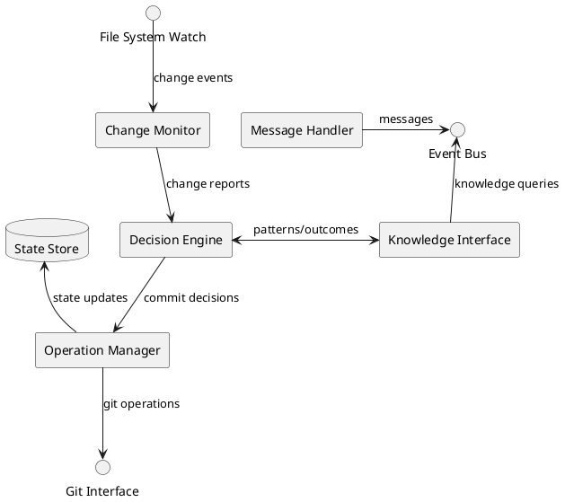

# Version Control Master Agent (VCMA) Specification

**Version: 0.1.0**  
**Date: April 21, 2025**  
**Author: Jeremiah Pegues <jeremiah@pegues.io>**  
**Organization: Pegues OPSCORP LLC**  
**License: MIT**

## 1. Overview

The Version Control Master Agent (VCMA) is an autonomous agent responsible for monitoring development activities across the platform, identifying code changes that warrant version control operations, and executing those operations at appropriate times. It serves as the "observer" in the system, proactively managing version control without requiring explicit commands.

## 2. Core Capabilities

### 2.1 Change Monitoring

The VCMA continuously monitors the workspace for relevant changes:

- File system watches for modified, added, and deleted files
- Detection of meaningful change patterns
- Filtering of temporary/generated files via configurable rules
- Recording of change history and patterns

### 2.2 Decision Intelligence

The agent employs sophisticated decision-making to determine when to perform version control operations:

- Semantic analysis of code changes to identify logical completion points
- Temporal patterns to identify appropriate commit frequency
- Contextual understanding of development workflows
- Learning from past commit patterns and outcomes

### 2.3 Operation Execution

Autonomous execution of version control operations:

- Staging of related changes into logical groups
- Generation of descriptive commit messages
- Management of branches for different workflows
- Stashing and retrieval of work-in-progress changes
- Conflict resolution during merges

### 2.4 Integration

Integration with the broader agent ecosystem:

- Notification of other agents about version control state changes
- Coordination with development agents on timing of commits
- Knowledge sharing with the central knowledge base
- Metrics collection and reporting for system monitoring

## 3. System Interfaces

### 3.1 Input Interfaces

```typescript
interface ChangeNotification {
  filePath: string;
  changeType: 'add' | 'modify' | 'delete' | 'rename';
  timestamp: string;
  agent?: string;  // Agent responsible for change, if known
  operation?: string;  // Operation that caused the change, if known
}

interface CommitRequest {
  files?: string[];  // Optional list of files to commit (all changes if omitted)
  message?: string;  // Optional commit message (generated if omitted)
  branch?: string;   // Target branch (current branch if omitted)
  priority: 'low' | 'medium' | 'high' | 'critical';
}

interface BranchOperation {
  operation: 'create' | 'switch' | 'merge' | 'delete';
  branchName: string;
  baseBranch?: string;  // For 'create' operations
  message?: string;     // For merge commits
}
```

### 3.2 Output Interfaces

```typescript
interface CommitResult {
  success: boolean;
  commitId?: string;
  message?: string;
  files: string[];
  timestamp: string;
  branch: string;
  error?: string;
}

interface BranchResult {
  success: boolean;
  operation: 'create' | 'switch' | 'merge' | 'delete';
  branchName: string;
  error?: string;
}

interface VCStatusUpdate {
  currentBranch: string;
  uncommittedChanges: number;
  lastCommitId: string;
  lastCommitMessage: string;
  lastCommitTimestamp: string;
}
```

## 4. Internal Architecture



## 5. Decision Algorithm

The commit decision algorithm follows a multi-factor approach:

```python
def evaluate_commit_worthiness(changes, context):
    # Initialize with base score
    score = 0
    
    # Factor 1: Syntactic completeness
    if changes_are_syntactically_complete(changes):
        score += 30
    
    # Factor 2: Logical unit of work
    work_unit_score = analyze_logical_completeness(changes, context)
    score += work_unit_score  # 0-40 range
    
    # Factor 3: Time since last commit
    time_factor = min(20, (time_since_last_commit / max_interval_config) * 20)
    score += time_factor
    
    # Factor 4: Change volume
    if change_volume > significant_threshold:
        volume_factor = min(10, (change_volume / ideal_change_size) * 10)
        score += volume_factor
    
    # Decision thresholds
    if score >= 80:
        return CommitDecision.HIGH_PRIORITY
    elif score >= 50:
        return CommitDecision.MEDIUM_PRIORITY
    elif score >= 30:
        return CommitDecision.LOW_PRIORITY
    else:
        return CommitDecision.NO_COMMIT
```

## 6. Machine Learning Components

The VCMA employs several machine learning models to enhance its capabilities:

### 6.1 Change Pattern Recognition

- **Input**: Historical change patterns, commit boundaries
- **Model Type**: Sequence model (LSTM or Transformer)
- **Output**: Prediction of logical change groups

### 6.2 Commit Message Generation

- **Input**: Set of changes, file context, project history
- **Model Type**: Text generation model
- **Output**: Human-readable, informative commit message

### 6.3 Workflow Learning

- **Input**: Developer actions, timing patterns, project context
- **Model Type**: Reinforcement learning model
- **Output**: Optimized commit timing and grouping

## 7. Configuration Options

```json
{
  "monitoring": {
    "pollingInterval": 5000,
    "ignorePaths": ["node_modules/**", "*.log", "dist/**"],
    "watchExtensions": [".py", ".js", ".ts", ".jsx", ".tsx", "*.md"]
  },
  "decisionThresholds": {
    "minTimeBetweenCommits": 300000,
    "maxTimeBetweenCommits": 3600000,
    "minChangesForCommit": 10,
    "idealChangeBatchSize": 100
  },
  "workflow": {
    "defaultBranch": "main",
    "featureBranchPrefix": "feature/",
    "bugfixBranchPrefix": "fix/",
    "automaticPush": false
  },
  "integration": {
    "notifyOnCommit": true,
    "requireApprovalForMerge": true,
    "collectMetrics": true
  }
}
```

## 8. Security Considerations

1. **Access Control**: The VCMA requires specific permissions:
   - Read/write access to git repository
   - File system monitoring permissions
   - Access to git credentials

2. **Operation Safeguards**:
   - No automatic force pushing to protected branches
   - Confirmation required for destructive operations
   - Backup of local state before potentially dangerous operations

3. **Audit Trail**:
   - Comprehensive logging of all operations
   - Attribution of automated actions
   - Versioning of agent decisions

## 9. Metrics and Evaluation

The VCMA's performance is evaluated based on the following metrics:

1. **Commit Quality**:
   - Logical coherence of committed changes
   - Clarity and usefulness of commit messages
   - Developer feedback on automated commits

2. **Timing Effectiveness**:
   - Appropriateness of commit timing
   - Balance between commit frequency and size
   - Prevention of long uncommitted work periods

3. **Operational Efficiency**:
   - Speed of operation execution
   - Resource utilization
   - Error rate in git operations

4. **Learning Progress**:
   - Improvement in commit message quality over time
   - Adaptation to project-specific patterns
   - Reduction in required human interventions